

  

<strong>Universidad Peruana de Ciencias Aplicadas</strong>

<strong>Ingeniería de Software</strong> 
Diseño de experimentos de ingeniería de Software  
<strong>Profesor:</strong> Julio Manuel Noriega Melendez 

<h2 align="center">INFORME</h2>
<h2 align="center">2025 - 2</h2>

<h3 align="center">Startup: EASY</h3>
<h3 align="center">1ASI0729-2510-4313</h3>

<strong>Producto: SplitEasy</strong>

<h3 align="center">Team Members:</h3>

| **Member**                           | **Code**     |
|--------------------------------------|--------------|
|Rodrigo Alya Cabrera      |  U202219481  |
|Diego Fernando Herrera Enriquez         | U202319027  |
|Valentino Sandoval Paiva         | U20211A962  |
|Eslander Celis Berrospi         |  U201911249 |

<strong>Agosoto 2025</strong>

# Registro de Versiones del Informe
| Versión | Fecha      | Autor(es)                       | Descripción                                                                                                                                                                                                                                                                |
| ------- | ---------- | ------------------------------- | -------------------------------------------------------------------------------------------------------------------------------------------------------------------------------------------------------------------------------------------------------------------------- |
| TB1     | 08/09/2025 | Diego Fernando Herrera Enriquez | Desarrollo de los **Capítulos 1 y 2**: **Capítulo 1: Introducción** (perfil de la startup, perfiles del grupo, descripción general) y **Capítulo 2: Requirements Elicitation & Analysis** (análisis competitivo, estrategias frente a competidores, entrevistas y diseño). |
| TB1     | 09/09/2025 | Diego Fernando Herrera Enriquez | Continuación del **Capítulo 2: Requirements Elicitation & Analysis**: entrevistas, segmentación de usuarios y análisis de la problemática.                                                                                                                                 |
| TB1     | 10/09/2025 | Eslander Celis Berrospi         | Desarrollo del **Capítulo 3: Requirements Specification**. Incluye el mapeo de escenarios actuales (As-is), user personas, y análisis de necesidades.                                                                                                                      |
| TB1     | 11/09/2025 | Eslander Celis Berrospi         | Continuación del **Capítulo 3: Requirements Specification**. Trabajo sobre el **User Journey Mapping**, **Empathy Mapping** y **As-is Scenario Mapping**.                                                                                                                  |
| TB1     | 12/09/2025 | Rodrigo Alya Cabrera            | Desarrollo del **Capítulo 4: Product Design**. Incluye el diseño de **Style Guidelines**, **Wireframes** de la Landing Page, y la arquitectura de la información.                                                                                                          |
| TB1     | 13/09/2025 | Rodrigo Alya Cabrera            | Continuación del **Capítulo 4: Product Design**. Enfoque en el diseño UX/UI para la **Web Application**, incluyendo wireflows, mock-ups y prototipos.                                                                                                                      |
| TB1     | 14/09/2025 | Valentino Sandoval Paiva        | Desarrollo del **Capítulo 5: Product Implementation, Validation & Deployment**. Incluye la **Gestión de Configuración del Software** y la planificación de Sprints.                                                                                                        |
| TB1     | 15/09/2025 | Valentino Sandoval Paiva        | Continuación del **Capítulo 5**. Documentación de **Services**, pruebas de ejecución, y evidencias de despliegue para la revisión del Sprint.                                                                                                                              |
| TB1     | 16/09/2025 | Valentino Sandoval Paiva        | Finalización del **Capítulo 5**. Análisis de las **User Stories**, documentación de endpoints, y resúmenes de ejecución para la revisión del Sprint.                                                                                                                       |

| Versión | Fecha      | Autor(es)                           | Descripción                                                                                                                                                                                      |
| ------- | ---------- | ----------------------------------- | ------------------------------------------------------------------------------------------------------------------------------------------------------------------------------------------------ |
| **TP1** | 28/09/2025 | **Diego Fernando Herrera Enriquez** | Desarrollo del **Capítulo 5: Product Implementation & Deployment**, que incluye la planificación de **Sprint Backlogs** y la estructura de implementación general del producto.                  |
| **TP1** | 29/09/2025 | **Diego Fernando Herrera Enriquez** | Continuación del **Capítulo 5**, incluyendo la **Implemented Landing Page Evidence** y la documentación inicial de la implementación de la landing page.                                         |
| **TP1** | 30/09/2025 | **Eslander Celis Berrospi**         | **Capítulo 5** - Desarrollo de la **Implemented Frontend-Web Application Evidence**, pruebas iniciales y documentación sobre la integración del frontend con la landing page.                    |
| **TP1** | 01/10/2025 | **Eslander Celis Berrospi**         | Continuación del **Capítulo 5**, trabajo sobre el **Acuerdo de Servicio - SaaS** y detalles sobre el modelo de servicio propuesto para la plataforma.                                            |
| **TP1** | 02/10/2025 | **Rodrigo Alya Cabrera**            | Desarrollo de la **Implemented Native-Mobile Application Evidence** y revisión del diseño móvil, asegurando la coherencia con la web.                                                            |
| **TP1** | 03/10/2025 | **Rodrigo Alya Cabrera**            | **Capítulo 5** - Implementación del **RESTful API and/or Serverless Backend Evidence**, documentación técnica y configuración de la infraestructura del backend.                                 |
| **TP1** | 04/10/2025 | **Valentino Sandoval Paiva**        | Desarrollo de la **RESTful API documentation** para la integración y consumo de los endpoints del sistema.                                                                                       |
| **TP1** | 05/10/2025 | **Valentino Sandoval Paiva**        | **Capítulo 5** - **Team Collaboration Insights**, análisis y documentación sobre la colaboración entre miembros del equipo y su impacto en el desarrollo de la plataforma.                       |
| **TP1** | 06/10/2025 | **Valentino Sandoval Paiva**        | Desarrollo del **Capítulo 6: Product Verification & Validation**, que incluye **Core Entities Unit Tests** y **Core Integration Tests**. Enfoque en pruebas unitarias e integración del sistema. |
| **TP1** | 07/10/2025 | **Valentino Sandoval Paiva**        | Continuación del **Capítulo 6**, trabajo en **Core Behavior-Driven Development** y **Core System Tests**, validando la funcionalidad y comportamiento del producto.                              |
| **TP1** | 08/10/2025 | **Diego Fernando Herrera Enriquez** | Desarrollo del **Capítulo 7: DevOps Practices**, que incluye la implementación de herramientas y prácticas de **Continuous Integration**, y la construcción de la suite de pruebas.              |
| **TP1** | 09/10/2025 | **Diego Fernando Herrera Enriquez** | Continuación del **Capítulo 7**, trabajo en **Continuous Delivery**, implementación de herramientas y fases de despliegue del pipeline.                                                          |
| **TP1** | 10/10/2025 | **Eslander Celis Berrospi**         | Desarrollo del **Capítulo 7**, implementación de prácticas de **Continuous Deployment** y documentación de los componentes del pipeline para el despliegue en producción.                        |
| **TP1** | 11/10/2025 | **Eslander Celis Berrospi**         | Continuación del **Capítulo 7**, análisis y pruebas de **Production Deployment Pipeline Components**, validación del flujo de despliegue a producción.                                           |

Link del repositorio: https://github.com/1ASI0732-2520-7505-SPLITEASY/Report/tree/develop
                                 
# Contenido

- [Registro de Versiones del Informe](#registro-de-versiones-del-informe)
- [Project Report Collaboration Insights](#project-report-collaboration-insights)
- [Contenido](#contenido)
  - [Capítulo I: Introducción](#capítulo-i-introducción)
  - [Capítulo II: Requirements Elicitation \& Analysis](#capítulo-ii-requirements-elicitation--analysis)
  - [Capítulo III: Requirements Specification](#capítulo-iii-requirements-specification)
  - [Capítulo IV: Product Design](#capítulo-iv-product-design)
  - [Capítulo V: Product Implementation, Validation \& Deployment](#capítulo-v-product-implementation-validation--deployment)
  - [Anexos](#anexos)
- [Student Outcome](#student-outcome)
- [Project: SplitEasy](#project-spliteasy)
- [Chapter 1: Introduction](#chapter-1-introduction)
  - [1.1. Startup Profile](#11-startup-profile)
    - [1.1.1. Descripción de la Startup](#111-descripción-de-la-startup)
    - [1.1.2. Perfiles de Integrantes del Grupo](#112-perfiles-de-integrantes-del-grupo)
  - [1.2. Solution Profile](#12-solution-profile)
    - [1.2.1. Antecedentes y Problemática](#121-antecedentes-y-problemática)
    - [What](#what)
      - [¿Cuál es el problema?](#cuál-es-el-problema)
      - [¿Cuál es la relación con la persona en cuestión?](#cuál-es-la-relación-con-la-persona-en-cuestión)
    - [When](#when)
      - [¿Cuándo sucede el problema?](#cuándo-sucede-el-problema)
      - [¿Cuándo utiliza el cliente el producto?](#cuándo-utiliza-el-cliente-el-producto)
    - [Where](#where)
      - [¿Dónde está el cliente cuando usa el producto?](#dónde-está-el-cliente-cuando-usa-el-producto)
      - [¿A dónde se dirige?](#a-dónde-se-dirige)
      - [¿Dónde surge el problema?](#dónde-surge-el-problema)
    - [Why](#why)
      - [¿Cuál es la causa principal del problema?](#cuál-es-la-causa-principal-del-problema)
    - [Who](#who)
      - [¿Quiénes están involucrados?](#quiénes-están-involucrados)
      - [¿A quiénes les sucede el problema?](#a-quiénes-les-sucede-el-problema)
      - [¿Quién lo utilizará?](#quién-lo-utilizará)
    - [How](#how)
      - [¿Cómo ocurre el problema?](#cómo-ocurre-el-problema)
      - [¿En qué condiciones los clientes usan nuestro producto?](#en-qué-condiciones-los-clientes-usan-nuestro-producto)
      - [¿Qué llevará a la persona a usar nuestro producto?](#qué-llevará-a-la-persona-a-usar-nuestro-producto)
    - [1.2.2. Lean UX Process](#122-lean-ux-process)
      - [1.2.2.1. Lean UX Problem Statements](#1221-lean-ux-problem-statements)
      - [1.2.2.2. Lean UX Assumptions](#1222-lean-ux-assumptions)
    - [Business Outcomes](#business-outcomes)
    - [User Outcomes](#user-outcomes)
      - [1.2.2.3. Lean UX Hypothesis Statements](#1223-lean-ux-hypothesis-statements)
      - [1.2.2.4. Lean UX Canvas](#1224-lean-ux-canvas)
  - [Segmentos Objetivos](#segmentos-objetivos)
    - [Segmento objetivo 1: Personas del hogar](#segmento-objetivo-1-personas-del-hogar)
    - [Segmento objetivo 2: Representante del hogar](#segmento-objetivo-2-representante-del-hogar)
- [Chapter 2: Requirements Elicitation \& Analysis](#chapter-2-requirements-elicitation--analysis)
  - [2.1. Competidores](#21-competidores)
    - [2.1.1. Analisis Competitivo](#211-analisis-competitivo)
      - [¿Por qué llevar a cabo este análisis?](#por-qué-llevar-a-cabo-este-análisis)
    - [2.1.2. Estrategias y tácticas frente a competidores](#212-estrategias-y-tácticas-frente-a-competidores)
      - [Estrategia de diferenciación por valor social](#estrategia-de-diferenciación-por-valor-social)
      - [Estrategia de funcionalidad avanzada desde el inicio](#estrategia-de-funcionalidad-avanzada-desde-el-inicio)
      - [Estrategia de comunidad y crecimiento orgánico](#estrategia-de-comunidad-y-crecimiento-orgánico)
  - [2.2. Entrevistas](#22-entrevistas)
    - [2.2.1. Diseño de Entrevistas](#221-diseño-de-entrevistas)
    - [Segmento objetivo 1: Personas del hogar](#segmento-objetivo-1-personas-del-hogar-1)
    - [Segmento objetivo 2: Representante del hogar](#segmento-objetivo-2-representante-del-hogar-1)
    - [2.2.2. Registro de entrevistas](#222-registro-de-entrevistas)
      - [**Primer Segmento - Personas del Hogar:** ](#primer-segmento---personas-del-hogar-)
      - [**Segundo Segmento - Representantes del Hogar:**](#segundo-segmento---representantes-del-hogar)
    - [2.2.3. Análisis de entrevistas](#223-análisis-de-entrevistas)
  - [2.3 Needfinding](#23-needfinding)
      - [Segmento #1: Personas del hogar](#segmento-1-personas-del-hogar)
      - [Segmento #2: Representante del hogar](#segmento-2-representante-del-hogar)
    - [2.3.1. User Personas](#231-user-personas)
    - [2.3.2. User Task Matrix](#232-user-task-matrix)
    - [2.3.3. User Journey Mapping](#233-user-journey-mapping)
    - [Segmento 1: Personas del hogar](#segmento-1-personas-del-hogar-1)
    - [Segmento 2: Representante del hogar](#segmento-2-representante-del-hogar-1)
    - [2.3.4. Empathy Mapping](#234-empathy-mapping)
    - [Segmento 1: Personas del hogar](#segmento-1-personas-del-hogar-2)
    - [Segmento 2: Representante del hogar](#segmento-2-representante-del-hogar-2)
    - [2.3.5. As-is Scenario Mapping](#235-as-is-scenario-mapping)
    - [Segmento #1: Personas del Hogar](#segmento-1-personas-del-hogar-3)
    - [Segmento #2: Representante del Hogar](#segmento-2-representante-del-hogar-3)
  - [2.4. Ubiquitous Language](#24-ubiquitous-language)
- [Capítulo 3: Requirements Specification](#capítulo-3-requirements-specification)
  - [3.1 To-Be Scenario Mapping](#31-to-be-scenario-mapping)
    - [Segmento 1: Miembros del hogar](#segmento-1-miembros-del-hogar)
    - [Segmento 2: Representante del hogar](#segmento-2-representante-del-hogar-4)
  - [3.2. User Stories](#32-user-stories)
    - [Epic](#epic)
    - [EP01 - Registro y Gestión de Perfil](#ep01---registro-y-gestión-de-perfil)
    - [EP02 - Panel del Representante del Hogar](#ep02---panel-del-representante-del-hogar)
    - [EP03 - Panel del Miembro del Hogar](#ep03---panel-del-miembro-del-hogar)
    - [EP04 - Gestión de Gastos Compartidos](#ep04---gestión-de-gastos-compartidos)
    - [EP05 - Seguimiento y Recordatorios](#ep05---seguimiento-y-recordatorios)
    - [EP06 - Soporte y Comunidad](#ep06---soporte-y-comunidad)
    - [EP07 - Exploración como Visitante](#ep07---exploración-como-visitante)
  - [3.3. Impact Mapping](#33-impact-mapping)
    - [Segmento 1: Miembros del hogar](#segmento-1-miembros-del-hogar-1)
    - [Segmento 2: Representante del hogar](#segmento-2-representante-del-hogar-5)
  - [3.4. Product Backlog](#34-product-backlog)
    - [Priorización de User Stories - Plataforma SplitEasy](#priorización-de-user-stories---plataforma-spliteasy)
- [Capítulo IV: Product Design](#capítulo-iv-product-design-1)
  - [4.1. Style Guidelines](#41-style-guidelines)
    - [4.1.1. General Style Guidelines](#411-general-style-guidelines)
      - [Tipografía](#tipografía)
      - [Colores](#colores)
      - [Espaciado](#espaciado)
      - [Iconografía](#iconografía)
      - [Tono de Comunicación y Lenguaje Aplicado](#tono-de-comunicación-y-lenguaje-aplicado)
    - [4.1.2. Web Style Guidelines](#412-web-style-guidelines)
  - [4.2. Information Architecture](#42-information-architecture)
    - [4.2.1. Organization Systems](#421-organization-systems)
      - [Organización Visual del Contenido](#organización-visual-del-contenido)
      - [Esquemas de Categorización de Contenido](#esquemas-de-categorización-de-contenido)
      - [Implementación en la Interfaz](#implementación-en-la-interfaz)
    - [4.2.2. Labeling Systems](#422-labeling-systems)
      - [Menú de navegación](#menú-de-navegación)
      - [Botón principal](#botón-principal)
      - [Sección "How does it work?" para Representantes](#sección-how-does-it-work-para-representantes)
      - [Sección "How does it work?" para Miembros](#sección-how-does-it-work-para-miembros)
      - [Footer](#footer)
    - [4.2.3. SEO Tags and Meta Tags](#423-seo-tags-and-meta-tags)
      - [Landing Page](#landing-page)
    - [Web Application](#web-application)
    - [4.2.4. Searching Systems](#424-searching-systems)
      - [Filtros de búsqueda por entradas](#filtros-de-búsqueda-por-entradas)
      - [Filtros de búsqueda por tabs](#filtros-de-búsqueda-por-tabs)
      - [Flujo de búsqueda y filtros](#flujo-de-búsqueda-y-filtros)
    - [4.2.5. Navigation Systems](#425-navigation-systems)
      - [1. Navegación en la Landing Page](#1-navegación-en-la-landing-page)
      - [2. Navegación en la Web Application](#2-navegación-en-la-web-application)
      - [Para Representantes del Hogar:](#para-representantes-del-hogar)
      - [Para Miembros del Hogar:](#para-miembros-del-hogar)
      - [Interacción con el sistema](#interacción-con-el-sistema)
  - [4.3. Landing Page UI Design](#43-landing-page-ui-design)
    - [4.3.1. Landing Page Wireframe](#431-landing-page-wireframe)
    - [4.3.2. Landing Page Mock-up](#432-landing-page-mock-up)
  - [4.4. Web Applications UX/UI Design](#44-web-applications-uxui-design)
    - [4.4.1. Web Applications Wireframes](#441-web-applications-wireframes)
    - [4.4.2. Web Applications Wireflow Diagrams](#442-web-applications-wireflow-diagrams)
    - [4.4.3. Web Applications Mock-ups](#443-web-applications-mock-ups)
    - [4.4.4. Web Applications User Flow Diagrams](#444-web-applications-user-flow-diagrams)
  - [4.5. Web Applications Prototyping](#45-web-applications-prototyping)
  - [4.6. Domain-Driven Software Architecture](#46-domain-driven-software-architecture)
    - [4.6.1. Software Architecture Context Diagram](#461-software-architecture-context-diagram)
    - [4.6.2. Software Architecture Container Diagrams](#462-software-architecture-container-diagrams)
    - [4.6.3. Software Architecture Components Diagrams](#463-software-architecture-components-diagrams)
  - [4.7. Software Object-Oriented Design](#47-software-object-oriented-design)
    - [4.7.1 Class Diagrams](#471-class-diagrams)
    - [4.7.2. Class Dictionary](#472-class-dictionary)
      - [Class: HouseholdMember](#class-householdmember)
      - [Class: HouseholdManager](#class-householdmanager)
      - [Class: Household](#class-household)
      - [Class: Contribution](#class-contribution)
      - [Class: Expense](#class-expense)
      - [Class: Document](#class-document)
      - [Class: Balance](#class-balance)
      - [Enumerations](#enumerations)
        - [ContributionStatus](#contributionstatus)
        - [ExpenseCategory](#expensecategory)
  - [4.8. SplitEasy - Database Design](#48-spliteasy---database-design)
    - [Descripción General](#descripción-general)
  - [Diagrama Entidad-Relación](#diagrama-entidad-relación)
    - [users](#users)
    - [households](#households)
    - [household\_members](#household_members)
    - [bills](#bills)
    - [contributions](#contributions)
    - [member\_contributions](#member_contributions)
    - [settings](#settings)
    - [Comentario General](#comentario-general)
    - [Índices](#índices)
    - [Objetivos del Diseño](#objetivos-del-diseño)
    - [4.8.1. Database Diagram](#481-database-diagram)
- [Capítulo V: Product Implementation, Validation \& Deployment](#capítulo-v-product-implementation-validation--deployment-1)
  - [5.1. Software Configuration Management](#51-software-configuration-management)
    - [5.1.1. Software Development Environment Configuration](#511-software-development-environment-configuration)
      - [Project Management](#project-management)
      - [Requirements Management](#requirements-management)
      - [Product UX/UI Design](#product-uxui-design)
      - [Software Development](#software-development)
      - [Software Documentation](#software-documentation)
    - [5.1.2. Source Code Management](#512-source-code-management)
    - [5.1.3. Source Code Style Guide \& Conventions](#513-source-code-style-guide--conventions)
      - [HTML](#html)
      - [CSS](#css)
      - [JavaScript](#javascript)
      - [Angular](#angular)
      - [Springboot](#springboot)
    - [5.1.4. Software Deployment Configuration](#514-software-deployment-configuration)
  - [5.2. Landing Page, Services \& Applications Implementation](#52-landing-page-services--applications-implementation)
    - [5.2.1. Sprint 1](#521-sprint-1)
      - [5.2.1.1. Sprint Planning 1](#5211-sprint-planning-1)
      - [5.2.1.3. Sprint Backlog 1 – SplitEasy](#5213-sprint-backlog-1--spliteasy)
  - [Sprint 1 - Objetivo](#sprint-1---objetivo)
  - [Historias de Usuario Abordadas (EP07 - Exploración como Visitante)](#historias-de-usuario-abordadas-ep07---exploración-como-visitante)
  - [Tasks del Sprint](#tasks-del-sprint)
    - [Evidencias de Tablero Trello](#evidencias-de-tablero-trello)
  - 
  - [Integrantes del Equipo](#integrantes-del-equipo)
      - [5.2.1.4. Deployment Evidence for Sprint Review](#5214-deployment-evidence-for-sprint-review)
      - [5.2.1.5. Execution Evidence for Sprint Review.](#5215-execution-evidence-for-sprint-review)
        - [Capturas de pantalla de vistas principales implementadas:](#capturas-de-pantalla-de-vistas-principales-implementadas)
          - [Vista de la Landing Page](#vista-de-la-landing-page)
          - [Vista de la Sección de Registro/Login](#vista-de-la-sección-de-registrologin)
          - [Vista de la Sección de Características](#vista-de-la-sección-de-características)
          - [Funcionalidad característica de los representantes:](#funcionalidad-característica-de-los-representantes)
          - [Funcionalidad característica de los miembros:](#funcionalidad-característica-de-los-miembros)
      - [5.2.1.6. Services Documentation Evidence for Sprint Review.](#5216-services-documentation-evidence-for-sprint-review)
        - [Resumen de logros:](#resumen-de-logros)
        - [Tabla de Endpoints Documentados:](#tabla-de-endpoints-documentados)
        - [Enlace al repositorio de Web Services:](#enlace-al-repositorio-de-web-services)
        - [ID de commits relacionados con la documentación:](#id-de-commits-relacionados-con-la-documentación)
    - [5.2.2 Sprint 2](#522-sprint-2)
      - [5.2.2.1 Sprint Planning 2](#5221-sprint-planning-2)
      - [5.2.2.2 Aspect Leaders and Collaborators](#5222-aspect-leaders-and-collaborators)
  - 
      - [5.2.2.3 Deployment Evidence for Sprint Review](#5223-deployment-evidence-for-sprint-review)
      - [5.2.2.4 Testing Suite Evidence for Sprint Review](#5224-testing-suite-evidence-for-sprint-review)
      - [5.2.2.5. Execution Evidence for Sprint Review](#5225-execution-evidence-for-sprint-review)
      - [5.2.2.6. Services Documentation Evidence for Sprint Review](#5226-services-documentation-evidence-for-sprint-review)
        - [Capturas de la documentación:](#capturas-de-la-documentación)
  - 
    - [Repositorio en GitHub:](#repositorio-en-github)
      - [5.2.2.7. Software Deployment Evidence for Sprint Review](#5227-software-deployment-evidence-for-sprint-review)
        - [Capturas incluidas:](#capturas-incluidas)
  - 
      - [5.2.2.8. Team Collaboration Insights during Sprint](#5228-team-collaboration-insights-during-sprint)
        - [Acciones de colaboración:](#acciones-de-colaboración)
        - [Capturas incluidas:](#capturas-incluidas-1)
        - [Participación destacada:](#participación-destacada)
    - [5.2.3. Sprint 3](#523-sprint-3)
      - [5.2.3.1. Sprint Planning 3](#5231-sprint-planning-3)
      - [5.2.3.2. Aspect Leaders and Collaborators](#5232-aspect-leaders-and-collaborators)
      - [5.2.3.3. Sprint Backlog 3](#5233-sprint-backlog-3)
      - [5.2.3.4. Development Evidence for Sprint Review](#5234-development-evidence-for-sprint-review)
      - [5.2.3.5. Execution Evidence for Sprint Review](#5235-execution-evidence-for-sprint-review)
      - [Households (Hogares)](#households-hogares)
      - [Users y Bills (Usuarios y Cuentas)](#users-y-bills-usuarios-y-cuentas)
      - [Contribuciones](#contribuciones)
      - [Household Members (Miembros del Hogar)](#household-members-miembros-del-hogar)
      - [Bills (Detalle de facturas)](#bills-detalle-de-facturas)
      - [5.2.3.6. Services Documentation Evidence for Sprint Review](#5236-services-documentation-evidence-for-sprint-review)
      - [Ejemplo de definición técnica de un endpoint (`/api/v1/households`):](#ejemplo-de-definición-técnica-de-un-endpoint-apiv1households)
      - [5.2.3.7. Software Deployment Evidence for Sprint Review](#5237-software-deployment-evidence-for-sprint-review)
      - [5.2.3.8. Team Collaboration Insights during Sprint](#5238-team-collaboration-insights-during-sprint)
    - [5.2.4. Sprint 4](#524-sprint-4)
      - [5.2.4.1. Sprint Planning 4.](#5241-sprint-planning-4)
      - [5.2.4.2. Aspect Leaders and Collaborators.](#5242-aspect-leaders-and-collaborators)
      - [5.2.4.3.Sprint Backlog 4.](#5243sprint-backlog-4)
      - [5.2.4.4.Development Evidence for Sprint Review.](#5244development-evidence-for-sprint-review)
      - [5.2.4.5.Execution Evidence for Sprint Review.](#5245execution-evidence-for-sprint-review)
      - [5.2.4.6.Services Documentation Evidence for Sprint Review.](#5246services-documentation-evidence-for-sprint-review)
      - [5.2.4.7.Software Deployment Evidence for Sprint Review.](#5247software-deployment-evidence-for-sprint-review)
      - [5.2.4.8.Team Collaboration Insights during Sprint.](#5248team-collaboration-insights-during-sprint)
  - [5.3. Validation Interviews](#53-validation-interviews)
    - [5.3.1 Diseño de Entrevistas](#531-diseño-de-entrevistas)
    - [5.3.2 Registro de Entrevistas](#532-registro-de-entrevistas)
    - [SEGMENTO 1:](#segmento-1)
    - [SEGMENTO 2:](#segmento-2)
    - [5.3.3. Evaluaciones según heurísticas](#533-evaluaciones-según-heurísticas)
  - [5.4. Video About-the-Product](#54-video-about-the-product)
  - [5.5. Video: "About-The-Team"](#55-video-about-the-team)
- [Conclusión](#conclusión)
  - [Enfoque centrado en el usuario](#enfoque-centrado-en-el-usuario)
  - [Funcionalidades clave implementadas](#funcionalidades-clave-implementadas)
  - [Beneficios y valor agregado](#beneficios-y-valor-agregado)
  - [Futuro y escalabilidad](#futuro-y-escalabilidad)
- [Referencias (Normas APA 7)](#referencias-normas-apa-7)
  - [Aplicaciones para dividir gastos](#aplicaciones-para-dividir-gastos)
  - [Herramientas de desarrollo y gestión de proyectos](#herramientas-de-desarrollo-y-gestión-de-proyectos)
  - [Desarrollo General](#desarrollo-general)

- Enlace Frontend Desplegado: https://new-spliteasy.netlify.app
- Enlace Backend Desplegado: https://back-spliteasy.onrender.com/swagger-ui/index.html

# Student Outcome
| **Criterio específico**                                                                                                                                          | **Acciones realizadas**                                                                                                                                                                                                                                                                                                                                                                                                                                                                                                                                                                                                                                                                                                                                                                                                                                                                                                                                          | **Conclusiones**                                                                                                                                                                                                                                                                                                                                                                                                               |
| ---------------------------------------------------------------------------------------------------------------------------------------------------------------- | ---------------------------------------------------------------------------------------------------------------------------------------------------------------------------------------------------------------------------------------------------------------------------------------------------------------------------------------------------------------------------------------------------------------------------------------------------------------------------------------------------------------------------------------------------------------------------------------------------------------------------------------------------------------------------------------------------------------------------------------------------------------------------------------------------------------------------------------------------------------------------------------------------------------------------------------------------------------- | ------------------------------------------------------------------------------------------------------------------------------------------------------------------------------------------------------------------------------------------------------------------------------------------------------------------------------------------------------------------------------------------------------------------------------ |
| **4.c.1 Reconoce responsabilidad ética y profesional en situaciones de ingeniería de software**                                                                  | TB1:   **Rodrigo Alya Cabrera :** Desarrolló la arquitectura de la información y la estructura de navegación de la plataforma, asegurando la inclusión de accesibilidad universal y un diseño ético que respeta la diversidad de usuarios. **Eslander Celis Berrospi :** Realizó un análisis ético en la creación de las user personas y las entrevistas de validación, priorizando la transparencia y la honestidad en el tratamiento de la información de los usuarios. **Valentino Sandoval Paiva :** Implementó las soluciones de autenticación y seguridad del sistema asegurando que las mejores prácticas en términos de privacidad y protección de datos fueran aplicadas. **Diego Fernando Herrera Enriquez :** Gestionó las entrevistas con usuarios y el análisis de competidores, enfocándose en un enfoque ético que asegurara la equidad y respeto en el diseño de la solución.  **TP:** **Rodrigo Alya Cabrera**: Desarrolló la arquitectura de la información y la estructura de navegación de la plataforma, asegurando la inclusión de accesibilidad universal y un diseño ético que respeta la diversidad de usuarios.  **Eslander Celis Berrospi**: Realizó un análisis ético en la creación de las user personas y las entrevistas de validación, priorizando la transparencia y la honestidad en el tratamiento de la información de los usuarios.  **Valentino Sandoval Paiva**: Implementó las soluciones de autenticación y seguridad del sistema asegurando que las mejores prácticas en términos de privacidad y protección de datos fueran aplicadas.  **Diego Fernando Herrera Enriquez**: Gestionó las entrevistas con usuarios y el análisis de competidores, enfocándose en un enfoque ético que asegurara la equidad y respeto en el diseño de la solución.   | **TB1**:  Durante todo el proceso, se priorizó la ética profesional mediante decisiones técnicas que fomentaron la accesibilidad, la seguridad y la privacidad del usuario.  Se reconoció la importancia de la transparencia y la responsabilidad en el manejo de datos personales, asegurando que las decisiones tomadas en todas las fases del proyecto fueran alineadas con principios éticos y responsables. **TP1**:   El equipo, en conjunto, priorizó la ética profesional en todas las fases del proyecto, asegurando que la plataforma fuera accesible, segura y respetuosa con la diversidad de usuarios. Las decisiones tomadas en cada etapa del desarrollo reflejaron un enfoque responsable y transparente, especialmente en lo relacionado con la protección de datos y la equidad. La colaboración fue clave para mantener estos principios a lo largo del proyecto.                  |
| **4.c.2 Emite juicios informados considerando el impacto de las soluciones de ingeniería de software en contextos globales, económicos, ambientales y sociales** | TB1:   **Rodrigo Alya Cabrera :** Desarrolló el diseño asegurando que fuera inclusivo y accesible globalmente, teniendo en cuenta a diferentes grupos de usuarios y su impacto en diversas culturas. **Eslander Celis Berrospi :** Evaluó cómo las soluciones propuestas afectaban a diferentes contextos sociales, implementando cambios para que el producto fuera útil y accesible para un público global diverso. **Valentino Sandoval Paiva :** La implementación de medidas de seguridad y privacidad consideró el impacto económico, buscando una solución que fuera eficiente en términos de costo y fácil de mantener a largo plazo. **Diego Fernando Herrera Enriquez :** El análisis de competidores y entrevistas incluyó una evaluación del impacto social y económico del producto, para asegurar que la solución propuesta fuera viable en el contexto global.  **TP1**:  **Rodrigo Alya Cabrera**:  Desarrolló el diseño asegurando que fuera inclusivo y accesible globalmente, teniendo en cuenta a diferentes grupos de usuarios y su impacto en diversas culturas.  **Eslander Celis Berrospi**:Evaluó cómo las soluciones propuestas afectaban a diferentes contextos sociales, implementando cambios para que el producto fuera útil y accesible para un público global diverso.  **Valentino Sandoval Paiva**:La implementación de medidas de seguridad y privacidad consideró el impacto económico, buscando una solución que fuera eficiente en términos de costo y fácil de mantener a largo plazo.  **Diego Fernando Herrera Enriquez**: El análisis de competidores y entrevistas incluyó una evaluación del impacto social y económico del producto, para asegurar que la solución propuesta fuera viable en el contexto global.                 | **TB1**:   Las decisiones tomadas en el desarrollo de la solución fueron guiadas por una visión global y económica, considerando tanto el bienestar social de los usuarios como la sostenibilidad y el impacto económico del proyecto.  El equipo también fue consciente de los posibles efectos ambientales y sociales, buscando crear una solución que tuviera un impacto positivo a largo plazo para los usuarios y la sociedad.  **TP**:  El equipo adoptó una perspectiva global y económica en todas las decisiones de diseño e implementación. Se evaluaron y consideraron los impactos sociales, culturales y económicos del producto, con un enfoque en crear una solución inclusiva, accesible y económicamente viable. La sostenibilidad y el impacto positivo en las comunidades globales fueron factores clave para orientar el desarrollo del proyecto, asegurando que las decisiones tomadas favorecieran tanto a los usuarios como al entorno económico y social. |

# Project: SplitEasy
# Chapter 1: Introduction
## 1.1. Startup Profile

###  1.1.1. Descripción de la Startup

SplitEasy es una innovadora plataforma digital diseñada para transformar la forma en que los hogares y grupos de convivencia gestionan sus gastos compartidos. Nuestra herramienta permite organizar y distribuir de manera proporcional los gastos comunes según los ingresos de cada miembro, promoviendo la transparencia, la equidad y la colaboración. En un entorno donde los conflictos financieros pueden generar tensiones en la convivencia, SplitEasy surge como una solución integral que combina tecnología intuitiva y un diseño centrado en el usuario, facilitando la planificación y el seguimiento de los gastos sin manejar dinero directamente.

Nuestro enfoque se fundamenta en tres pilares esenciales: equidad, simplicidad y colaboración. A través de SplitEasy, redefinimos la organización financiera del hogar, brindando a los miembros la posibilidad de coordinar sus gastos de manera justa, mejorar la comunicación y fomentar una cultura de responsabilidad compartida.

**Misión:** Facilitar la gestión de gastos compartidos en hogares y grupos de convivencia mediante una plataforma digital que distribuye los gastos de manera proporcional a los ingresos individuales. Buscamos empoderar a los miembros del hogar para tomar decisiones económicas justas, transparentes y colaborativas, evitando conflictos y promoviendo la armonía en la convivencia.

**Visión:** Convertirnos en la plataforma líder en gestión de gastos compartidos para hogares y grupos de convivencia en América Latina, siendo reconocidos por transformar la manera en que las personas coordinan sus finanzas colectivas, fomentando hogares más organizados, equitativos y colaborativos.

### 1.1.2. Perfiles de Integrantes del Grupo

| **Nombre** | **Descripción personal** |
|------------|--------------------------|
| **Rodrigo Alya Cabrera - U202219481**     | Soy Rodrigo, una persona responsable, comprometida con mis objetivos y con gran disposición para aprender continuamente. Me adapto con facilidad al trabajo en equipo, aportando ideas y soluciones. Valoro mucho la eficiencia, la ética profesional y la mejora constante. Me esfuerzo por entregar siempre resultados de calidad, gestionando mis tareas con orden y enfoque. |
| **Valentino Sandoval Paiva - U20211A962**     | Soy Valentino Sandoval, me considero persona responsable, comprometida con mis objetivos y soy puntual, lo que me permite realizar todos los trabajos a tiempo. Me gusta tener buena comunicación con el equipo. Me esfuerzo por entregar los mejores resultados. |
| **Diego Fernando Herrera Enriquez - U202319027**     | Soy Diego, con creatividad, responsabilidad y con gran disposición para aprender y crecer junto a mi equipo, pienso en entregar una aportación sobresaliente. Me adapto con facilidad a distintos retos, aportando ideas y soluciones prácticas que buscan mejorar cada proyecto. Valoro las buenas prácticas en esta profesión para servir a las personas con pasión por lo que hacemos. Conocimientos competentes en Frontend (HTML, CSS, JS) y experimentado en el diseño de proyectos a nivel integral. Mi enfoque está orientado a desarrollar soluciones prácticas y efectivas, siempre priorizando la satisfacción del usuario y con visión a seguir mejorando en futuros proyectos. |
| **Eslander Celis Berrospi - U201911249**     | Soy Eslander, estudiante de Ingeniería de Software. Me considero una persona responsable y comprometida con mis objetivos, con una gran disposición para aprender y mejorar de manera continua. Valoro mucho la ética y el trabajo en equipo, aportando siempre ideas y soluciones para alcanzar resultados de calidad. Me esfuerzo por mantener un enfoque ordenado en mis tareas y contribuir activamente al desarrollo colectivo. Tengo conocimientos en Python, C++ y HTML, lo que me permite desarrollar soluciones tecnológicas y fortalecer mis habilidades en programación. Estoy motivado a seguir aprendiendo y asumir nuevos retos que me ayuden a crecer tanto profesional como personalmente. |

## 1.2. Solution Profile

SplitEasy es una plataforma digital diseñada para facilitar la distribución equitativa de los gastos del hogar entre sus miembros, teniendo en cuenta los ingresos individuales de cada uno. El sistema calcula automáticamente el porcentaje que cada miembro debe aportar en función de su capacidad económica, lo que asegura una distribución justa de los gastos comunes, como alquiler, servicios y alimentos. Los usuarios pueden registrar sus ingresos, ver cuánto deben pagar y cuánto han pagado, y el representante del hogar tiene una visión general de todo el proceso. Además, la plataforma ofrece un seguimiento en tiempo real, reportes mensuales detallados y alertas automáticas sobre pagos pendientes. Con una interfaz intuitiva y fácil de usar, SplitEasy no solo optimiza la gestión financiera, sino que también promueve la transparencia y la confianza entre los miembros del hogar, reduciendo los posibles conflictos relacionados con el dinero y asegurando una gestión financiera eficiente y justa.

### 1.2.1. Antecedentes y Problemática

La metodología 5W y 2H es un enfoque utilizado para identificar la causa raíz de problemas, errores o no conformidades en sistemas. Desarrollada por Toyota, esta herramienta es fundamental dentro del Sistema de Producción Toyota (TPS), ya que, según Taichii Ohno, clarifica problemas y facilita la implementación de acciones correctivas o preventivas (Palko et al., 2015). Además, esta metodología es adaptable a cualquier tipo de organización, lo que la convierte en una herramienta versátil para la resolución de problemas.

### What

#### ¿Cuál es el problema?

El problema es la distribución inadecuada de los gastos en hogares donde las personas tienen diferentes ingresos, lo que genera desigualdad en las contribuciones y posibles conflictos. Esto puede ocurrir cuando las parejas o compañeros de hogar intentan dividir los gastos de manera equitativa sin tener en cuenta las diferencias en sus salarios.

#### ¿Cuál es la relación con la persona en cuestión?

El sistema está diseñado para que cada miembro del hogar pueda visualizar y aportar su parte justa según su capacidad económica. El representante del hogar gestiona el seguimiento y asegura que todos contribuyan de manera justa.

### When

#### ¿Cuándo sucede el problema?

El problema ocurre a menudo cuando llega el momento de pagar las facturas del hogar (mensualmente, por ejemplo). Los miembros del hogar se enfrentan a la dificultad de repartir los gastos de manera justa, especialmente si hay variaciones significativas en sus ingresos.

#### ¿Cuándo utiliza el cliente el producto?

El cliente utilizará el producto cada vez que se registre un gasto común (alquiler, luz, agua, supermercado, etc.) o cuando quiera conocer su contribución justa según su ingreso. También lo usarán al final de cada mes para realizar un seguimiento de pagos y deudas pendientes.

### Where

#### ¿Dónde está el cliente cuando usa el producto?

El cliente generalmente estará en su hogar o en un lugar donde tenga acceso a Internet, como en su teléfono móvil o computadora. Es un producto digital, por lo que se accede a través de una aplicación web o móvil.

#### ¿A dónde se dirige?

El cliente se dirige al panel de control del sistema para consultar los gastos, los montos que debe aportar y el saldo pendiente.

#### ¿Dónde surge el problema?

El problema surge en el hogar, cuando los gastos comunes (como luz, agua, comida, etc.) deben ser repartidos de forma proporcional entre los miembros, teniendo en cuenta sus diferentes ingresos.

### Why

#### ¿Cuál es la causa principal del problema?

La causa principal es la falta de un sistema claro y equitativo para distribuir los gastos entre personas con ingresos diferentes. Las contribuciones desiguales pueden generar malestar o conflictos dentro del hogar, ya que no se refleja la capacidad de cada uno para aportar.

### Who

#### ¿Quiénes están involucrados?

Los principales involucrados son los miembros del hogar y el representante del hogar.

#### ¿A quiénes les sucede el problema?

Les sucede a las personas que viven juntas y comparten gastos, como parejas, familias o compañeros de cuarto que tienen ingresos distintos.

#### ¿Quién lo utilizará?

- **Los miembros del hogar**, quienes podrán ver cuánto deben pagar según su capacidad económica.  
- **El representante del hogar**, quien gestiona y supervisa el proceso de reparto de los gastos.

### How

#### ¿Cómo ocurre el problema?

El problema ocurre cuando se intenta dividir los gastos comunes (como el alquiler, la electricidad, el agua, la comida, etc.) sin un cálculo equitativo basado en los ingresos de cada persona, lo que genera desigualdad en las contribuciones.

#### ¿En qué condiciones los clientes usan nuestro producto?

Los clientes usarán el producto cuando necesiten calcular su contribución proporcional a los gastos del hogar o cuando quieran verificar qué tanto han pagado y cuánto les queda por pagar según su ingreso. También lo usarán si quieren tener un control más organizado sobre las finanzas compartidas.

#### ¿Qué llevará a la persona a usar nuestro producto?

La necesidad de un reparto equitativo de los gastos del hogar, la falta de transparencia en las contribuciones o la búsqueda de soluciones para evitar conflictos financieros en el hogar llevará a la persona a usar el producto. Además, si desean ver los montos a pagar de forma clara y en tiempo real, el sistema será una herramienta útil para ello.

<strong>Representación de costo promedio de errores en cálculos manuales - 2020</strong>

  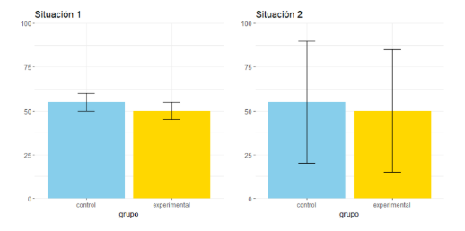

Fernando Blanco P. (2020). Gráfico de LDL – ESTADÍSTICA VISUAL (VIII). Gráficos con barras de error: manual de usuario – Lima, 2020

<em>Figura: Representación visual del costo promedio de errores manuales.</em>

### 1.2.2. Lean UX Process

Lean UX se define como un proceso iterativo y colaborativo que prioriza la experimentación y el aprendizaje continuo sobre la creación de documentación exhaustiva. En lugar de centrarse en entregar un producto final completamente detallado, este enfoque permite a los equipos de diseño y desarrollo trabajar en conjunto para construir prototipos y realizar pruebas rápidas. Estas pruebas se realizan con usuarios reales y en contextos reales, lo que permite validar hipótesis y ajustar el producto en función de los resultados obtenidos. El objetivo principal de Lean UX es reducir el desperdicio y aumentar la eficiencia en el desarrollo del producto, permitiendo a los equipos responder de manera más ágil a las necesidades y expectativas de los usuarios (Gothelf & Seiden, 2013).

#### 1.2.2.1. Lean UX Problem Statements

**¿Cómo podemos crear una herramienta innovadora que motive a los miembros del hogar a gestionar sus finanzas compartidas de manera justa, permitiendo una distribución proporcional de los gastos según sus ingresos individuales?**  
Muchas personas que comparten un hogar enfrentan dificultades al dividir los gastos de manera equitativa. La falta de un sistema justo puede generar conflictos, resentimientos y desorganización financiera. Las herramientas actuales son muy básicas o se limitan a simples divisiones matemáticas que no consideran la capacidad económica de cada persona.

**¿Cómo podemos diseñar una solución que promueva la transparencia, el compromiso y la responsabilidad financiera entre los miembros del hogar?**  
Hemos observado que cuando no existe un registro claro de lo que cada persona debe o ha pagado, surgen confusiones y desconfianza. La ausencia de una herramienta que brinde visibilidad y control compartido dificulta una convivencia armoniosa en el aspecto económico.

**¿Cómo podemos integrar reportes automáticos y alertas que ayuden a los usuarios a cumplir con sus pagos, y que al mismo tiempo den control al representante del hogar para monitorear el estado financiero del grupo?**  
En muchos hogares, una persona se encarga de la administración, pero no siempre tiene los medios para realizar un seguimiento claro. Los recordatorios manuales y el control informal suelen ser ineficientes y pueden causar fricciones innecesarias.

**¿Cómo podemos facilitar una herramienta intuitiva que se adapte tanto a personas con conocimientos básicos de finanzas como a quienes desean un control más detallado de los gastos familiares?**  
Los usuarios necesitan una plataforma sencilla, pero también lo suficientemente flexible para mostrar datos relevantes y personalizables. Muchas soluciones actuales son complejas o no abordan este enfoque colectivo y equitativo.

**¿Cómo podemos fomentar una cultura de ahorro y planificación financiera conjunta dentro del hogar, basada en metas comunes y acuerdos colaborativos?**  
La mayoría de los hogares no tienen metas financieras compartidas ni hábitos de ahorro establecidos en grupo. La falta de planificación colectiva limita el crecimiento económico del hogar y genera dependencia o desigualdad en las contribuciones.

#### 1.2.2.2. Lean UX Assumptions

### Business Outcomes

- Creemos que nuestros usuarios necesitan una herramienta digital para gestionar los gastos del hogar de forma justa y proporcional.  
- Esta necesidad se resuelve con una plataforma que calcula automáticamente cuánto debe aportar cada persona en función de sus ingresos.  
- Nuestros clientes iniciales serán parejas, familias o grupos de convivencia que desean organizar sus finanzas colectivas de forma equitativa.  
- El valor principal que los usuarios esperan es la distribución justa de los gastos según ingresos y la visibilidad de los pagos.  
- Otros beneficios clave incluyen: reportes automáticos, recordatorios de pagos, control centralizado por parte del representante del hogar, y sugerencias para ahorro grupal.  
- Generamos ingresos a través de versiones premium que ofrecen funciones avanzadas como análisis históricos, exportación de datos, y personalización de reglas de reparto.  
- Nuestra principal competencia serán apps de finanzas personales y hojas de cálculo compartidas, pero SplitEasy se destaca por su enfoque colaborativo y equitativo.  
- Superaremos a la competencia ofreciendo personalización basada en ingresos, visibilidad colectiva y herramientas de colaboración.  
- Nuestro mayor riesgo es que los usuarios no confíen en los cálculos o no se adapten al uso de una plataforma compartida.  
- Lo resolveremos con una interfaz intuitiva, algoritmos claros y explicativos, y soporte personalizado.  
- Creemos que al automatizar y transparentar la distribución de gastos, mejoraremos la convivencia, la confianza y la organización financiera del hogar. Si esta hipótesis es incorrecta, podríamos tener baja retención de usuarios.

### User Outcomes

- **¿Quién será nuestro usuario?**  
  Personas que viven en un mismo hogar (parejas, familias, compañeros de piso) y desean organizar los gastos de forma justa.

- **¿Dónde encaja nuestro producto en su vida?**  
  En la planificación y gestión de los gastos mensuales compartidos, desde cualquier lugar, especialmente al momento de dividir pagos importantes como alquiler, luz, agua, comida, etc.

- **¿Qué problemas tiene nuestro producto y cómo se pueden resolver?**  
  Puede haber falta de compromiso o datos erróneos al registrar ingresos. Se resolverá con validación simple, incentivos y recordatorios automáticos.

- **¿Cómo y cuándo es usado nuestro producto?**  
  Es utilizado regularmente al inicio y final de cada mes, y también al hacer pagos importantes o para revisar el estado financiero compartido.

- **¿Qué problemas tiene nuestro producto?**  
  Podría haber resistencia al cambio en hogares con dinámicas ya establecidas. Lo abordaremos facilitando la migración y ofreciendo beneficios visibles desde el primer uso.

- **¿Qué características son importantes?**
  - Cálculo automático proporcional según ingresos  
  - Reportes visuales del estado de aportes  
  - Panel para el representante del hogar  
  - Historial de pagos y contribuciones  
  - Alertas de vencimiento  
  - Objetivos y metas compartidas  
  - Seguridad de datos  
  - Experiencia simple y colaborativa  

#### 1.2.2.3. Lean UX Hypothesis Statements

**Hipótesis 1: Distribución proporcional de gastos**  
Creemos que una herramienta que calcule automáticamente cuánto debe aportar cada miembro del hogar según sus ingresos fomentará una convivencia más justa y organizada.  
_Sabremos que estamos bien cuando al menos el 70% de los usuarios reporten una disminución de conflictos por dinero y una mayor satisfacción con el reparto de gastos en los primeros tres meses de uso._

**Hipótesis 2: Supervisión por el representante del hogar**  
Creemos que permitir que un representante tenga una visión general del estado financiero del grupo y reciba alertas mejorará la gestión y cumplimiento de los pagos.  
_Sabremos que estamos bien cuando veamos una reducción en pagos atrasados y un uso activo del panel de control por parte del representante en al menos el 60% de los hogares registrados._

#### 1.2.2.4. Lean UX Canvas

  

## Segmentos Objetivos

Para realizar un análisis concreto sobre los segmentos objetivo de SplitEasy, es importante profundizar en las características de cada grupo:

### Segmento objetivo 1: Personas del hogar

Este segmento está compuesto por los miembros que conviven en un hogar y participan directamente en la distribución de los gastos compartidos.

**Aspectos demográficos:**
- Sexo: Masculino y femenino  
- Edades: 18 - 65 años  
- Nivel socioeconómico: Clases A, B y C (alta, media-alta y media)  
- Estado civil: Solteros, casados, convivientes, parejas, compañeros de cuarto  

**Aspectos geográficos:**
- Nacionalidad: Peruana  
- Zona geográfica en la que vive: Urbana y suburbana  
- Departamento: Lima Metropolitana y otras ciudades principales  

**Aspectos psicográficos:**
- Buscan una forma equitativa de compartir los gastos del hogar, como la renta, los servicios, y otros gastos comunes.  
- Interesados en herramientas que les permitan gestionar sus finanzas de manera transparente y justa.  
- Preocupados por mantener un equilibrio financiero entre los miembros del hogar, asegurando que cada uno aporte según sus ingresos.
- Tienen un estilo de vida que involucra convivencia y responsabilidades compartidas, por lo que valoran la facilidad de distribución de gastos. 

Este segmento refleja a los usuarios finales de SplitEasy, quienes necesitan una plataforma que facilite la coordinación de gastos dentro de la convivencia diaria, promoviendo transparencia y equidad.

### Segmento objetivo 2: Representante del hogar

Este segmento está compuesto por la persona encargada de planificar y supervisar los gastos del hogar, asegurando que la distribución sea equitativa y eficiente.

**Aspectos demográficos:**
- Sexo: Masculino y femenino  
- Edades: 25 - 50 años  
- Nivel socioeconómico: Clases A, B y C (alta, media-alta y media)  
- Estado civil: Casados, convivientes, parejas con hijos, o personas responsables del control de finanzas familiares  

**Aspectos geográficos:**
- Nacionalidad: Peruana  
- Zona geográfica en la que vive: Urbana y suburbana  
- Departamento: Lima Metropolitana y otras ciudades principales  

**Aspectos psicográficos:**
- Encargados de la planificación y distribución de los gastos del hogar, buscando equidad entre los miembros.
- Interesados en herramientas tecnológicas que faciliten la gestión de las finanzas y el monitoreo de los gastos de manera sencilla. 
- Preocupados por el bienestar financiero del hogar y por evitar conflictos económicos entre los miembros. 
- Comprometidos con la gestión eficiente de los recursos, asegurando que todos los gastos se distribuyan proporcionalmente a los ingresos.

Este segmento es clave para la adopción de SplitEasy, ya que son los usuarios que toman decisiones sobre la organización financiera del hogar y buscan soluciones que optimicen la equidad y la transparencia en la gestión de presupuestos compartidos.

# Chapter 2: Requirements Elicitation & Analysis

## 2.1. Competidores
### 2.1.1. Analisis Competitivo

#### ¿Por qué llevar a cabo este análisis?
Analizar la competencia en el mercado de gestión energética para hogares inteligentes.  
Comparar fortalezas, debilidades y estrategias para identificar oportunidades y amenazas.

| Categoría                  | SplitEasy (Nuestra startup)                                                                                         |    Splitwise                                                                                       |     Tricount                                                                                        |     SettleUp                                                                                       |
|---------------------------|----------------------------------------------------------------------------------------------------------------|--------------------------------------------------------------------------------------------------|-------------------------------------------------------------------------------------------------|------------------------------------------------------------------------------------------------|
| **Perfil - Overview**     | Aplicación de gestión financiera del hogar. Divide los gastos tomando en cuenta los ingresos.                 | Plataforma para dividir gastos entre amigos o grupos.                                           | App para dividir fácilmente gastos en grupo, ideal para eventos o viajes.                     | App para registrar deudas compartidas en contextos no permanentes como viajes o salidas.     |
| **Ventaja competitiva**   | Reparto justo y automatizado según ingresos. Fomenta equidad y transparencia.                                  | División rápida y sencilla. Reduce fricción para saldar deudas.                                | Registro ágil y claro para gastos grupales.                                                    | Claridad visual del seguimiento de pagos en grupo.                                            |
| **Perfil de Marketing**   |                                                                                                                |                                                                                                  |                                                                                                 |                                                                                                |
| Mercado objetivo          | Familias, parejas y roommates con economías compartidas y distintos niveles de ingreso.                        | Grupos de amigos o compañeros que comparten gastos ocasionalmente.                             | Grupos pequeños que hacen actividades conjuntas.                                               | Grupos de amigos jóvenes que comparten actividades.                                           |
| Estrategias de marketing  | Enfocado en la equidad financiera y automatización. Redes sociales, foros y comunidades financieras.            | Comunicación clara, fuerte presencia en redes sociales, marketing de conveniencia.             | Promoción basada en simplicidad, interfaz amigable.                                            | Publicidad a grupos sociales, organización visual como ventaja clave.                         |
| **Perfil de Producto**    |                                                                                                                |                                                                                                  |                                                                                                 |                                                                                                |
| Productos y servicios     | Plataforma para dividir gastos del hogar según ingresos. Incluye reportes, historial, metas y seguimiento.     | Registro y división de gastos compartidos. Incluye recordatorios y sincronización.             | División rápida de cuentas grupales, interfaz sencilla.                                        | Gestión visual de gastos compartidos con gráficas.                                            |
| Precios y costos          | Freemium: versión gratuita con funciones básicas. Premium: reportes, metas, recordatorios, exportación.        | Freemium: básica gratis, Pro con extras como exportación.                                       | Gratuita, opción a donaciones. Publicidad como ingreso.                                        | Gratis con opción de pago para quitar anuncios o funciones extra.                             |
| Canales de distribución   | App móvil (Google Play y App Store), redes sociales, foros, influencers de finanzas personales.                | App Store, Google Play, redes sociales, recomendaciones orgánicas.                             | App Store, Google Play, SEO en búsquedas de dividir gastos.                                   | App Store, Google Play, marketing boca a boca, redes sociales.                                |
| **Análisis SWOT**         |                                                                                                                |                                                                                                  |                                                                                                 |                                                                                                |
| Fortalezas                | Equidad proporcional basada en ingresos. Automatización. Foco en convivencia y economía compartida.            | Base de usuarios sólida. Interfaz amigable. Integraciones.                                      | Fácil de usar. Rápida. Sin registro en muchos casos.                                           | Diseño visual atractivo. Funciones colaborativas.                                             |
| Debilidades               | Proyecto en etapa inicial. Requiere datos sensibles (ingresos).                                                | Limitado a divisiones iguales o manuales. No considera ingresos.                               | Funciones limitadas. Sin seguimiento histórico.                                                | Funciones avanzadas tras muro de pago.                                                        |
| Oportunidades             | Más hogares con economías compartidas. Creciente interés en equidad y herramientas de finanzas personales.     | Posibilidad de añadir personalización o justicia financiera.                                   | Expandir mercado o integrar con fintech.                                                       | Alianzas con bancos o billeteras digitales.                                                   |
| Amenazas                  | Competencia consolidada. Preferencia por métodos tradicionales (Excel, notas, billeteras físicas).             | Lo mismo: herramientas tradicionales siguen siendo usadas.                                      | Puede quedar rezagada frente a apps con más recursos.                                          | Entrada de bancos o apps de pago con funciones similares.                                     |

### 2.1.2. Estrategias y tácticas frente a competidores

SplitEasy se diferencia de sus competidores mediante una propuesta de valor centrada en la equidad real, considerando los ingresos de cada persona en la distribución de gastos compartidos. Esta estrategia permite posicionarse en un nicho aún poco explorado por aplicaciones como Splitwise, Tricount o SettleUp, las cuales se enfocan en divisiones igualitarias o personalizadas manualmente, pero no abordan el concepto de proporcionalidad basada en capacidad económica.

#### Estrategia de diferenciación por valor social
SplitEasy enfatiza la justicia financiera dentro del hogar, reduciendo conflictos y mejorando la convivencia. Esto lo distingue de aplicaciones que solo calculan deudas sin contexto social o económico.

**Táctica:** Enfoque educativo y emocional en el marketing. Se utilizarán campañas que destaquen cómo la equidad mejora relaciones personales, apoyándose en testimonios, ejemplos reales y visuales que generen empatía.

#### Estrategia de funcionalidad avanzada desde el inicio
A diferencia de apps que limitan sus funciones en versiones gratuitas, SplitEasy ofrecerá desde el principio características como:

- Cálculo proporcional según ingresos  
- Reportes automáticos mensuales  
- Gestión de metas financieras comunes  

**Táctica:** Modelo freemium con funciones realmente diferenciadoras. Se ofrecerá una versión gratuita funcional y una versión premium con proyecciones financieras, integración bancaria y recordatorios automáticos.

#### Estrategia de comunidad y crecimiento orgánico
Incentivar la recomendación entre roommates, parejas y familias, priorizando experiencias compartidas y simplicidad.

**Táctica:** Sistema de referidos y uso colaborativo. Cada nuevo usuario puede invitar fácilmente a su grupo de convivencia, con beneficios pequeños como más espacio de historial o funciones extra por cada referido activo.

## 2.2. Entrevistas

### 2.2.1. Diseño de Entrevistas

**Propósito de la entrevista:**  
SplitEasy busca ofrecer una solución digital que permita distribuir los gastos del hogar de forma equitativa, basándose en los ingresos de cada miembro. Esta entrevista tiene como objetivo comprender las necesidades, hábitos y expectativas de las personas que comparten gastos del hogar, así como de quienes asumen la responsabilidad de administrarlos. Esta información nos permitirá diseñar una herramienta que promueva la transparencia, evite conflictos financieros y se ajuste a las realidades de los hogares peruanos actuales.

**¿Está usted dispuesto(a) a participar en una breve entrevista que nos ayude a crear una aplicación que facilite la gestión justa de los gastos en el hogar?**

### Segmento objetivo 1: Personas del hogar

**Aspectos demográficos y psicográficos clave**

- Sexo: Masculino y femenino  
- Edad: 18 a 65 años  
- Nivel socioeconómico: A, B, y C  
- Estado civil: Solteros, casados, convivientes, parejas, roommates  
- Zona: Urbana y suburbana (Perú)

**Preguntas:**

1. ¿Con quién vive actualmente y cómo reparten los gastos del hogar?  
2. ¿Considera justo el sistema que usan para dividir los pagos? ¿Por qué?  
3. ¿Cuáles son los mayores retos al organizar los gastos compartidos?  
4. ¿Han tenido desacuerdos por temas de dinero o pagos en el hogar?  
5. ¿Han considerado dividir los gastos en función de los ingresos de cada persona?  
6. ¿Utilizan alguna app para anotar los pagos del hogar? ¿Cuál y qué tan útil les resulta?  
7. ¿Qué funcionalidades cree que debería tener una app ideal para gestionar gastos entre varias personas?  
8. ¿Cómo le gustaría visualizar lo que le toca pagar, lo que ya pagó y lo que está pendiente?  
9. ¿Cree que una aplicación como SplitEasy podría ayudar a mejorar la convivencia y la organización en su hogar?

### Segmento objetivo 2: Representante del hogar

**Aspectos demográficos y psicográficos clave**

- Sexo: Masculino y femenino  
- Edad: 25 a 50 años  
- Nivel socioeconómico: A, B, y C  
- Estado civil: Casados, convivientes, parejas con hijos, personas responsables de las finanzas del hogar  
- Zona: Urbana y suburbana (Perú)

**Preguntas:**

1. ¿Cuál es su rol dentro de su hogar en cuanto a la administración del dinero?  
2. ¿Cómo organiza actualmente los ingresos y gastos del hogar?  
3. ¿Considera que el reparto de los gastos es equitativo para todos los miembros?  
4. ¿Qué dificultades enfrenta para lograr un reparto justo de los gastos?  
5. ¿Cómo controla que cada miembro cumpla con su parte financiera?  
6. ¿Qué herramientas (apps, cuadernos, Excel, etc.) usa actualmente para llevar este control?  
7. ¿Qué funcionalidades le gustaría que tenga una app como SplitEasy?  
8. ¿Qué tan importante considera la transparencia financiera dentro del hogar?  
9. ¿Estaría dispuesto(a) a registrar los ingresos de cada miembro para que la aplicación calcule automáticamente cuánto debe aportar cada uno?  
10. ¿Qué beneficios cree que traería una solución como SplitEasy en la convivencia familiar?

### 2.2.2. Registro de entrevistas

#### **Primer Segmento - Personas del Hogar:**  

| **ENTREVISTA 1** | |
|------------------|----------------------------|
| **Nombre entrevistado** | Cristian Campos |
| **Edad** | 23 |
| **Profesión** | Estudiante de Ingeniería Civil |
| **Departamento** | Lima |
| **Inicio del video** | 00:00 |
| **Fin del video** | 04:08 |
| **Link del video** | https://goo.su/SxaUdL |
| **Foto entrevista** |  |
| **Resumen** | Cristian actualmente vive con su madre y su hermano mayor. No reparten los gastos de forma equitativa, lo que genera conflictos internos porque a veces quien gana más paga menos y quien gana menos paga más. El principal reto es la falta de una herramienta que permita dividir los gastos proporcionalmente a los ingresos. No usan ninguna app para llevar el registro de pagos; simplemente asignan los gastos sin reglas claras. Cristian considera que la app ideal debería permitir designar todos los gastos, registrar pagos y pendientes de manera clara, y tener una interfaz limpia y fácil de entender, especialmente para personas mayores. Cree que una aplicación como SplitEasy podría mejorar la convivencia y la organización del hogar. |

| **ENTREVISTA 2** | |
|------------------|----------------------------|
| **Nombre entrevistado** | Juan Manuel Álvarez Ortega |
| **Edad** | — |
| **Profesión** | Estudiante egresado / Analítica de datos |
| **Departamento** | Lima |
| **Inicio del video** | 00:00 |
| **Fin del video** | 04:44 |
| **Link del video** | https://goo.su/MIazHVt |
| **Foto entrevista** |  |
| **Resumen** | Juan Manuel vive con sus padres y hermanos. Los gastos del hogar se reparten de forma desigual: los servicios de luz, agua y desarrollo los pagan principalmente sus padres, mientras que Internet y telefonía los pagan él y sus hermanos mayores. Considera que el sistema no es totalmente justo, ya que algunas personas que ganan más pagan menos. Los principales retos son coordinar quién paga qué y lidiar con posibles préstamos entre miembros. Actualmente usan Excel para registrar los pagos, pero esto solo enumera los pagos sin facilitar la distribución equitativa. Juan Manuel considera que una app ideal debería dividir correctamente los gastos según cada persona, enviar recordatorios de pago y mostrar de manera clara lo que cada uno debe pagar, lo que ya pagó y lo pendiente. Cree que **SplitEasy** podría mejorar la organización y convivencia familiar. |

| **ENTREVISTA 3** | |
|------------------|----------------------------|
| **Nombre entrevistado** |Milenko Rubén Cayanchi   |
| **Edad** | 19 |
| **Profesión** | Estudiante de Ingeniería de Software |
| **Departamento** | Lima |
| **Inicio del video** | 0:00 |
| **Fin del video** | 7:46 |
| **Link del video** | https://goo.su/KJ2f4D |
| **Foto entrevista** |  |
| **Resumen** | Milenko es un miembro de una familia donde solo el padre de familia trabaja y es el representante y paga los gastos del hogar actualmente. Su situación familiar es sencilla en la que, si bien actualmente la madre no puede trabajar, ambos padres se ponen de acuerdo en las contribuciones con facilidad. Cree que la aplicación puede ser más útil con familias donde haya más de un solo miembro que trabaja y que pueda contribuir. En su situación familiar no daría tanto impacto a diferencia de en otras familias que tengan más miembros contribuyentes. |

#### **Segundo Segmento - Representantes del Hogar:**

| **ENTREVISTA 1** | |
|------------------|----------------------------|
| **Nombre entrevistado** | Vannya Herrera |
| **Edad** | 29 |
| **Profesión** | Medicina Familiar |
| **Departamento** | Lima |
| **Inicio del video** | 00:00 |
| **Fin del video** | 05:25 |
| **Link del video** | https://goo.su/7hyRk8 |
| **Foto entrevista** |  |
| **Resumen** | La doctora Vannya Herrera actualmente vive con su esposo y forma con él una representante del hogar. Entre ella y él administran los gastos en un documento excel de forma mensual, por lo que la deben rehacer cada mes. Como ellos tienen sueldos distintos, es complicado hacer un cálculo proporcional de forma manual en este excel. La repartición resulta justa pero complicada dada la inestabilidad de los ingresos entrante. Esperan de la aplicación de nuestro startup un reporte preciso de ingresos, egresos y ahorro total en períodos de tiempo.  |

| **ENTREVISTA 2** | |
|------------------|----------------------------|
| **Nombre entrevistado** | Paul Requejo |
| **Edad** | 33 |
| **Profesión** | Policía |
| **Departamento** | Lima |
| **Inicio del video** | 0:00 |
| **Fin del video** | 8:03 |
| **Link del video** | https://goo.su/GXelFH |
| **Foto entrevista** |  |
| **Resumen** | El oficial Paul Requejo organiza equitativamente los gastos con su pareja. Afirma que ambos aportan en lo que se han puesto de acuerdo. Sin embargo, carecen de planificaciones concretas y a veces ponerse de acuerdo es difícil dada la diferencia de sueldos significativa. Cree que una app como SplitEasy tenga un buen impacto en su convivencia familiar y espera de ella una funcionalidad útil como asesoramiento económico porque a veces tienen poca disciplina al administrar sus recursos. |

| **ENTREVISTA 3** | |
|------------------|----------------------------|
| **Nombre entrevistado** | Gianelly Vásquez |
| **Edad** | 25 |
| **Profesión** | Estudiante |
| **Departamento** | Lima |
| **Inicio del video** | 00:00 |
| **Fin del video** | 04:46 |
| **Link del video** | https://goo.su/pBWp |
| **Foto entrevista** |  |
| **Resumen** | Gianelly convive con dos amigas, con quienes comparte un departamento. Dividen los gastos fijos como alquiler, agua, luz e Internet por igual, y los gastos variables como supermercado se compensan al final del mes mediante un registro en grupo de WhatsApp. Considera que la mayor dificultad es cuando alguien olvida registrar sus gastos, complicando el cálculo exacto de quién debe a quién. Actualmente usan un cuaderno y una hoja de Excel sencilla. Gianelly considera que una app ideal debería enviar recordatorios automáticos, registrar gastos con comprobantes en foto y calcular automáticamente los aportes proporcionales de cada miembro. Destaca que la transparencia financiera es muy importante para mantener la confianza y evitar discusiones. Cree que **SplitEasy** ayudaría a organizar mejor los gastos y mejorar la convivencia entre los miembros del hogar. |

### 2.2.3. Análisis de entrevistas

**SEGMENTO - PERSONAS DEL HOGAR:**

| Característica                                          | Tipo      | Evidencia                                     | Porcentaje (3 entrevistas) |
| ------------------------------------------------------- | --------- | --------------------------------------------- | -------------------------- |
| Convivencia con familiares o pareja                     | Objetiva  | Todos viven con su pareja o padres            | 100%                       |
| Ingreso principal asumido por uno solo                  | Objetiva  | En 2/3 casos, solo una persona trabaja        | 67%                        |
| Reparto de gastos según ingresos                        | Subjetiva | 3/3 consideran justo dividir según ingresos   | 100%                       |
| No uso de app financiera actualmente                    | Objetiva  | Ninguno usa app, pero estarían dispuestos     | 100%                       |
| Interés por funcionalidades como ahorro y visualización | Subjetiva | Mencionado en todas las entrevistas           | 100%                       |
| Conflictos por temas de dinero                          | Subjetiva | 2/3 han tenido conflictos por pagos           | 67%                        |
| Brecha generacional en adopción digital                 | Subjetiva | Mencionado en entrevista 3 (personas mayores) | 33%                        |

Observaciones clave:
La falta de herramientas digitales no se debe a desinterés, sino a falta de opciones prácticas o conocimiento. Todos los entrevistados están dispuestos a usar una app si esta es intuitiva y útil.

Se evidencian dos arquetipos complementarios:

- El proveedor de hogar joven: trabaja, cubre la mayoría de los gastos, busca una forma justa de organizar.

- El conviviente colaborador tradicional: comparte con padres, usa métodos manuales, dispuesto a adoptar herramientas simples.

**SEGMENTO - REPRESENTANTES DEL HOGAR:**

| Característica                                           | Tipo      | Evidencia                                                     | % (3 entrevistas) |
| -------------------------------------------------------- | --------- | ------------------------------------------------------------- | ----------------- |
| Convivencia con amigos                                   | Objetiva  | Todos viven con amigos, no con familiares o pareja            | 100%              |
| Reparto en partes iguales, pero desequilibrado           | Subjetiva | "A veces uno termina pagando más que el otro"                 | 100%              |
| No uso de app, solo notas compartidas                    | Objetiva  | WhatsApp y notas, pero no actualizadas siempre                | 100%              |
| Necesidad de herramientas visuales                       | Subjetiva | "Gráficos o barras fáciles de entender"                       | 100%              |
| Problemas para recordar pagos                            | Subjetiva | "A veces no recordamos quién pagó qué"                        | 100%              |
| Funcionalidades deseadas: recordatorios, claridad visual | Subjetiva | "Registrar pagos, ver quién debe qué, y enviar recordatorios" | 100%              |

**Observaciones clave:**

  La falta de un sistema estructurado y la dependencia de herramientas informales como WhatsApp y notas en celulares se destacan como puntos de mejora. Los gráficos y recordatorios automáticos son cruciales para mejorar la convivencia y evitar malentendidos por los pagos.
  
  El arquetipo final emergente sería:
  “El roommate organizado pero caótico”: joven que busca mantener la equidad en los pagos, pero necesita soluciones tecnológicas que simplifiquen la administración de gastos y eviten conflictos.

## 2.3 Needfinding

Las necesidades principales que hemos encontrado en nuestros segmentos objetivos son las siguientes:

#### Segmento #1: Personas del hogar
- Distribuir los gastos del hogar de manera equitativa según ingresos  
- Tener visibilidad clara de los aportes y gastos compartidos  
- Evitar conflictos financieros dentro de la convivencia  
- Usar herramientas digitales que simplifiquen la organización de pagos  

#### Segmento #2: Representante del hogar
- Gestionar y supervisar los pagos del hogar de forma centralizada  
- Recibir recordatorios automáticos y reportes financieros claros  
- Asegurar la equidad y transparencia en la distribución de los gastos  
- Ahorrar tiempo en la planificación financiera y evitar malentendidos  

### 2.3.1. User Personas

**Segmento #1: Personas del hogar / User Persona: Camila Torres**

  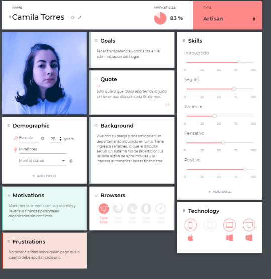

**Segmento #2: Representante del hogar / User Persona: Javier Morales**

  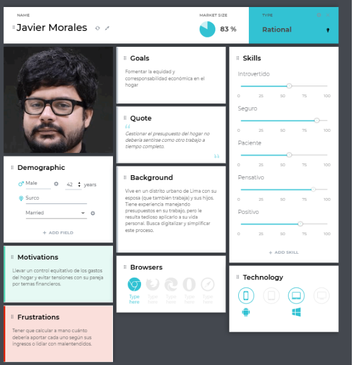

### 2.3.2. User Task Matrix
En esta sección se presenta la User Task Matrix, una herramienta enfocada en los 2 segmentos clave de usuarios de SplitEasy, en miembro del hogar y en responsable del hogar, que permite identificar sus tareas habituales y principales necesidades. Este análisis resulta fundamental para establecer prioridades al momento de definir las funcionalidades del producto e integrar el product backlog. Para la dimensión de frecuencia, se han utilizado cinco niveles: never, rarely, sometimes, often y always; y para la importancia, tres niveles: low, medium y high.

| **User Task**                                              | **Camila Torres - Miembro del hogar** |                                     | **Javier Morales - Responsable del hogar** |                                     |
|------------------------------------------------------------|----------------------------------------|-------------------------------------|--------------------------------------------|-------------------------------------|
|                                                            | **Frecuencia**                         | **Importancia**                     | **Frecuencia**                             | **Importancia**                     |
| Registrar y dividir los gastos del hogar                   | Often                                  | High                                | Sometimes                                  | High                                |
| Revisar cuánto debe aportar cada integrante                | Often                                  | High                                | Sometimes                                  | High                                |
| Usar aplicaciones móviles de finanzas compartidas          | Sometimes                              | Medium                              | Sometimes                                  | Medium                              |
| Hablar con los demás sobre gastos y responsabilidades      | Sometimes                              | High                                | Rarely                                     | High                                |
| Verificar si los pagos del mes ya se realizaron            | Often                                  | High                                | Often                                      | High                                |
| Planificar y distribuir el presupuesto del hogar           | Never                                  | Low                                 | Often                                      | High                                |
| Supervisar que los pagos mensuales estén cubiertos         | Never                                  | Low                                 | Often                                      | High                                |
| Calcular cuánto debería aportar cada miembro               | Never                                  | Low                                 | Sometimes                                  | High                                |
| Buscar herramientas para facilitar la gestión financiera   | Sometimes                              | Medium                              | Sometimes                                  | Medium                              |
| Resolver conflictos por dinero entre miembros              | Rarely                                 | High                                | Rarely                                     | High                                |

### 2.3.3. User Journey Mapping
En esta sección se presentarán los user journey mapping para cada user persona. El recorrido comienza cuando una persona del hogar recibe una notificación relacionada a un nuevo gasto compartido, enviada a través de SplitEasy. A partir de ello, consulta su historial de aportes y visualiza cuánto han pagado otros miembros del hogar. Luego, se realiza el cálculo proporcional de lo que debe aportar, basado en reglas previamente acordadas. Posteriormente, se comunica con otros miembros en caso de dudas o para validar el monto. El recorrido finaliza cuando realiza el pago de su parte desde la aplicación o mediante un enlace compartido.

### Segmento 1: Personas del hogar

  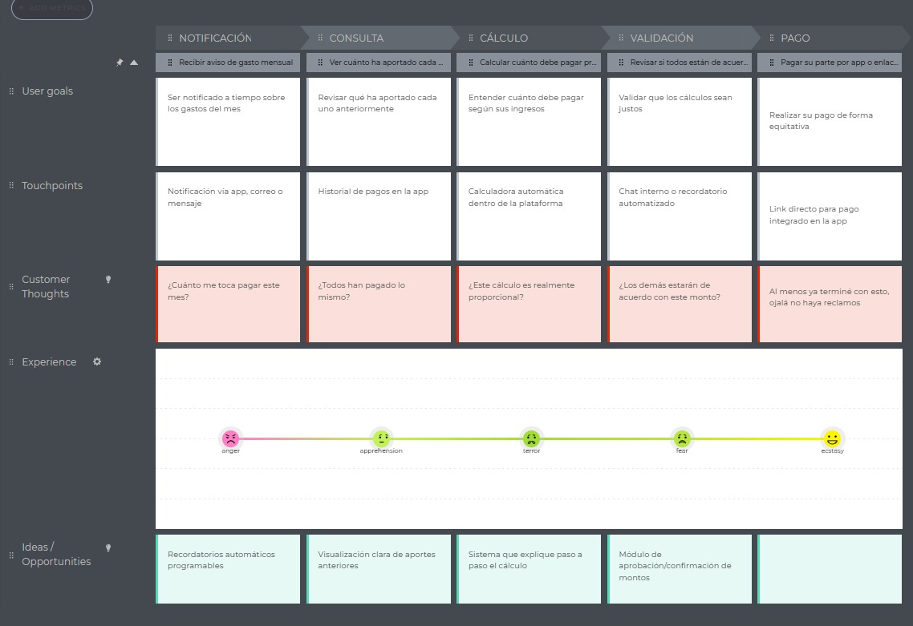

### Segmento 2: Representante del hogar

  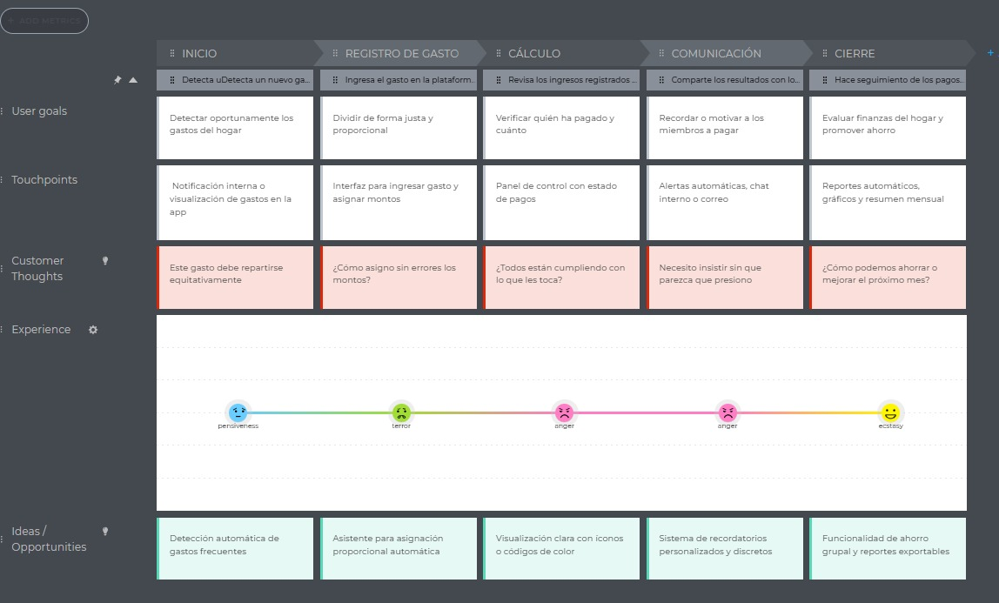

### 2.3.4. Empathy Mapping

### Segmento 1: Personas del hogar

  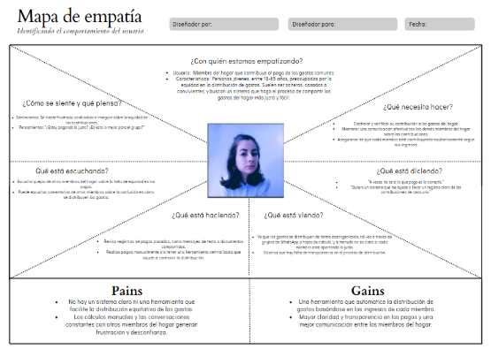

### Segmento 2: Representante del hogar

  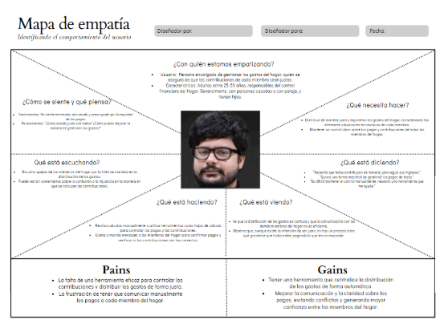

### 2.3.5. As-is Scenario Mapping

### Segmento #1: Personas del Hogar

  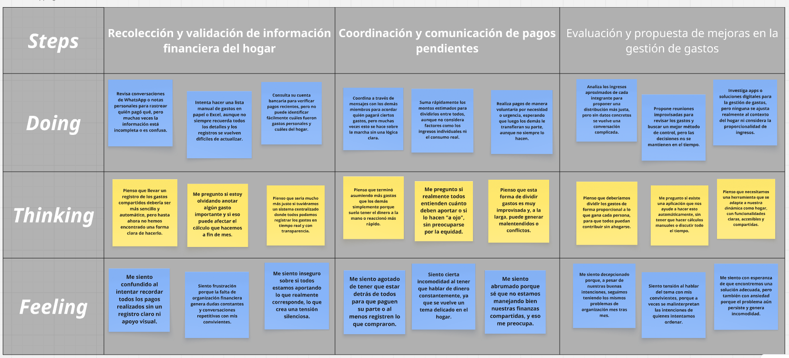

### Segmento #2: Representante del Hogar

  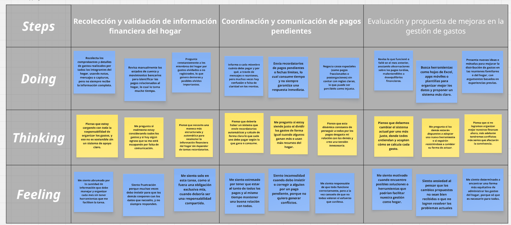

## 2.4. Ubiquitous Language

| **Término en Inglés**          | **Término en Español**       | **Definición**                                                                                                                                           |
|--------------------------------|-----------------------------|----------------------------------------------------------------------------------------------------------------------------------------------------------|
| Household Representative      | Representante del hogar     | Usuario responsable de administrar el hogar dentro del sistema. Tiene permisos especiales para registrar nuevos miembros, ingresar gastos comunes y visualizar los aportes de todos. |
| Household Member              | Miembro del hogar           | Usuario que forma parte de un hogar registrado. Aporta según su capacidad económica y puede visualizar su historial de gastos y contribuciones.              |
| Income-Based Contribution     | Contribución basada en ingresos | Mecanismo mediante el cual se calcula la cantidad que debe aportar cada miembro del hogar, según el ingreso personal declarado. Busca que el reparto sea justo y equitativo. |
| Shared Expense                | Gasto compartido             | Gasto que afecta a todo el hogar y que debe dividirse proporcionalmente entre sus miembros (por ejemplo, alquiler, servicios, compras comunes).              |
| Spending Record               | Registro de gastos          | Documento digital o entrada dentro del sistema que detalla la fecha, el monto, la categoría y quién ingresó el gasto.                                       |
| Contribution Percentage       | Porcentaje de contribución  | Valor en porcentaje que representa la participación proporcional de cada miembro en los gastos comunes del hogar, calculado con base en su ingreso.         |
| Financial Overview            | Resumen financiero          | Vista general de los ingresos, aportes y gastos de un hogar, accesible para sus miembros y con mayor detalle para el representante.                       |
| Pending Contribution          | Contribución pendiente      | Monto que un miembro del hogar aún no ha cubierto con respecto a los gastos registrados. Puede generar recordatorios o alertas.                             |
| Expense Category              | Categoría de gasto          | Clasificación usada para organizar los gastos ingresados (por ejemplo: alimentación, servicios, alquiler, entretenimiento). Facilita el análisis y el seguimiento. |
| Adjustment Report             | Reporte de ajustes          | Documento generado automáticamente por el sistema cuando hay una variación significativa en los ingresos de un miembro, sugiriendo una nueva distribución de aportes. |

# Capítulo 3: Requirements Specification

## 3.1 To-Be Scenario Mapping

### Segmento 1: Miembros del hogar

  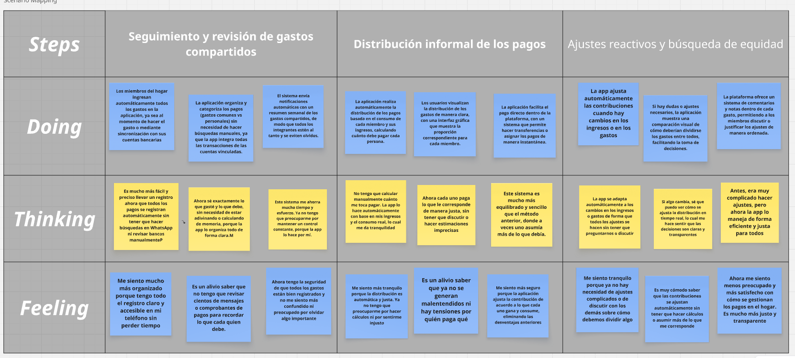

### Segmento 2: Representante del hogar

  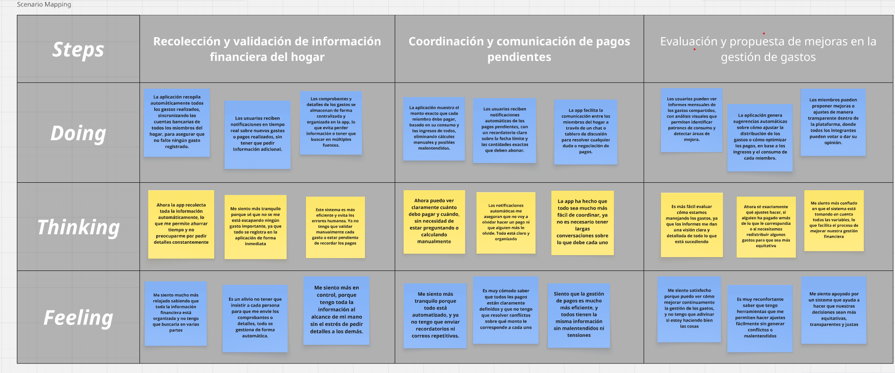

## 3.2. User Stories

### Epic

| **EPIC ID** | **Nombre del Epic**                                              | **Descripción**                                                                                                                        |
| ----------- | ---------------------------------------------------------------- | -------------------------------------------------------------------------------------------------------------------------------------- |
| **EP01**    | **Experiencia del Usuario en la Landing Page**                   | Como usuario, quiero tener una landing page atractiva y funcional para conocer los beneficios y la información clave de la plataforma. |
| **EP02**    | **Registro y Gestión de Perfil**                                 | Como usuario, quiero registrarme y gestionar mi perfil para acceder a la plataforma de manera segura y personalizada.                  |
| **EP03**    | **Gestión y Panel Principal del Hogar (Representante)**          | Como representante del hogar, quiero gestionar y supervisar el hogar y sus miembros desde un panel centralizado y fácil de usar.       |
| **EP04**    | **Gestión de Gastos, Facturas y Contribuciones (Representante)** | Como representante del hogar, quiero gestionar los gastos, contribuciones y facturas de forma eficiente y transparente.                |
| **EP05**    | **Gestión del Rol Miembro y Participación**                      | Como miembro del hogar, quiero tener acceso a mis responsabilidades y una visualización clara de mis pagos y deudas.                   |
| **EP06**    | **Gestión de Pagos y Seguimiento de Contribuciones (Miembro)**   | Como miembro, quiero poder seguir el estado de mis contribuciones y realizar pagos de manera eficiente.                                |

| **User Story ID** | **Título**                                    | **Descripción**                                                                                                                                                                   | **Criterios de Aceptación**                                                                                                                                                                                                                                                                                                                                                                                                                                                                                                                                                                                                                                                                                                                                                                                                   | **Relacionado con (Epic ID)** |
| ----------------- | --------------------------------------------- | --------------------------------------------------------------------------------------------------------------------------------------------------------------------------------- | ----------------------------------------------------------------------------------------------------------------------------------------------------------------------------------------------------------------------------------------------------------------------------------------------------------------------------------------------------------------------------------------------------------------------------------------------------------------------------------------------------------------------------------------------------------------------------------------------------------------------------------------------------------------------------------------------------------------------------------------------------------------------------------------------------------------------------- | ----------------------------- |
| **US01**          | Vista General de Beneficios y Funcionalidades | Como usuario potencial, quiero ver una descripción general de los beneficios y funcionalidades clave de la plataforma.                                                            | **Escenario 1:** El usuario potencial visita la página principal.   Dado que el usuario potencial ha accedido a la página de inicio, cuando navega hacia la sección de beneficios y funcionalidades, entonces puede ver una descripción clara y visualmente destacada de las características clave de la plataforma.                                                                                                                                                                                                                                                                                                                                                                                                                                                                                                       | **EP01**                      |
| **US02**          | Resumen de la Empresa                         | Como visitante, quiero ver un resumen de la empresa para entender su enfoque y valores antes de registrarme.                                                                      | **Escenario 1:** El visitante quiere conocer más sobre la empresa antes de registrarse.   Dado que el visitante navega por la sección "Acerca de" en la página principal, cuando lee el contenido de la misión y visión, entonces puede obtener un resumen claro y conciso sobre la empresa y sus valores.                                                                                                                                                                                                                                                                                                                                                                                                                                                                                                                 | **EP01**                      |
| **US03**          | Navegación Clara y Directa en la Página       | Como usuario potencial, quiero poder navegar de forma clara y directa entre las secciones de la página para encontrar la información que necesito rápidamente.                    | **Escenario 1:** El usuario potencial navega por las secciones de la página.   Dado que el usuario se encuentra en la página principal, cuando interactúa con el menú de navegación principal, entonces puede moverse fácilmente entre las secciones sin perderse o sentir confusión.                                                                                                                                                                                                                                                                                                                                                                                                                                                                                                                                      | **EP01**                      |
| **US04**          | Video de Demostración del Producto            | Como visitante en la landing page, quiero poder ver un video de demostración del producto para conocer mejor la funcionalidad de la app web.                                      | **Escenario 1:** El visitante accede a la página y ve el video.   Dado que soy un visitante en la landing page, cuando accedo a la página, entonces puedo ver un video que muestre la funcionalidad de la app web.   **Escenario 2:** El visitante reproduce el video.   Dado que estoy viendo el video, cuando lo reproduzco, entonces el video se muestra correctamente en pantalla completa o en su contenedor.   **Escenario 3:** Relación con las funcionalidades.   Dado que soy un visitante, cuando veo el video, entonces debe estar claramente relacionado con las funcionalidades de la app. | **EP01**                      |
| **US05**          | Iniciar Sesión Rápido y Visible               | Como usuario de la plataforma, quiero poder iniciar sesión desde un enlace visible en la página principal para acceder rápidamente a mi cuenta.                                   | **Escenario 1:** El usuario busca iniciar sesión.   Dado que el usuario accede a la página principal, cuando localiza el enlace de inicio de sesión en la esquina superior derecha, entonces puede hacer clic en el enlace e iniciar sesión fácilmente.                                                                                                                                                                                                                                                                                                                                                                                                                                                                                                                                                                    | **EP01**                      |
| **US06**          | Registro de Cuenta y Rol Inicial              | Como nuevo usuario, quiero crear una cuenta proporcionando mi nombre de usuario, correo electrónico, contraseña y rol, para poder acceder a la plataforma con permisos adecuados. | **Escenario 1:** El usuario crea una cuenta.   Dado que completo los campos necesarios (usuario, correo, contraseña, rol e ingresos), cuando presiono "Crear tu cuenta", entonces veo un mensaje de éxito y soy redirigido al inicio de sesión.                                                                                                                                                                                                                                                                                                                                                                                                                                                                                                                                                                            | **EP02**                      |
| **US07**          | Acceso y Validación de Credenciales           | Como usuario registrado, quiero iniciar sesión con mi usuario y contraseña, y recibir un mensaje claro si mis credenciales son incorrectas.                                       | **Escenario 1:** El usuario ingresa credenciales válidas.   Dado que ingreso un usuario y contraseña válidos, cuando presiono "Iniciar sesión", soy redirigido al dashboard.   **Escenario 2:** El usuario ingresa credenciales incorrectas.   Si las credenciales son incorrectas, se muestra un mensaje de error claro.                                                                                                                                                                                                                                                                                                                                                                                                                                                                                            | **EP02**                      |
| **US08**          | Recuperación de Contraseña                    | Como usuario registrado, quiero poder recuperar mi contraseña si la olvido, para restablecer el acceso a mi cuenta.                                                               | **Escenario 1:** El usuario recupera la contraseña.   Dado que hago clic en "¿Olvidaste tu contraseña?", cuando ingreso mi correo electrónico, recibo un mensaje de confirmación y un correo con el enlace de restablecimiento.                                                                                                                                                                                                                                                                                                                                                                                                                                                                                                                                                                                            | **EP02**                      |
| **US09**          | Selección de Idioma                           | Como usuario, quiero poder seleccionar el idioma de la interfaz antes de iniciar sesión o registrarme, para usar la aplicación en mi idioma preferido.                            | **Escenario 1:** El usuario selecciona un idioma.   Dado que hago clic en el selector de idioma y selecciono un nuevo idioma, entonces todo el texto de la pantalla cambia a ese idioma.                                                                                                                                                                                                                                                                                                                                                                                                                                                                                                                                                                                                                                   | **EP02**                      |
| **US10**          | Configuración Inicial del Hogar               | Como Representante, quiero crear y configurar un hogar donde pueda definir un nombre, descripción y moneda principal, para comenzar a gestionarlo.                                | **Escenario 1:** El representante crea el hogar.   Dado que soy un Representante sin hogar, cuando inicio sesión, se me solicita crear un hogar ingresando nombre, descripción y seleccionando la moneda. Cuando presiono "Crear Hogar", soy redirigido al panel principal.                                                                                                                                                                                                                                                                                                                                                                                                                                                                                                                                                | **EP03**                      |
| **US11**          | Navegación y Panel Principal                  | Como Representante, quiero que la navegación sea bloqueada hasta que cree un hogar, y que al tenerlo, se me muestre el resumen del hogar en el panel.                             | **Escenario 1:** El representante navega antes de crear el hogar.   Dado que soy un Representante sin hogar, cuando intento navegar en el sistema, la navegación está bloqueada.   **Escenario 2:** El representante ve el resumen del hogar.   Cuando tengo un hogar configurado, la pantalla de inicio muestra el resumen del hogar y el menú lateral habilitado.                                                                                                                                                                                                                                                                                                                                                                                                                                                  | **EP03**                      |
| **US12**          | Resumen del Hogar y Perfil                    | Como Representante, quiero ver en la pantalla principal el resumen del hogar con métricas clave, y acceder rápidamente a mi perfil con mi rol y datos.                            | **Escenario 1:** El representante ve el resumen.   Dado que accedo a la pantalla de inicio, veo tarjetas con las métricas de miembros, cuentas y contribuciones, y el nombre/descripción del hogar. También puedo ver mi perfil con mi nombre y rol como Representante.                                                                                                                                                                                                                                                                                                                                                                                                                                                                                                                                                    | **EP03**                      |
| **US13**          | Gestión de Miembros                           | Como Representante, quiero poder añadir, eliminar y gestionar a los miembros de mi hogar de forma sencilla.                                                                       | **Escenario 1:** El representante gestiona miembros.   Dado que accedo a la pestaña de miembros, puedo añadir miembros por correo electrónico, eliminar miembros con confirmación y ver su información de ingresos. Si elimino un miembro, sus contribuciones deben ser ajustadas según la lógica del hogar.                                                                                                                                                                                                                                                                                                                                                                                                                                                                                                               | **EP03**                      |
| **US14**          | Registro y Visualización de Facturas          | Como Representante, quiero registrar nuevas facturas con descripción, monto y fecha, y verlas en una lista tabular con todos los detalles.                                                        | **Escenario 1:** El representante registra una factura.   Dado que presiono "+Registrar Factura", ingreso la descripción, monto y fecha, y cuando presiono "Guardar", la factura aparece en la lista de facturas del hogar en la pestaña "Cuentas".                                                                                                                                                                                                 | **EP04**                      |
| **US15**          | Edición y Eliminación de Facturas             | Como Representante que creó una factura, quiero poder editar o eliminar la factura si cometí un error o necesito actualizar los datos.                                                            | **Escenario 1:** El representante edita una factura.   Dado que presiono el ícono de edición en una factura registrada, puedo modificar los datos y actualizar la factura.   **Escenario 2:** El representante elimina una factura.   Dado que presiono el ícono de eliminación en una factura registrada, puedo eliminar la factura de la lista.                                                                                             | **EP04**                      |
| **US16**          | Creación y Configuración de Contribución      | Como Representante, quiero crear una contribución asociándola a un comprobante, seleccionar la estrategia de reparto, definir la descripción, y asignar los miembros que participarán en el pago. | **Escenario 1:** El representante crea una contribución.   Dado que presiono "+Nueva contribución", selecciono un Comprobante, Estrategia de reparto, ingreso la Descripción, Fecha Límite, y selecciono los Miembros opcionales, entonces la contribución se crea y la deuda se distribuye según la estrategia seleccionada y los miembros asignados.                                                                                              | **EP04**                      |
| **US17**          | Revisión y Aprobación de Comprobantes de Pago | Como Representante, quiero ver qué contribuciones tienen pagos pendientes de revisión, acceder a los detalles y aprobar o rechazar los pagos de los miembros.                                     | **Escenario 1:** El representante revisa los pagos pendientes.   Dado que un Miembro sube un comprobante, cuando accedo a la pestaña Contribuciones, veo los pagos pendientes. Al hacer clic en un comprobante, puedo revisar los detalles y aprobar o rechazar el pago.   **Escenario 2:** El representante aprueba un pago.   Al aprobar, el estado cambia a "Pagado", y al rechazar, se marca como "Pendiente" y el miembro es notificado. | **EP04**                      |
| **US18**          | Resumen del Miembro y Miembros del Hogar      | Como Miembro, quiero ver un resumen personal de mis pagos, contribuciones activas, y una lista de todos los miembros de mi hogar, incluyendo su rol.                                              | **Escenario 1:** El miembro ve su resumen personal.   Dado que soy un Miembro en un hogar, cuando accedo al panel de inicio, veo un mensaje de bienvenida con mi nombre, información sobre las contribuciones activas, la deuda pendiente, los pagos realizados, y la lista de miembros del hogar.                                                                                                                                                  | **EP05**                      |
| **US19**          | Visualización de Deudas y Pagos               | Como Miembro, quiero ver claramente el monto total pendiente de contribuciones y el total de pagos que he realizado hasta la fecha.                                                               | **Escenario 1:** El miembro visualiza su deuda y pagos.   Dado que tengo contribuciones asignadas, la tarjeta "TOTAL PENDIENTE" muestra mi deuda total. Además, la tarjeta "TOTAL PAGADO" muestra la suma de mis pagos realizados en la moneda del hogar.                                                                                                                                                                                           | **EP05**                      |
| **US20**          | Navegación Habilitada para Miembros           | Como Miembro, quiero tener acceso a las secciones de "Contribuciones", "Estado" y "Ajustes" desde el menú de navegación, para poder gestionar mis pagos y ver mi estado.                          | **Escenario 1:** El miembro navega por las secciones.   Dado que soy un Miembro, cuando hago clic en "Contribuciones", "Estado" o "Ajustes", soy redirigido a la sección correspondiente para ver mis pagos y detalles del estado de mi participación.                                                                                                                                                                                              | **EP05**                      |
| **US21**          | Visualización y Seguimiento de Contribuciones | Como Miembro, quiero ver una lista de mis contribuciones pendientes y pagadas, con detalles como factura, monto, estrategia, estado y fecha de pago.                                              | **Escenario 1:** El miembro visualiza sus contribuciones.   Dado que accedo a la pestaña "Contribuciones" o "Estado", veo tablas separadas que muestran mis contribuciones pendientes (con el botón "Pagar") y mis contribuciones pagadas (con la fecha de pago).                                                                                                                                                                                   | **EP05**                      |
| **US22**          | Subida de Comprobante y Estado de Revisión    | Como Miembro, quiero poder subir un comprobante de pago para cambiar el estado de la contribución a "En Revisión".                                                                                | **Escenario 1:** El miembro sube un comprobante.   Dado que presiono "Pagar" en una contribución pendiente y subo el comprobante, el estado cambia a "En Revisión" y se refleja en la lista de mis contribuciones.                                                                                                                                                                                                                                  | **EP05**                      |
| **US23**          | Actualización de Estado a "Pagado"            | Como Miembro, quiero que el estado de una contribución cambie a "Pagado" cuando el Representante apruebe mi comprobante de pago.                                                                  | **Escenario 1:** El miembro ve su contribución como pagada.   Dado que el Representante aprueba mi comprobante, el estado de la contribución cambia a "Pagado" y se refleja en mi lista de contribuciones en la pestaña "Estado".                                                                                                                                                                                                                   | **EP05**                      |
| **US24**          | Paginación de Contribuciones                  | Como Miembro, quiero poder navegar entre las páginas de mis contribuciones si tengo muchas registradas.                                                                                           | **Escenario 1:** El miembro navega entre las páginas.   Dado que tengo más de 10 contribuciones, cuando hago clic en los botones de paginación, la tabla se actualiza para mostrar el siguiente lote de contribuciones.                                                                                                                                                                                                                             | **EP05**                      |

**TS**
| **User Story ID** | **Título**                                          | **Descripción**                                                                                                                                                                 | **Criterios de Aceptación**                                                                                                                                                                                                                                                                                                                                                                                                                        | **Relacionado con (Epic ID)** |
| ----------------- | --------------------------------------------------- | ------------------------------------------------------------------------------------------------------------------------------------------------------------------------------- | -------------------------------------------------------------------------------------------------------------------------------------------------------------------------------------------------------------------------------------------------------------------------------------------------------------------------------------------------------------------------------------------------------------------------------------------------- | ----------------------------- |
| TS01              | Implementar autenticación JWT                       | Como desarrollador, quiero que el inicio de sesión implemente autenticación JWT para mayor seguridad en el manejo de sesiones.                                                  | **Escenario 1:** Generación del JWT Dado que el usuario proporciona credenciales correctas, cuando se autentica, entonces el backend genera y responde con un JWT válido. **Escenario 2:** Validación del JWT Dado que el JWT se adjunta en el encabezado de la solicitud, cuando el backend verifica el token, entonces autoriza el acceso si el token es válido.                                                                        | EP02                          |
| TS02              | Cifrar contraseñas en base de datos                 | Como desarrollador, quiero que las contraseñas de los usuarios sean encriptadas antes de guardarlos en la base de datos para garantizar la seguridad.                           | **Escenario 1:** Almacenar contraseña cifrada Dado que el password llega en texto plano, cuando el backend lo encripta, entonces se almacena en la base de datos de forma hashed. **Escenario 2:** Validar contraseña cifrada durante autenticación Dado que el password en base de datos está hashed, cuando el backend verifica credenciales, entonces primero hace el hash de la password ingresada y lo compara con el guardado.      | EP02                          |
| TS03              | Validar roles de administrador y miembro en backend | Como desarrollador, quiero que ciertos endpoints sean usados solo por determinados roles para asegurar que solo los usuarios autorizados puedan ejecutar determinadas acciones. | **Escenario 1:** Acceso permitido a endpoint por rol administrador Dado que el rol incluido en el JWT es administrador, cuando invoque un endpoint administrador, entonces el backend permitirá el acceso. **Escenario 2:** Acceso denegado a endpoint por rol no autorizado Dado que el rol incluido en el JWT es miembro, cuando invoque un endpoint administrador, entonces el backend rechazará la solicitud con 403 (Forbidden).     | EP02                          |
| TS04              | Implementar actualización de perfil a partir de API | Como desarrollador, quiero implementar la actualización del perfil de usuario mediante una API para permitir que los usuarios modifiquen su información de manera segura.       | **Escenario 1:** Actualización exitosa Dado que el token es válido, cuando el usuario envía nuevos datos, entonces el backend actualiza el perfil en la base de datos. **Escenario 2:** Solicitud sin autenticación válida Dado que el token es vencido o inexistente, cuando el backend recibe la solicitud, entonces responde con 401 (Unauthorized).                                                                                   | EP02                          |
| TS05              | Conectar formularios con endpoints                  | Como desarrollador, quiero conectar los formularios de registro y login con los endpoints del backend para que funcionen correctamente.                                         | **Escenario 1:** Envío de datos de registro al backend Dado que el usuario complete el formulario de registro, cuando envía el formulario, entonces el formulario enviará la información al endpoint correspondiente. **Escenario 2:** Autenticación de usuario mediante el backend Dado que el usuario ingrese sus credenciales, cuando el frontend las envía al endpoint de autenticación, entonces el backend valida las credenciales. | EP02                          |
| TS06              | Validar respuestas del backend                      | Como desarrollador, quiero validar las respuestas del backend para mostrar mensajes adecuados al usuario.                                                                       | **Escenario 1:** Error en el registro Dado que haya un error del backend al procesar el registro, cuando el usuario envíe un formulario, entonces se mostrará un mensaje de error específico. **Escenario 2:** Fallo en el inicio de sesión Dado que el backend retorne un 401 Unauthorized, cuando se intente iniciar sesión, entonces el front indicará que las credenciales son inválidas.                                             | EP02                          |
| TS07              | Implementar actualización y eliminación de gastos   | Como desarrollador, quiero poder actualizar o eliminar gastos.                                                                                                                  | **Escenario 1:** Actualización Dado que el gasto existe, cuando el administrador envía nuevos datos, entonces el backend actualiza el registro. **Escenario 2:** Eliminado Dado que el administrador solicita borrar, cuando el backend elimina el gasto, entonces deja de aparecer en futuros reportes.                                                                                                                                  | EP04                          |
| TS8              | Verificar integración de gastos                     | Como desarrollador, quiero verificar que el backend de gastos esté correctamente conectado al frontend.                                                                         | **Escenario 1:** Mostrar lista de gastos Dado que haya gastos registrados, cuando el usuario acceda a la sección de gastos, entonces se mostrará la información proveniente del backend. **Escenario 2:** Agregar gasto Dado que se complete el formulario, cuando se presione "Guardar", entonces se guardará mediante la API y se actualizará la vista.                                                                                 | EP04                          |

### EP01 - Experiencia del Usuario en la Landing Page

| **Story ID** | **Título**                                    |
| ------------ | --------------------------------------------- |
| US-01        | Vista General de Beneficios y Funcionalidades |
| US-02        | Resumen de la Empresa, Misión y Visión      |
| US-03        | Navegación Clara y Directa en la Página      |
| US-04        | Demostración Visual del Producto (Video)     |
| US-05        | Iniciar Sesión Rápido y Visible              |

### EP02 - Registro y Gestión de Perfil

| **Story ID** | **Título**                          |
| ------------ | ----------------------------------- |
| US-06       | Registro de Cuenta y Rol Inicial    |
| US-07       | Acceso y Validación de Credenciales |
| US-08       | Recuperación de Contraseña          |
| US-09       | Selección de Idioma                 |
| TS01        | Implementar autenticación JWT                                        |
| TS02        | Cifrar contraseñas en base de datos                                  |
| TS03        | Validar roles de administrador y miembro en backend                  |
| TS04        | Implementar actualización de perfil a partir de API                  |
| TS05        | Conectar formularios de registro y login del front-end con endpoints |
| TS06        | Validar respuestas del backend en la gestión de perfil del usuario   |

### EP03 - Gestión y Panel Principal del Hogar (Representante)
| **Story ID** | **Título**                      |
| ------------ | ------------------------------- |
| US-10       | Configuración Inicial del Hogar |
| US-11       | Navegación y Panel Principal    |
| US-12       | Resumen del Hogar y Perfil      |
| US-13       | Gestión de Miembros             |

### EP04 - Gestión de Gastos, Facturas y Contribuciones (Representante)
| **Story ID** | **Título**                                     |
| ------------ | ---------------------------------------------- |
| US-14       | Registro y Visualización de Facturas           |
| US-15       | Edición y Eliminación de Facturas              |
| US-16       | Creación y Configuración de Contribución               |
| US-17       | Revisión y Aprobación de Comprobantes de Pagos           |
| TS07        | Implementar actualización y eliminación de gastos                             |
| TS08        | Verificar integración entre back-end de gastos y sus componentes en front-end |

### EP05 - Gestión del Rol Miembro y Participación

| **Story ID** | **Título**                               |
| ------------ | ---------------------------------------- |
| US-18       | Resumen del Miembro y Miembros del Hogar |
| US-19       | Visualización de Deudas y Pagos          |
| US-20       | Navegación Habilitada para Miembros      |

### EP06 - Gestión de Pagos y Seguimiento de Contribuciones (Miembro)

| **Story ID** | **Título**                                    |
| ------------ | --------------------------------------------- |
| US-21       | Visualización y Seguimiento de Contribuciones |
| US-22       | Subida de Comprobante y Estado de Revisión    |
| US-23       | Actualización de Estado a "Pagado"            |
| US-24       | Paginación de Contribuciones                  |

## 3.3. Impact Mapping

### Segmento 1: Miembros del hogar

  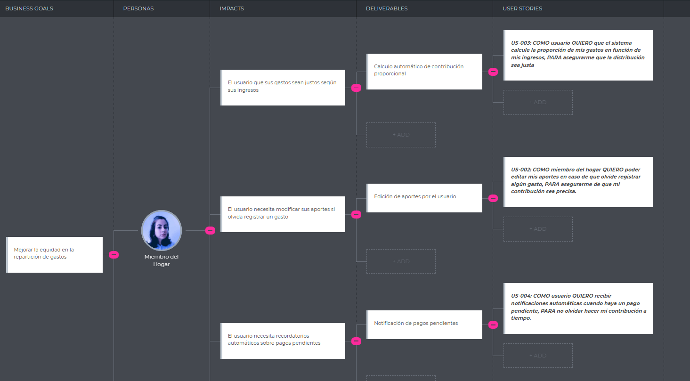

### Segmento 2: Representante del hogar

  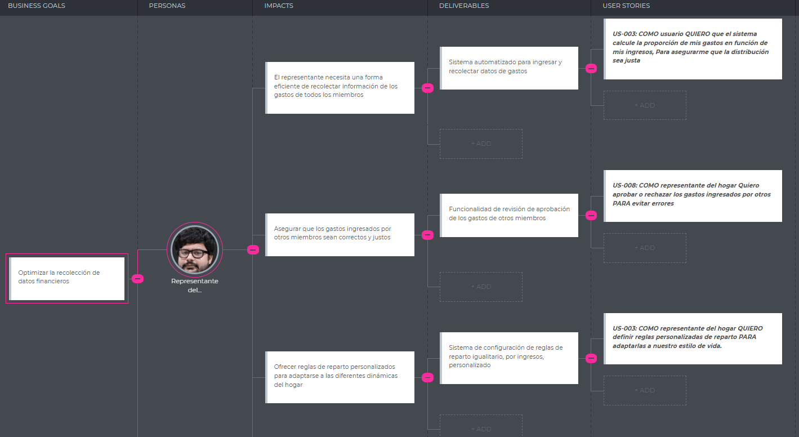

## 3.4. Product Backlog

### Priorización de User Stories - Plataforma SplitEasy

| **#Orden** | **User Story ID** | **Título**                                    | **Descripción**                                                                                                                                                                                  | **Story Points** |
| ---------- | ----------------- | --------------------------------------------- | ------------------------------------------------------------------------------------------------------------------------------------------------------------------------------------------------ | ---------------- |
| 1          | US-01             | Vista General de Beneficios y Funcionalidades | Como usuario potencial, quiero ver una descripción general de los beneficios y funcionalidades clave de la plataforma                                                                            | 3                |
| 2          | US-02             | Resumen de la Empresa                         | Como visitante, quiero ver un resumen de la empresa para entender su enfoque y valores antes de registrarme                                                                                      | 2                |
| 3          | US-03             | Navegación Clara y Directa en la Página       | Como usuario potencial, quiero poder navegar de forma clara y directa entre las secciones de la página para encontrar la información rápidamente                                                 | 3                |
| 4          | US-04             | Demostración Visual del Producto (Video)      | Como visitante en la landing page, quiero poder ver un video de demostración del producto para conocer mejor la funcionalidad de la app web                                                      | 5                |
| 5          | US-05             | Iniciar Sesión Rápido y Visible               | Como usuario de la plataforma, quiero poder iniciar sesión desde un enlace visible en la página principal para acceder rápidamente a mi cuenta                                                   | 2                |
| 6          | US-06             | Registro de Cuenta y Rol Inicial              | Como nuevo usuario, quiero crear una cuenta proporcionando mi nombre de usuario, correo electrónico, contraseña y rol, para poder acceder a la plataforma                                        | 5                |
| 7          | US-07             | Acceso y Validación de Credenciales           | Como usuario registrado, quiero iniciar sesión con mi usuario y contraseña, y recibir un mensaje claro si mis credenciales son incorrectas                                                       | 3                |
| 8          | US-08             | Recuperación de Contraseña                    | Como usuario registrado, quiero poder recuperar mi contraseña si la olvido, para restablecer el acceso a mi cuenta                                                                               | 3                |
| 9          | US-09             | Selección de Idioma                           | Como usuario, quiero poder seleccionar el idioma de la interfaz antes de iniciar sesión o registrarme, para usar la aplicación en mi idioma preferido                                            | 2                |
| 10         | US-10             | Configuración Inicial del Hogar               | Como Representante, quiero crear y configurar un hogar donde pueda definir un nombre, descripción y moneda principal, para comenzar a gestionarlo                                                | 5                |
| 11         | US-11             | Navegación y Panel Principal                  | Como Representante, quiero que la navegación sea bloqueada hasta que cree un hogar, y que al tenerlo, se me muestre el resumen del hogar en el panel                                             | 5                |
| 12         | US-12             | Resumen del Hogar y Perfil                    | Como Representante, quiero ver en la pantalla principal el resumen del hogar con métricas clave, y acceder rápidamente a mi perfil con mi rol y datos                                            | 3                |
| 13         | US-13             | Gestión de Miembros                           | Como Representante, quiero poder añadir, eliminar y gestionar a los miembros de mi hogar de forma sencilla                                                                                       | 8                |
| 14         | US-14             | Registro y Visualización de Facturas          | Como Representante, quiero registrar nuevas facturas con descripción, monto y fecha, y verlas en una lista tabular con todos los detalles                                                        | 5                |
| 15         | US-15             | Edición y Eliminación de Facturas             | Como Representante que creó una factura, quiero poder editar o eliminar la factura si cometí un error o necesito actualizar los datos                                                            | 3                |
| 16         | US-16             | Creación y Configuración de Contribución      | Como Representante, quiero crear una contribución asociándola a un comprobante, seleccionar la estrategia de reparto, definir la descripción, y asignar los miembros que participarán en el pago | 8                |
| 17         | US-17             | Revisión y Aprobación de Comprobantes de Pago | Como Representante, quiero ver qué contribuciones tienen pagos pendientes de revisión, acceder a los detalles y aprobar o rechazar los pagos de los miembros                                     | 5                |
| 18         | US-18             | Resumen del Miembro y Miembros del Hogar      | Como Miembro, quiero ver un resumen personal de mis pagos, contribuciones activas, y una lista de todos los miembros de mi hogar, incluyendo su rol                                              | 3                |
| 19         | US-19             | Visualización de Deudas y Pagos               | Como Miembro, quiero ver claramente el monto total pendiente de contribuciones y el total de pagos que he realizado hasta la fecha                                                               | 2                |
| 20         | US-20             | Navegación Habilitada para Miembros           | Como Miembro, quiero tener acceso a las secciones de "Contribuciones", "Estado" y "Ajustes" desde el menú de navegación                                                                          | 3                |
| 21         | US-21             | Visualización y Seguimiento de Contribuciones | Como Miembro, quiero ver una lista de mis contribuciones pendientes y pagadas, con detalles como factura, monto, estrategia, estado y fecha de pago                                              | 5                |
| 22         | US-22             | Subida de Comprobante y Estado de Revisión    | Como Miembro, quiero poder subir un comprobante de pago para cambiar el estado de la contribución a "En Revisión"                                                                                | 3                |
| 23         | US-23             | Actualización de Estado a "Pagado"            | Como Miembro, quiero que el estado de una contribución cambie a "Pagado" cuando el Representante apruebe mi comprobante de pago                                                                  | 3                |
| 24         | US-24             | Paginación de Contribuciones                  | Como Miembro, quiero poder navegar entre las páginas de mis contribuciones si tengo muchas registradas                                                                                           | 2                |
| 25     | TS02          | Cifrar contraseñas en base de datos                    | Implementar cifrado de contraseñas                                      | 5            |
| 26     | TS03          | Validar roles de administrador y miembro en backend    | Verificar que los roles estén definidos y sean accesibles               | 4            |
| 29     | TS06          | Validar respuestas del backend en la gestión de perfil | Asegurar que el backend maneje correctamente la actualización de perfil | 3            |

# Capítulo IV: Product Design

## 4.1. Style Guidelines

**SplitEasy** es una plataforma digital creada para simplificar y equilibrar la gestión financiera dentro del hogar. Mediante un sistema de cálculo proporcional según ingresos, permite distribuir gastos de forma justa, promoviendo la transparencia, la colaboración y el control financiero compartido. Con una interfaz moderna y directa, SplitEasy responde a las necesidades de hogares contemporáneos que buscan soluciones simples, efectivas y accesibles.

Esta sección presenta una guía estructurada que consolida todos los elementos visuales y de diseño utilizados en la interfaz de SplitEasy. Se incluyen recursos gráficos como tipografías, paleta cromática —con predominancia de negros, blancos y azul celeste—, íconos y componentes de interfaz. El objetivo es mantener una identidad visual coherente, sobria y tecnológica que refleje el enfoque funcional y equitativo de la marca.

Las guías de estilo están divididas en tres bloques —**General Style Guidelines**, **Web Style Guidelines** y **Mobile Style Guidelines**—, lo cual garantiza una experiencia uniforme, accesible y atractiva tanto en dispositivos móviles como en la web. Esta consistencia estética mejora la navegación, refuerza la confianza del usuario y comunica visualmente los valores de la plataforma: claridad, equilibrio y control.

### 4.1.1. General Style Guidelines

SplitEasy busca transmitir una identidad visual moderna y clara, enfocada en la transparencia, la colaboración y la equidad financiera. La marca utiliza colores oscuros como base para dar una sensación de profesionalismo y seriedad, mientras que el azul celeste funciona como color de acento para resaltar acciones importantes y darle un toque fresco y tecnológico.

El logotipo es simple pero distintivo, pensado para ser fácilmente reconocible en cualquier dispositivo. La tipografía es limpia y legible, lo que facilita la navegación y mantiene una experiencia visual coherente.

Todo el diseño está orientado a que los usuarios se sientan en control de sus finanzas compartidas sin complicaciones. Con este estilo, SplitEasy busca representar su propósito: ayudar a los hogares a organizar sus gastos de forma justa, práctica y accesible.

#### Tipografía

SplitEasy utiliza la tipografía **Roboto**, elegida por su estilo limpio, moderno y excelente legibilidad en interfaces digitales oscuras. Se aplican sus variantes **Regular**, **Medium**, **Bold** y **Black** para diferenciar jerarquías de contenido de forma clara y visualmente equilibrada.

Los tamaños de fuente empleados son:

- `h1` → 3em (48px)  
- `h2` → 2em (32px)  
- `h3` → 1em (16px)  
- **Texto general** → 1em (16px)

Esta estructura asegura una experiencia coherente y cómoda de lectura en todos los dispositivos.

#### Colores

La identidad visual de SplitEasy se construye sobre una paleta cromática moderna y profesional que se proyecta sobre un fondo negro, utilizado como color de fondo principal `#000000`. Esta base oscura permite que los demás colores resalten con claridad y armonía, reforzando la estética tecnológica de la plataforma.

- **Color primario**: `#1565C0` (azul oscuro), utilizado en elementos clave para transmitir solidez y confianza.  
- **Color secundario**: `#42A5F5` (celeste), aplicado en botones, íconos o enlaces activos, aportando dinamismo y frescura.  
- **Color de apoyo**: `#E3F2FD` (azul muy claro), usado para crear contrastes suaves o resaltar secciones sin romper la armonía.  
- **Texto general**: `#FFFFFF` (blanco), seleccionado para garantizar máxima legibilidad sobre el fondo oscuro.

Esta combinación asegura una experiencia visual clara, accesible y coherente con los valores del proyecto: orden, transparencia y modernidad.

  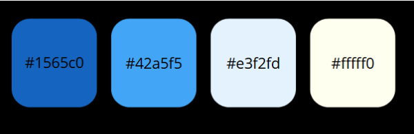

#### Espaciado

- **Botones**: Padding de `1rem` vertical y `2rem` horizontal.  
- **Margin entre texto**: `margin-bottom: 1rem` para elementos como `h1`, `h2`, `p`, etc.  
- **Margin entre elementos**: `margin-bottom: 1.5rem` (ej. `.precio-card`).  
- **Margin entre secciones**: Padding de `2rem` en el contenedor general (ajustable a `6rem` si es necesario).

#### Iconografía

La iconografía utilizada en SplitEasy mejora la experiencia del usuario, facilita la navegación y representa visualmente las funcionalidades clave. Se emplea la biblioteca **Bootstrap Icons**, que asegura una estética moderna, coherente y responsiva.

**Íconos principales y su propósito**:

- `bi-house-door-fill` (Home): Página principal / hogar.  
- `bi-info-circle-fill` (About): Información del proyecto.  
- `bi-gear-fill` (Services): Funcionalidades del sistema.  
- `bi-question-circle-fill` (How does it work?): Guía del flujo de uso.  
- `bi-currency-dollar` (Prices): Planes de suscripción.  
- `bi-chat-left-quote-fill` (Reviews): Opiniones de usuarios.  
- `bi-envelope-fill` (Contact us): Correo de contacto.

**Iconos en servicios**:

- `bi-calculator`: Cálculo Proporcional.  
- `bi-pie-chart-fill`: Seguimiento de Gastos.  
- `bi-people-fill`: Transparencia y Colaboración.

**Iconos en How does it work?**:

- `bi-person-plus-fill`: Registro de usuarios.  
- `bi-house-fill`: Crear hogar.  
- `bi-cash-coin`: Asignar aportes.  
- `bi-bar-chart-fill`: Control financiero.

**Íconos en el Footer**:

- `bi-facebook`, `bi-instagram`, `bi-twitter`, `bi-linkedin`: Enlaces a redes sociales.  
- `bi-envelope-fill`: Correo electrónico (`mailto:contacto@spliteasy.com`).

El uso constante de una misma familia de íconos asegura coherencia visual y contribuye a una experiencia de usuario fluida e intuitiva.

#### Tono de Comunicación y Lenguaje Aplicado

El tono de comunicación en la landing page es **claro, cercano y accesible**, diseñado para todos los usuarios.

**Aspectos clave**:

- **Tono amigable y cercano**: Lenguaje directo, inclusivo y motivador.  
- **Claridad en las opciones**:
  - **Representante**: Puede crear y administrar el hogar.  
  - **Miembro**: Puede ingresar al hogar con un ID.  
- **Simplificación del proceso**: Instrucciones breves y claras.  
- **Empatía con las necesidades**: Refleja comprensión de desafíos financieros.  
- **Invitación a la acción**: Frases proactivas como “Crea tu hogar” o “Ingresa a tu hogar”.  
- **Accesibilidad**: Lenguaje fácil de entender sin barreras.

Este enfoque garantiza una experiencia funcional, adaptada a las necesidades de todos los usuarios, haciendo que tanto representantes como miembros se sientan cómodos y seguros.

### 4.1.2. Web Style Guidelines

Se utilizó la tendencia web de **funcionalismo minimalista** con un esquema de colores oscuros predominante (negro y gris oscuro) como fondo. Esto proporciona una experiencia visual suave, favoreciendo el contraste con elementos interactivos y textos claros.

  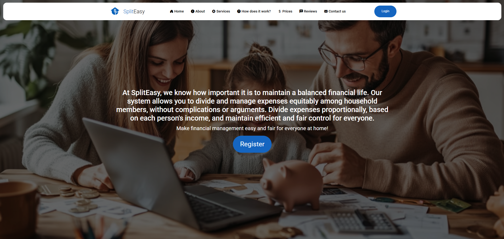

Para enriquecer la estética y agregar dinamismo:

- Se emplearon íconos blancos con moderación.  
- El diseño se mantiene minimalista pero atractivo.  
- Los íconos, claramente visibles sobre el fondo oscuro, refuerzan una experiencia visual limpia y ordenada.

Este equilibrio entre funcionalidad y diseño moderno garantiza una interfaz eficaz y atractiva.

  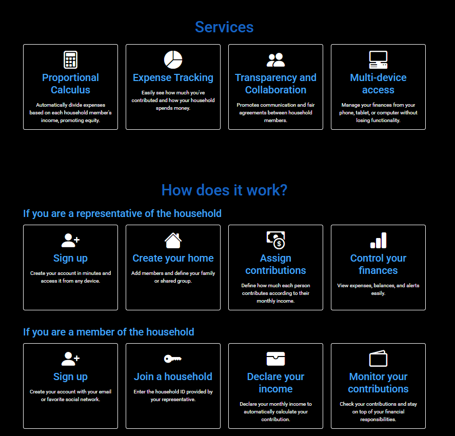

### 4.1.3. Mobile Style Guidelines

El diseño móvil de SplitEasy sigue los principios del minimalismo funcional y la coherencia visual, adaptados a las limitaciones y características de las pantallas pequeñas. La experiencia del usuario en dispositivos móviles se mantiene clara, accesible y moderna, con una estructura intuitiva que pone énfasis en la usabilidad.

### 4.1.3.1. iOS Mobile Style Guidelines

Para la plataforma iOS, se busca mantener las pautas de diseño de Apple, aprovechando sus patrones de navegación estándar y guiando al usuario de manera natural en la plataforma.

- Diseño limpio y simple: Al igual que en la versión web, el diseño se mantiene minimalista. El fondo oscuro (#000000) se utiliza como base, con detalles en azul para los botones y acciones clave.

- Interacción táctil: Todos los botones y elementos interactivos están diseñados para ser táctiles y fáciles de tocar. Los botones tienen un buen tamaño, con un padding de al menos 16px a cada lado, para evitar errores de clic.

- Estilo de íconos: Los íconos de Bootstrap Icons se usan con la misma paleta de colores, pero se ajustan a la escala de tamaño de dispositivos móviles, y los íconos de navegación son lo suficientemente grandes para facilitar el uso en pantallas táctiles.

- Tipografía: Se mantiene la tipografía Roboto con tamaños ajustados para pantallas pequeñas:

    - h1 → 2.5em (40px)

    - h2 → 2em (32px)

    - h3 → 1.2em (19px)

    - Texto general → 1em (16px)

- Transiciones suaves: Se deben usar transiciones suaves para interacciones, como la apertura de menús o botones, manteniendo el comportamiento visual fluido y agradable para el usuario.

- Navigación intuitiva: La barra de navegación será sticky (fija en la parte superior) y el acceso a las funciones clave estará disponible desde un menú hamburguesa o en la parte inferior de la pantalla, conforme a las convenciones de iOS.

- Botones y llamadas a la acción: Usar los colores #42A5F5 (celeste) para botones y enlaces interactivos. Estos deben destacarse bien en la interfaz de iOS, brindando un contraste claro con el fondo oscuro.

### 4.1.3.2. Android Mobile Style Guidelines

Para Android, seguimos las pautas de Material Design para garantizar que la interfaz sea familiar y consistente con otras aplicaciones en la plataforma.

- Diseño minimalista y coherente: Similar a iOS, la plataforma mantiene el fondo oscuro con detalles en celeste para los botones y elementos interactivos. El uso de Material Design ayuda a mantener una interfaz limpia y con una buena experiencia táctil.

- Material Design Components: Se recomienda usar Floating Action Buttons (FAB) para acciones clave y Bottom Navigation para secciones principales, de acuerdo con las mejores prácticas de Android.

- Tipografía: La tipografía Roboto se mantiene en Android, pero con ajustes específicos para este sistema:

    - h1 → 2.5em (40px)

    - h2 → 2em (32px)

    - h3 → 1.2em (19px)

    - Texto general → 1em (16px)

- Íconos: Los íconos deben tener un estilo consistente con los de la plataforma y la paleta de colores establecida. La biblioteca Bootstrap Icons funciona bien para mantener la simplicidad visual y es perfectamente compatible con Android.

- Gestos: Incorporar gestos comunes de Android, como el deslizar hacia la izquierda o derecha para navegar entre secciones o volver a la pantalla anterior, puede mejorar la experiencia móvil.

- Sombra y elevación: Según Material Design, agregar sombras sutiles en elementos interactivos puede ayudar a crear una jerarquía visual clara y facilitar la interacción táctil.

- Botones y llamadas a la acción: Los botones deben tener un padding de 16px para garantizar una interacción cómoda. Los colores #42A5F5 deben ser utilizados en botones principales, mientras que #1565C0 puede ser usado para botones secundarios o menos prominentes.

## 4.2. Information Architecture

### 4.2.1. Organization Systems

En la plataforma **SplitEasy**, se emplean diferentes sistemas de organización del contenido para mejorar la accesibilidad y experiencia de los usuarios, dependiendo del tipo de información que se presenta. Estos sistemas aseguran que los usuarios puedan navegar de manera intuitiva y eficiente por la aplicación. A continuación, se detallan los enfoques utilizados:

#### Organización Visual del Contenido

**Jerárquica (Visual Hierarchy):**  
La organización jerárquica se aplica en secciones donde es fundamental mostrar una estructura clara de importancia y relevancia, como en los formularios de creación de hogar o de asignación de aportes. Se emplean tamaños de texto diferenciados y un orden lógico de presentación, destacando los elementos más importantes (como los botones de acción o los campos requeridos) para guiar al usuario de forma natural a través de la plataforma.

**Secuencial (Step-by-Step to Accomplish):**  
En tareas que requieren la realización de pasos secuenciales, como el proceso de registro de usuario o creación de hogar, se utiliza un enfoque paso a paso. Los usuarios avanzan de una pantalla a otra de manera clara y ordenada, asegurando que comprendan el flujo de trabajo y puedan completar cada acción antes de pasar a la siguiente, minimizando la confusión.

#### Esquemas de Categorización de Contenido

**Por Audiencia (Grupos de Usuarios):**  
Dado que la plataforma tiene dos tipos de usuarios (representantes del hogar y miembros del hogar), el contenido se organiza de manera distinta para cada grupo. Los representantes tienen acceso a herramientas para gestionar los aportes y la creación de hogar, mientras que los miembros solo pueden consultar sus aportes y realizar seguimiento a los gastos. La categorización se adapta a las necesidades específicas de cada tipo de usuario, con una navegación clara que les lleva a las secciones correspondientes.

**Por Tópicos:**  
Además, la categorización por tópicos se utiliza en las secciones de ayuda y soporte. Los usuarios pueden acceder a diferentes categorías de contenido, como "Preguntas Frecuentes", "Política de Privacidad" y "Centro de Ayuda", lo que facilita la búsqueda de información relevante para resolver problemas específicos.

#### Implementación en la Interfaz

La organización jerárquica y secuencial se ve reflejada en el diseño de la interfaz, utilizando una estructura de navegación clara que incluye menús desplegables, botones con texto explicativo y pasos visibles para guiar al usuario en cada proceso.

Los esquemas de categorización por audiencia y por tópicos están integrados en las pantallas de inicio y las secciones de soporte, donde los usuarios pueden acceder rápidamente a la información que más les interesa, con un diseño que hace uso de íconos y texto, manteniendo el estilo visual minimalista y accesible.

Este enfoque asegura que la experiencia de navegación en SplitEasy sea intuitiva, eficiente y adaptada a las necesidades específicas de cada tipo de usuario, mejorando la funcionalidad y la experiencia general de la plataforma.

### 4.2.2. Labeling Systems

La landing page de SplitEasy emplea un sistema de etiquetado directo, simple y orientado a la acción, con el fin de facilitar la comprensión rápida de los contenidos y la navegación fluida para distintos tipos de usuarios. Se prioriza la claridad en la presentación textual de las secciones, utilizando el menor número de palabras posible y apoyándose en íconos visuales para reforzar los mensajes clave.

#### Menú de navegación

En el menú de navegación superior de la landing page, se emplean etiquetas simples, directas y acompañadas de íconos de Bootstrap Icons:

- "Home" (`bi-house-door-fill`)
- "About" (`bi-info-circle-fill`)
- "Services" (`bi-tools`)
- "How does it work?" (`bi-lightbulb-fill`)
- "Prices" (`bi-currency-dollar`)
- "Reviews" (`bi-chat-dots-fill`)
- "Contact us" (`bi-envelope-fill`)

  

#### Botón principal

- **"Register"**: principal llamada a la acción (CTA), funciona tanto para miembros como representantes.

  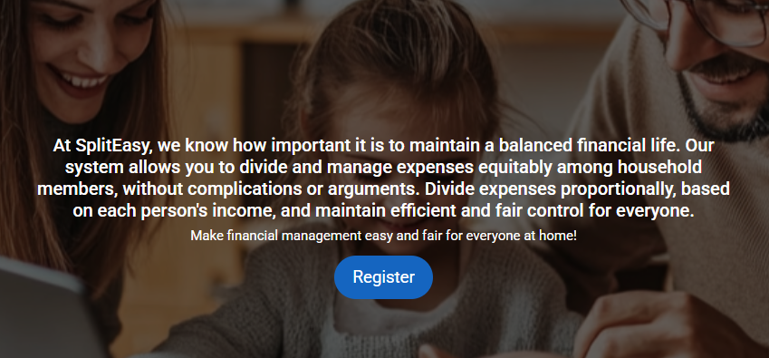

#### Sección "How does it work?" para Representantes

- **"Sign up"** (`bi-person-plus-fill`)
- **"Create your home"** (`bi-house-fill`)
- **"Assign contributions"** (`bi-cash-coin`)
- **"Control your finances"** (`bi-bar-chart-fill`)

  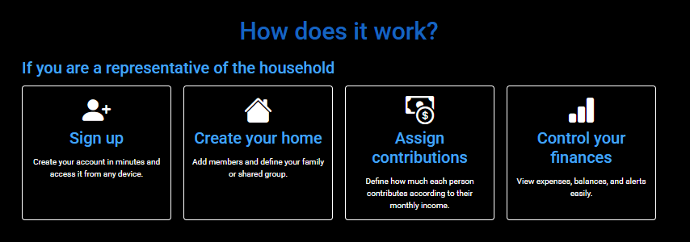

#### Sección "How does it work?" para Miembros

- **"Sign up"** (`bi-person-plus-fill`)
- **"Join a household"** (`bi-key-fill`)
- **"Declare your income"** (`bi-wallet-fill`)
- **"Monitor your contributions"** (`bi-graph-up-arrow`)

  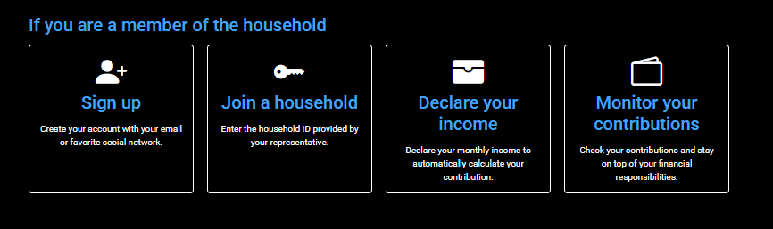

#### Footer

- **Legal notice**
- **Privacy Policy**
- **Cookies Policy**

En la sección de soporte:

- **Contact Support**
- **Help Center**

También se incorporan íconos de redes sociales: Facebook, Instagram, Twitter, LinkedIn.

  

### 4.2.3. SEO Tags and Meta Tags

#### Landing Page

html
<head>
    <meta charset="utf-8">
    <meta name="viewport" content="width=device-width, initial-scale=1">

    <title>SplitEasy - Control financiero justo para tu hogar</title>
    <meta name="description" content="SplitEasy te ayuda a dividir los gastos del hogar de forma proporcional según los ingresos de cada miembro. Fácil, justo y transparente.">
    <meta name="keywords" content="SplitEasy, finanzas compartidas, gastos del hogar, app de finanzas, control de gastos, división de pagos">
    <meta name="author" content="Equipo SplitEasy">

    <!-- CSS & Icons -->
    <link href="https://cdn.jsdelivr.net/npm/bootstrap@5.3.3/dist/css/bootstrap.min.css" rel="stylesheet">
    <link rel="stylesheet" href="https://cdn.jsdelivr.net/npm/bootstrap-icons@1.11.3/font/bootstrap-icons.min.css">
    <link rel="preconnect" href="https://fonts.googleapis.com">
    <link rel="preconnect" href="https://fonts.gstatic.com" crossorigin>
    <link href="https://fonts.googleapis.com/css2?family=Roboto&display=swap" rel="stylesheet">
    <link rel="stylesheet" href="css/style.css">
    <link rel="icon" href="/images/logo.PNG" alt="Logo">
</head>

### Web Application

<!-- SEO tags para la Web Application de SplitEasy -->
<title>SplitEasy App - Gestiona tus aportes y gastos familiares</title>
<meta name="description" content="Ingresa o crea un hogar, asigna aportes según ingresos y mantén el control de los gastos de tu familia de forma sencilla y equitativa.">
<meta name="keywords" content="SplitEasy app, control de finanzas, ingresos familiares, aportes proporcionales, gastos en el hogar, economía familiar">
<meta name="author" content="Equipo SplitEasy">

### 4.2.4. Searching Systems

En el caso de SplitEasy, se implementará un sistema de búsqueda y filtros que permita a los miembros y representantes del hogar encontrar información relevante rápidamente y facilitar su navegación dentro de la aplicación. El sistema de búsqueda y filtros estará estructurado de manera que cada tipo de usuario (miembro o representante) tenga acceso a las herramientas más útiles para su rol específico.

#### Filtros de búsqueda por entradas

**Miembros del hogar:**
- **Buscar por ID de hogar:** Los miembros podrán buscar e ingresar el ID de hogar proporcionado por el representante para unirse a un hogar ya creado.
- **Filtrar por fecha de contribución:** Ver un historial de aportes por fechas (mensual, semanal).
- **Estado de los aportes:** Filtrar contribuciones por estado: `"Aportado"`, `"Pendiente"`, `"Excedente"`.
- **Filtrar por tipo de gasto:** Clasificación de gastos por categorías como `"Alimentos"`, `"Servicios"`, etc.

**Representantes del hogar:**
- **Filtrar por estado de los aportes:** Ver contribuciones por fecha o estado.
- **Filtrar por miembros:** Buscar por nombre o ID de miembro para revisar su historial.
- **Estado del balance financiero:** Filtrar el balance general del hogar por fecha o tipo de gasto.

#### Filtros de búsqueda por tabs

Para mejorar la experiencia de usuario, se incluirán tabs interactivos que faciliten el acceso a información específica de forma ordenada.

**Miembros:**
- **Tab de historial de aportes:** Resumen de aportes con filtros por fecha, monto y estado.
- **Tab de estado de gastos:** Visualización de cómo se distribuyen los gastos del hogar.
- **Tab de búsqueda por ID de hogar:** Asociar ID de hogar para ingresar al perfil vinculado.

**Representantes:**
- **Tab de gestión de aportes:** Vista de aportes de todos los miembros con filtros por estado y fecha.
- **Tab de balance general:** Balance general filtrado por categorías y periodo.

#### Flujo de búsqueda y filtros

El flujo será simple y eficiente. En cada sección relevante (aportaciones, balances, gastos), se mostrará un campo de búsqueda o filtros configurables. Los filtros serán fáciles de aplicar y remover, asegurando una experiencia de navegación fluida.

### 4.2.5. Navigation Systems

En SplitEasy, la navegación debe ser fluida, intuitiva y accesible tanto en la **Landing Page** como en la **Web Application**.

#### 1. Navegación en la Landing Page

La página principal guía a nuevos usuarios hacia el registro o la información clave de forma clara y atractiva.

**Elementos de navegación:**
- **Menú de navegación superior** (con iconos):  
  - *Home*  
  - *About*  
  - *Services*  
  - *How does it work?*  
  - *Prices*  
  - *Reviews*  
  - *Contact us*
- **Llamadas a la acción (CTAs):**  
  Ejemplos: *"Sign up"*.
- **Desplazamiento fluido:**  
  Scroll natural por secciones de la página sin salir de ella.

#### 2. Navegación en la Web Application

La navegación se adapta al tipo de usuario y sus necesidades específicas.

#### Para Representantes del Hogar:

**Menú lateral fijo con opciones:**
- Dashboard
- Miembros del hogar
- Gastos
- Aportes
- Configuración de hogar

**Breadcrumbs:**  
Navegación jerárquica para volver a secciones anteriores o más generales.

#### Para Miembros del Hogar:

**Menú superior simplificado con opciones:**
- Dashboard
- Aportes
- Estado del hogar
- Buscar ID de hogar

**Accesos rápidos (botones flotantes):**
- Agregar aporte
- Ver detalles del gasto

#### Interacción con el sistema

- **Accesibilidad:** Navegación clara y visible con etiquetas comprensibles.
- **Navegación de búsqueda:** Filtros rápidos para búsqueda por ID de hogar o estado de aportes.
- **Ayuda y tutoriales:** Sección de asistencia con guía paso a paso para cada sección.

## 4.3. Landing Page UI Design

La landing page de SplitEasy está diseñada para ofrecer una experiencia clara y eficiente para usuarios que buscan gestionar de manera equitativa sus gastos compartidos. El diseño se enfoca en dos User Personas principales: el representante del hogar y los miembros del hogar.

La navegación es sencilla, con un navbar fijo y un diseño responsive que garantiza una experiencia optimizada en todos los dispositivos. La jerarquía visual está pensada para guiar al usuario desde la introducción de la app hasta sus principales funcionalidades: dividir gastos, registrar ingresos y visualizar aportes de cada miembro del hogar.

Accesibilidad: Se garantiza un contraste adecuado, tipografías legibles, botones grandes y adaptabilidad completa a dispositivos móviles, siguiendo las pautas WCAG 2.1.

La sección de Servicios destaca características clave como el cálculo proporcional de gastos, el seguimiento de contribuciones y la transparencia entre miembros del hogar. Además, la plataforma permite un acceso multi-dispositivo, asegurando que el control de los gastos esté siempre al alcance del usuario.

La app se valida con testimonios de usuarios que resaltan su facilidad de uso y eficiencia, eliminando conflictos y promoviendo una gestión financiera armoniosa.

### 4.3.1. Landing Page Wireframe

Los wireframes desarrollados para la landing page de SplitEasy contemplan versiones para navegadores de escritorio y dispositivos móviles, asegurando una experiencia responsive que se adapta a diferentes tamaños de pantalla. La estructura se organiza de la siguiente manera:

1. Encabezado (Header):

    - Menú fijo con enlaces a secciones: Home, About, Services, How it works, Prices, Reviews, Contact us.

    - Logo a la izquierda y botón de Login a la derecha.

2. Sección Hero:

    - Mensaje destacado sobre la importancia de la gestión financiera.

    - Botón de "Register" como llamada a la acción.

3. Sección About:

    - Explicación breve de la Misión, Visión y Razón de Creación del proyecto.

4. Sección Servicios:

    - Tarjetas con servicios: Proportional Calculus, Expense Tracking, Transparency, y Multi-device Access.

5. Sección Cómo Funciona:

    - Para representantes y miembros del hogar, explicando los pasos en tarjetas.

6. Sección Precios:

    - Comparativa entre Free (básico) y Premium (ilimitado).

7. Sección Reseñas:

    - Opiniones de usuarios destacando la facilidad y utilidad de la plataforma.

8. Sección Contacto:

    - Formulario con campos para Nombre, Correo y Teléfono.

    - Botón de "Contact us".

9. Pie de Página:

    - Enlaces a redes sociales, información legal y soporte.

En cuanto al diseño inclusivo, se han considerado aspectos como el contraste adecuado entre texto y fondo para garantizar la legibilidad, el uso de tipografías claras y tamaños de fuente apropiados para diferentes dispositivos, y la disposición de elementos interactivos con suficiente espacio para facilitar su uso por personas con diversas capacidades. Además, la estructura de la información sigue una arquitectura jerárquica que prioriza el contenido más relevante, permitiendo una navegación intuitiva.

  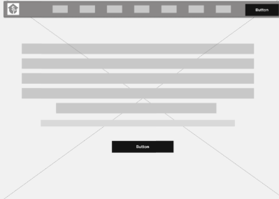

  

  

  

  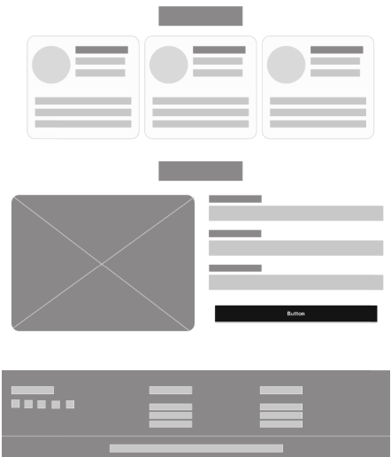

### 4.3.2. Landing Page Mock-up

Los mock-ups representan visualmente el resultado final del diseño propuesto y consolidan las decisiones tomadas en cuanto a estética, funcionalidad y usabilidad. En ambas versiones, se mantiene una coherencia visual que refuerza la identidad de la marca, respetando el Design System definido para el proyecto.

Se aplicaron principios fundamentales de diseño, como contraste y jerarquía visual, destacando los botones de acción con colores llamativos y una estructura que organiza el contenido de forma clara: desde el mensaje de valor inicial hasta el botón "Explora ahora". La consistencia visual se asegura mediante el uso uniforme de íconos, estilos y márgenes, ofreciendo una experiencia fluida.

La arquitectura de la información sigue una secuencia lógica: comienza con una presentación de valor, seguida de las funcionalidades de la plataforma, testimonios, preguntas frecuentes y un llamado final a la acción. Este flujo guía al usuario de manera eficiente hacia el objetivo principal del sitio.

  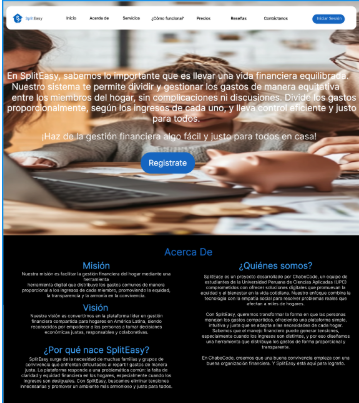

  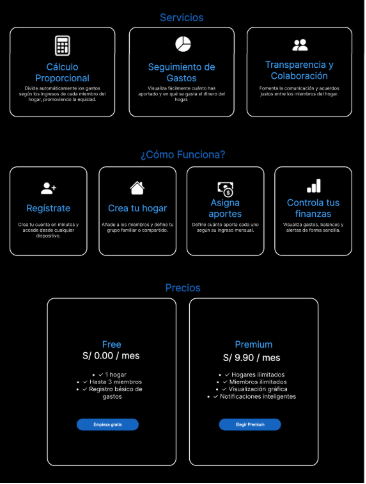

  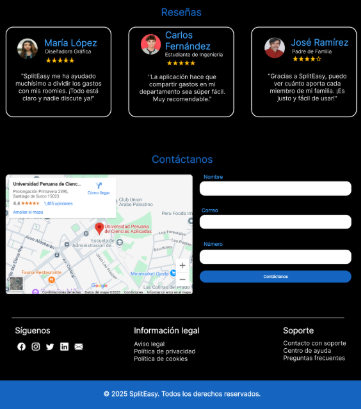

## 4.4. Mobile Applications UX/UI Design

El diseño UX/UI de las aplicaciones móviles de SplitEasy se desarrolló siguiendo un enfoque User-Centered Design, partiendo de entrevistas y mapas de empatía realizados en fases previas. Se identificaron dos flujos principales: aventurero explorador y emprendedor gestor, cuyas prioridades divergentes guiaron la estructuración de funcionalidades y jerarquía visual. El proceso de diseño incluyó:

Sketches rápidos en papel para idear flujos iniciales.

Wireframes en Figma que permitieron validar la disposición de componentes clave.

Wireflows detallados que reflejan los caminos más usados por cada tipo de usuario.

### 4.4.1. Mobile Applications Wireframes

ANEXO G: https://www.figma.com/design/7f2Ru1tTM2Z5YO2XXAPz5A/Untitled?node-id=0-1&p=f&t=PA99MmlXk8ZMm8U5-0

**Sección Representante del Hogar**

A través de estos wireframes, se presentan las pantallas dirigidas a los representantes del hogar, permitiéndoles crear cuentas, gestionar miembros y asignar contribuciones basadas en los ingresos. El diseño busca facilitar la administración financiera del hogar de manera clara y eficiente.

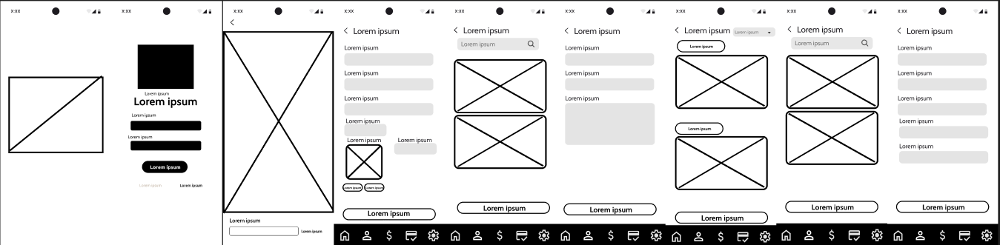

**Sección Miembro del Hogar**

Esta sección está diseñada para los miembros del hogar, quienes podrán registrarse, unirse a un hogar existente, declarar sus ingresos y monitorear sus contribuciones. El flujo está centrado en la simplicidad y facilidad de uso para asegurar una experiencia fluida.

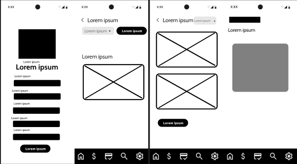

### 4.4.2. Mobile Applications Wireflow Diagrams

Esta sección presenta los wireframes correspondientes a la versión móvil de SplitEasy, diseñados para representantes del hogar y miembros del hogar. Cada pantalla refleja la disposición inicial de los componentes clave —como panel de gastos, historial de pagos y alertas—, permitiendo visualizar cómo los usuarios alcanzarán sus objetivos de manera clara, simple y centrada en una experiencia móvil intuitiva.

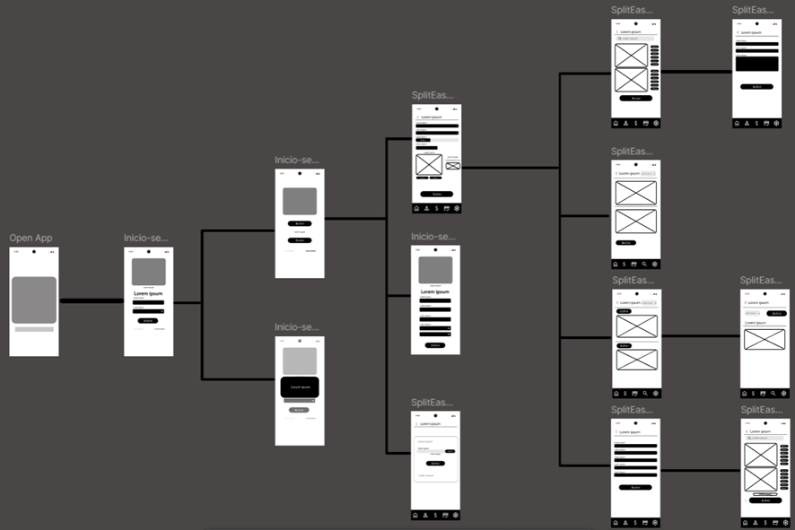

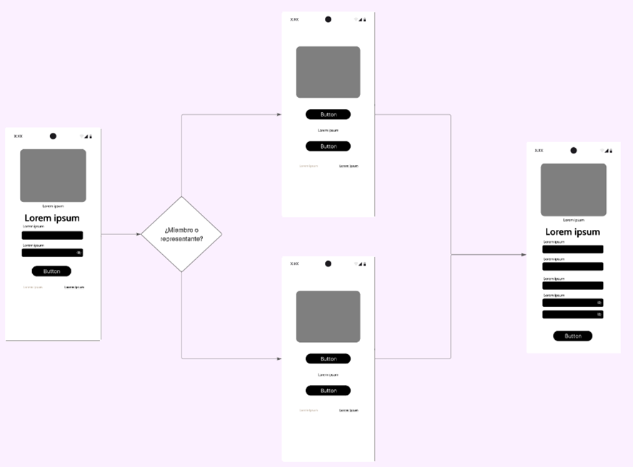

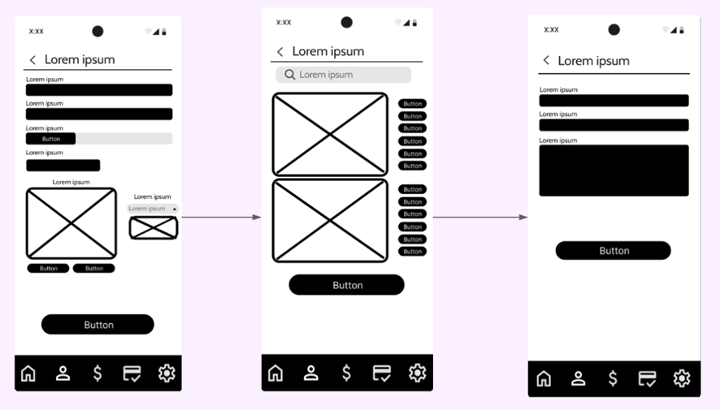

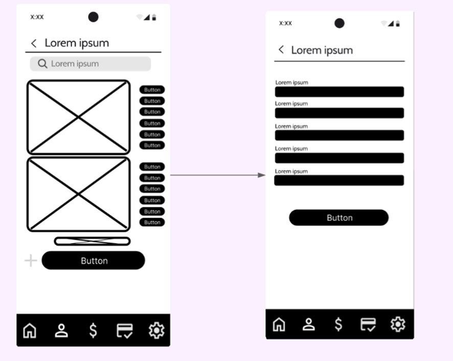

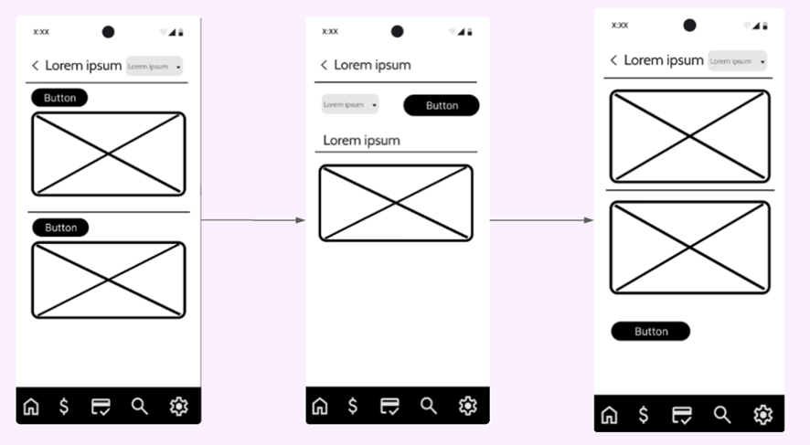

https://lucid.app/lucidchart/03769abf-adaa-4dd3-957a-1251a1179f0b/edit?viewport_loc=-777%2C533%2C7203%2C3264%2C0_0&invitationId=inv_efbf3ffd-6e54-4e92-a134-56479945b678 

### 4.4.3. Mobile Applications Mock-ups

ANEXO E: 
https://www.figma.com/design/7f2Ru1tTM2Z5YO2XXAPz5A/Untitled?node-id=0-1&p=f&t=PA99MmlXk8ZMm8U5-0

En esta sección se presentan los mock-ups de alta fidelidad desarrollados para la aplicación móvil de SplitEasy. Estas vistas permiten anticipar cómo lucirá la interfaz en dispositivos móviles tanto para representantes del hogar como para miembros del hogar, simulando su interacción real con la app. El diseño se centra en ofrecer una experiencia ágil, accesible y visualmente atractiva, optimizada para pantallas táctiles y navegación en movimiento.

**Pantalla de bienvenida**

Pantalla de bienvenida que explica la funcionalidad principal de la aplicación: dividir los gastos de forma equitativa según los ingresos de los miembros del hogar. Ofrece al usuario dos opciones para continuar: Representative o Member.

**Pestaña de inicio de sesión**

Pantalla de bienvenida y de inicio de sesión, con campos para introducir el correo electrónico y la contraseña.

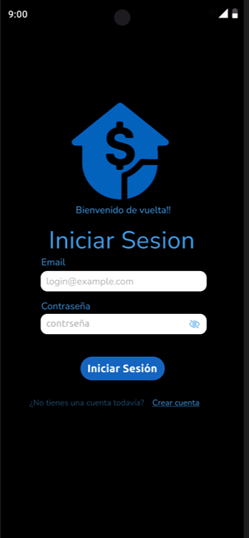

**Pestaña de elección**

Pantalla de registro para nuevos usuarios, que solicita seleccionar el tipo de cuenta: Miembro o Representante.

**Pestaña de registro**

Pantalla para completar la creación de una cuenta de tipo Miembro. Incluye los campos para ingresar el nombre completo, correo electrónico, ID de hogar, contraseña y la confirmación de la misma.

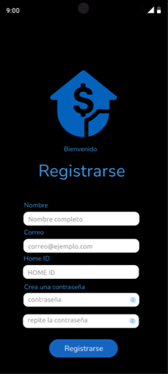

**Mock-ups para Usuario REPRESENTANTE DEL HOGAR**

**Pestaña 'Crear hogar'**

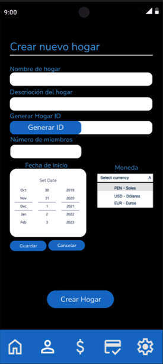

**Pestaña 'Miembros del hogar'**

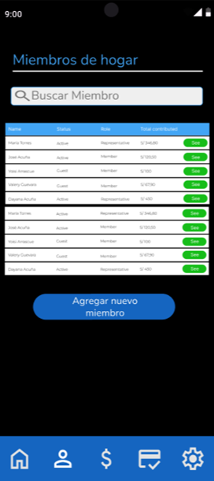

**Pestaña 'Añadir miembros'**

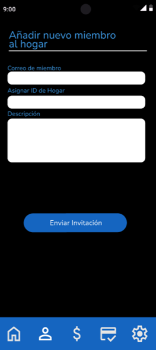

**Pestaña 'Gastos del hogar'**

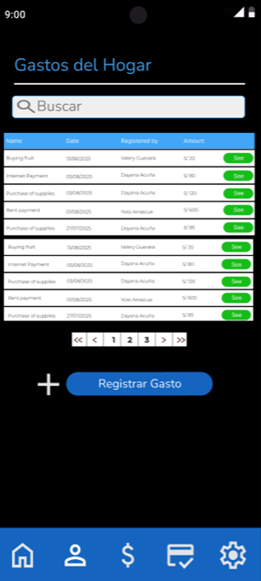

**Pestaña 'Registrar Gasto'**

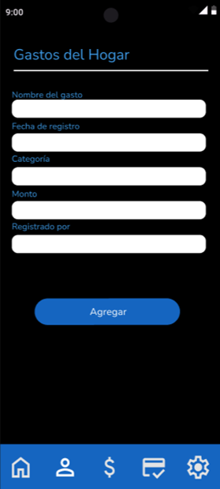

**Mock-ups para Usuario MIEMBROS DEL HOGAR**

**Pestaña 'Mis aportes'**

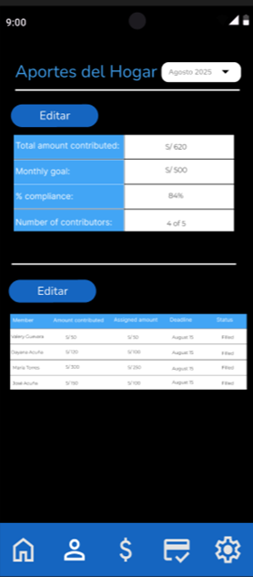

**Pestaña 'Estado hogar'**

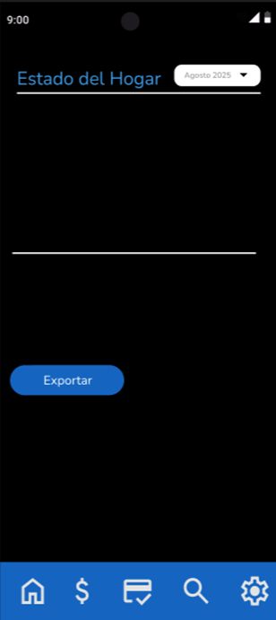

**Pestaña 'Unirse a un hogar'**

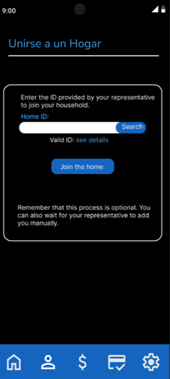

### 4.4.4. Mobile Applications User Flow Diagrams

A continuación, se muestra el User Flow Diagram de la aplicación móvil de SplitEasy, estructurado en base a los objetivos principales de los usuarios. Cada sección del flujo responde a una meta funcional específica, representando los recorridos posibles dentro de la app mediante mockups de alta fidelidad, optimizados para la experiencia en dispositivos móviles.

ANEXO I: https://lucid.app/lucidchart/03769abf-adaa-4dd3-957a-1251a1179f0b/edit?viewport_loc=-777%2C533%2C7203%2C3264%2C0_0&invitationId=inv_efbf3ffd-6e54-4e92-a134-56479945b678 

**USER GOAL:** Como visitante, quiero registrarme e iniciar sesión en la plataforma para comenzar a usar SplitEasy.

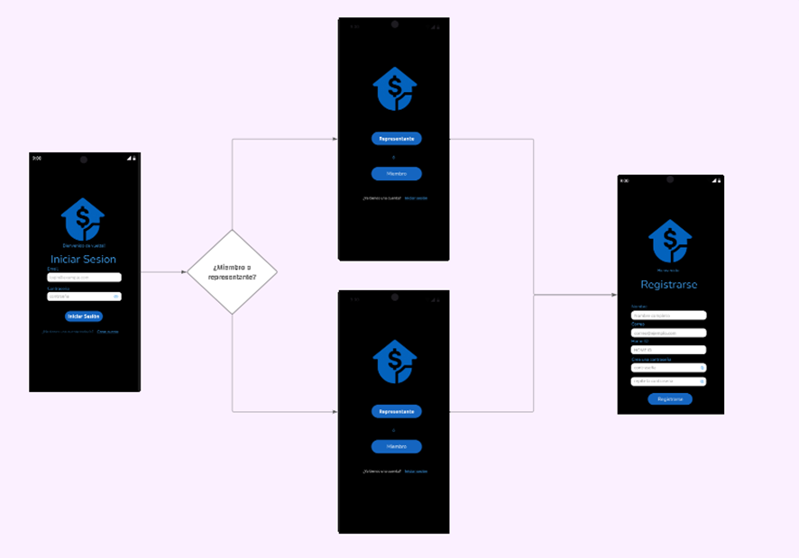

**USER GOAL:** Como representante del hogar, quiero crear un hogar en la app con los miembros del hogar para empezar a gestionar sus finanzas.

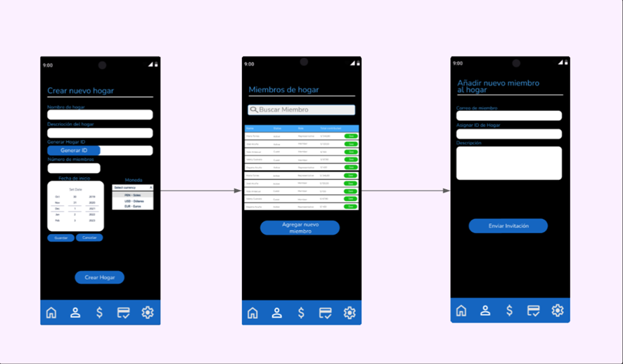

**USER GOAL:** Como representante del hogar, quiero registrar un gasto y gestionar el pago para los miembros del hogar.

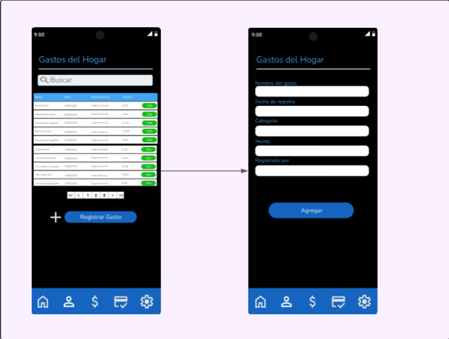

**USER GOAL:** Como miembro del hogar, quiero ver cuál es la distribución y registrar mi contribución de acuerdo a eso. 

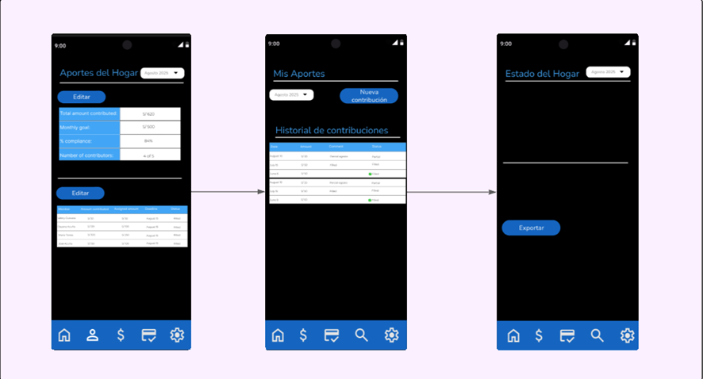

## 4.5. Mobile Applications Prototyping

### 4.5.1. Android Mobile Applications Prototyping

**Inicio - Representante del Hogar:**

La pantalla de inicio para el representante del hogar muestra un resumen claro de las contribuciones y balances del hogar, junto con un botón destacado "Agregar miembros" para facilitar la administración.

**Inicio - Miembro del Hogar:**

La página de inicio para el miembro del hogar es simple y funcional, mostrando un resumen de sus contribuciones y un botón para ver el desglose de gastos.

**Funcionalidades**

**Sección Representante del Hogar**

- Ver Hogar y Miembros: El representante puede revisar los miembros del hogar y sus respectivas contribuciones.

- Agregar Miembro: Un botón accesible para añadir nuevos miembros al hogar.

- Editar/Eliminar Miembros: Permite la edición o eliminación de miembros en el hogar de manera rápida.

- Estadísticas de Contribuciones: El representante puede filtrar y revisar las contribuciones por miembro, desde la más baja hasta la más alta.

**Sección Miembro del Hogar**

- Explorar Contribuciones: Muestra un desglose visual de las contribuciones del miembro dentro del hogar.

- Ver Gastos Compartidos: El miembro puede ver cómo se distribuyen los gastos entre los miembros del hogar.

**Video de explicación del flujo:** https://goo.su/hoLw

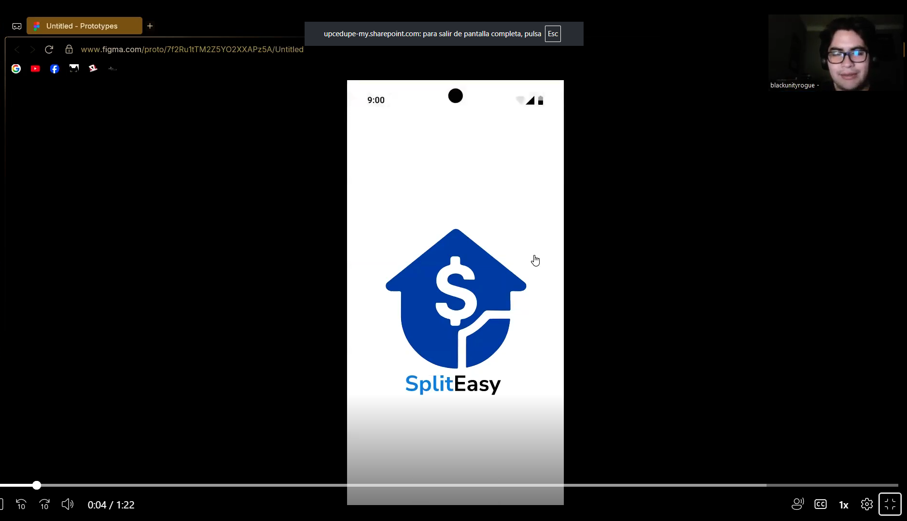

### 4.5.2. iOS Mobile Applications Prototyping

**Inicio - Representante del Hogar:**

La pantalla de inicio para el representante del hogar ofrece un vistazo rápido de las contribuciones y balances de los miembros del hogar, junto con un botón destacado "Agregar miembro" para facilitar la gestión.

**Inicio - Miembro del Hogar:**

La página de inicio para el miembro del hogar es clara y práctica, mostrando un resumen de sus contribuciones y un botón para ver el desglose de gastos, todo en un diseño visualmente atractivo.

**Funcionalidades**

**Sección Representante del Hogar**

- Ver Hogar y Miembros: El representante puede ver las contribuciones y balances de todos los miembros del hogar.

- Agregar Miembro: Un botón accesible para añadir nuevos miembros al hogar.

- Editar/Eliminar Miembros: Funcionalidades que permiten editar o eliminar miembros rápidamente.

- Estadísticas de Contribuciones: El representante puede filtrar las contribuciones por miembro, destacando a aquellos con mayor o menor aportación.

**Sección Miembro del Hogar**

- Explorar Contribuciones: Muestra un desglose visual de las contribuciones del miembro dentro del hogar.

- Ver Gastos Compartidos: Los miembros pueden ver cómo se distribuyen los gastos entre ellos.

**Video de Explicación del Flujo:** https://goo.su/Cf0YUKS

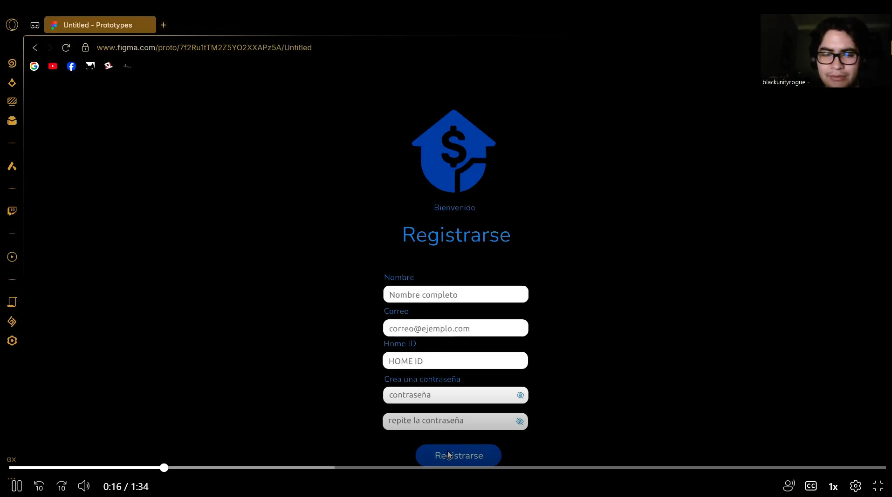

Los prototipos fueron fundamentales para identificar problemas de usabilidad antes del desarrollo, permitiendo realizar iteraciones tempranas basadas en observaciones y comentarios de usuarios reales. La consistencia entre plataformas y la claridad en las rutas de navegación ayudaron a validar las funcionalidades clave para representantes del hogar y miembros del hogar, asegurando una experiencia de usuario fluida y eficiente.

## 4.4. Web Applications UX/UI Design

El diseño de la plataforma web de SplitEasy está pensado para ofrecer una navegación intuitiva y coherente visualmente, adaptada a las necesidades de los dos tipos principales de usuarios: representantes de hogar y miembros del hogar.

En esta sección, se presentan los wireframes y wireflows, que muestran cómo los usuarios interactúan con la plataforma en distintos escenarios clave. El objetivo es garantizar que cada pantalla y cada paso en el flujo de navegación sean intuitivos, accesibles y útiles, promoviendo una experiencia digital fluida desde la creación de la cuenta hasta la gestión de los gastos compartidos y el control de las contribuciones.

### 4.4.1. Web Applications Wireframes

En esta sección se presentan los wireframes de la versión web de SplitEasy, organizados según los dos perfiles principales de usuario: representante de hogar y miembro del hogar. Cada diseño busca ofrecer una experiencia clara, coherente y centrada en las necesidades del usuario, asegurando una navegación intuitiva y fluida a lo largo de la plataforma.

  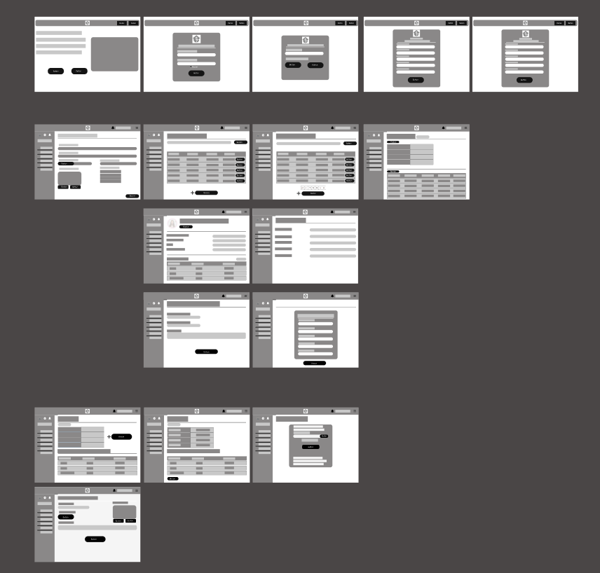

### 4.4.2. Web Applications Wireflow Diagrams

Esta sección presenta los diagramas de wireflow correspondientes a la versión web de SplitEasy, diseñados tanto para representantes de hogar como para miembros del hogar. Cada flujo de navegación representa una necesidad específica del usuario, permitiéndole lograr sus objetivos de manera clara, eficiente y centrada en una experiencia digital intuitiva.

  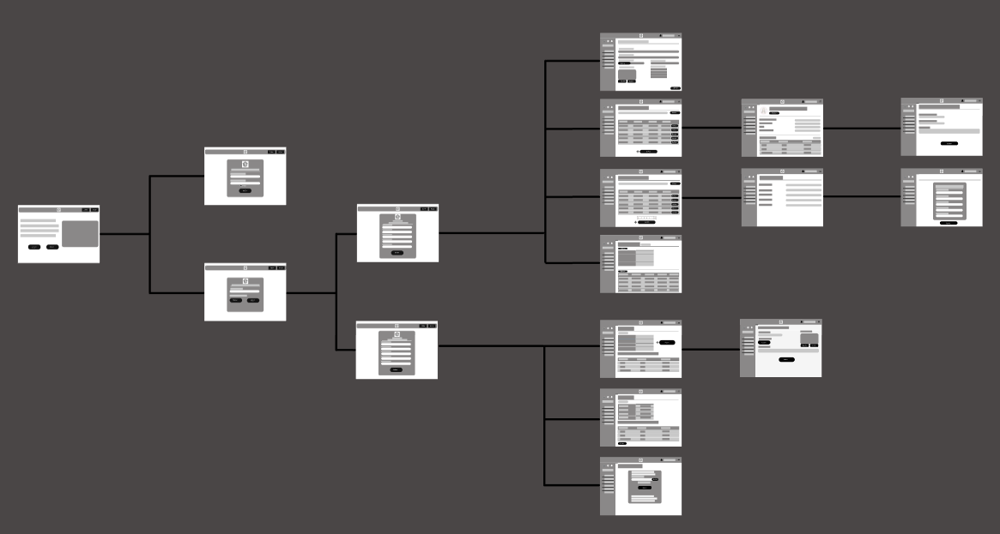

### 4.4.3. Web Applications Mock-ups

En esta sección se presentan los mock-ups de alta fidelidad desarrollados para la plataforma SplitEasy. Estas vistas permiten visualizar cómo lucirá la interfaz web tanto para representantes de hogar como para miembros del hogar, simulando su interacción real con la plataforma. El diseño se enfoca en ofrecer una experiencia fluida, accesible y visualmente atractiva.

  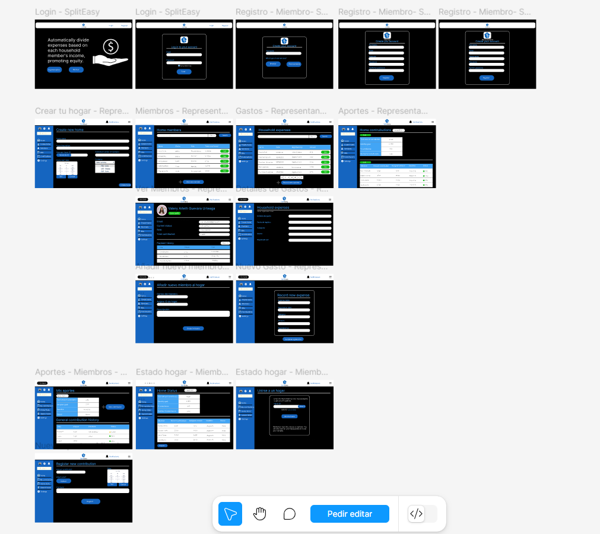

**Pantalla de bienvenida**

Pantalla de bienvenida que explica la funcionalidad principal de la aplicación: dividir los gastos de forma equitativa según los ingresos de los miembros del hogar. Ofrece al usuario dos opciones para continuar: Representative o Member.


**Pestaña de inicio de sesión**

- Pantalla de bienvenida y de inicio de sesión, con campos para introducir el correo electrónico y la contraseña.


**Pestaña de creación de cuenta**

- Pantalla de registro para nuevos usuarios, que solicita el nombre completo y permite seleccionar el tipo de cuenta: Miembro o Representante.


**Pestaña de registro** 

Pantalla para completar la creación de una cuenta de tipo Miembro. Incluye los campos para ingresar el nombre completo, correo electrónico, ID de hogar, contraseña y la confirmación de la misma.


**Mock-ups para Usuario REPRESENTANTE DEL HOGAR**

**Pestaña 'Crear hogar'**


**Pestaña 'Miembros del hogar'**


**Pestaña 'Añadir nuevo miembro'**


**Pestaña 'Perfil de miembro'**


**Pestaña 'Aportes del hogar'**


**Pestaña 'Gastos del hogar'**


**Pestaña 'Detalles de gasto'**


**Mock-ups para Usuario MIEMBROS DEL HOGAR**

**Pestaña 'Mis aportes'**


**Pestaña 'Estado hogar'**


**Pestaña 'Unirse a un hogar'**


### 4.4.4. Web Applications User Flow Diagrams
A continuación, se muestra el User Flow Diagram estructurado en base a los objetivos principales del usuario. Cada sección del flujo corresponde a una meta funcional específica, mostrando los recorridos posibles mediante mockups de alta fidelidad.

## 4.5. Web Applications Prototyping 

Se desarrolló un prototipo interactivo enfocado en la navegación web para evaluar y mejorar la accesibilidad y la experiencia de usuario antes del lanzamiento final. Este modelo simula fielmente el recorrido dentro del sitio, permitiendo explorar secciones y flujos como en la versión definitiva. Diseñado con una arquitectura clara, jerarquía visual coherente y principios de diseño inclusivo, garantiza una navegación intuitiva y accesible. Gracias a sus maquetas de alta fidelidad, el prototipo permite validar decisiones de diseño, detectar fricciones y asegurar una experiencia de uso consistente.

Link al prototipo: https://www.figma.com/proto/KpblxTexy8JiWceW2N9VmM/Open-Source?node-id=61-17&p=f&t=ciOjUSWSfUyZ9jxj-1&scaling=scale-down&content-scaling=fixed&page-id=33%3A9&starting-point-node-id=61%3A17

**Link del video explicativo:** https://goo.su/5fH6oe


## 4.6. Domain-Driven Software Architecture

### 4.6.1. Software Architecture Context Diagram

### 4.6.2. Software Architecture Container Diagrams

### 4.6.3. Software Architecture Components Diagrams

## 4.7. Software Object-Oriented Design

### 4.7.1 Class Diagrams

  

### 4.7.2. Class Dictionary

#### Class: HouseholdMember

**Attributes:**
- `id: UUID` — Identificador único para el miembro.
- `name: String` — Nombre completo del miembro.
- `email: String` — Dirección de correo electrónico del miembro.
- `householdId: String` — ID del hogar al que pertenece el miembro.

**Methods:**
- `login(): void` — Autentica al usuario y le da acceso al sistema.
- `viewContributionHistory(): List<Contribution>` — Devuelve una lista del historial de aportes del miembro.
- `viewExpensesByCategory(): List<Expense>` — Muestra los gastos del hogar categorizados.
- `findHouseholdByID(householdId): Household` — Recupera la información del hogar usando su ID.

#### Class: HouseholdManager

**Additional Attributes:**
- `isResponsible: Boolean` — Indica si el miembro es el representante del hogar.

**Additional Methods:**
- `manageContributions(): void` — Permite al representante ver y ajustar los aportes del hogar.
- `viewFinancialBalance(): Balance` — Recupera el balance financiero general del hogar.
- `configureHousehold(): void` — Permite modificar la configuración del hogar y gestionar a los miembros.
- `createHousehold(householdName: String): Household` — Permite al representante crear un nuevo hogar con un nombre especificado.

#### Class: Household

**Attributes:**
- `id: UUID` — Identificador único del hogar.
- `householdName: String` — Nombre del hogar.
- `creationDate: Date` — Fecha de creación del hogar.

**Methods:**
- `addMember(m: HouseholdMember): void` — Añade un nuevo miembro al hogar.
- `viewMembers(): List<HouseholdMember>` — Muestra todos los miembros actuales del hogar.
- `viewExpenses(): List<Expense>` — Lista todos los gastos registrados en el hogar.
- `viewBalance(): Balance` — Muestra el balance financiero actual del hogar.

#### Class: Contribution

**Attributes:**
- `id: UUID` — Identificador único del aporte.
- `amount: Decimal` — Monto del aporte.
- `date: Date` — Fecha en la que se realizó el aporte.
- `status: ContributionStatus` — Estado actual del aporte (Pending, Contributed, Surplus).
- `member: HouseholdMember` — Miembro que realizó el aporte.

**Methods:**
- `updateStatus(): void` — Cambia el estado del aporte.
- `filterByDate(d1, d2): List<Contribution>` — Devuelve los aportes dentro de un rango de fechas específico.
- `filterByStatus(status): List<Contribution>` — Filtra los aportes según su estado.

#### Class: Expense

**Attributes:**
- `id: UUID` — Identificador único del gasto.
- `description: String` — Descripción del gasto.
- `amount: Decimal` — Costo del gasto.
- `category: ExpenseCategory` — Categoría del gasto (ej. Food, Utilities, etc.).
- `date: Date` — Fecha en la que se registró el gasto.

**Methods:**
- `assignToContribution(): void` — Asocia el gasto a un aporte existente.
- `filterByCategory(category): List<Expense>` — Filtra los gastos por su categoría.

#### Class: Document

**Attributes:**
- `id: UUID` — Identificador único del documento.
- `type: String` — Tipo de documento (ej. Invoice, Receipt).
- `fileAttachment: String` — Ruta o enlace del archivo adjunto.
- `uploadDate: Date` — Fecha en la que se subió el documento.

**Methods:**
- `download(): File` — Permite descargar el documento.
- `view(): void` — Muestra el contenido del documento.
  
#### Class: Balance

**Attributes:**
- `totalContributed: Decimal` — Total de dinero aportado por los miembros del hogar.
- `totalSpent: Decimal` — Total de dinero gastado por el hogar.
- `balance: Decimal` — Balance restante (aportado - gastado).

**Methods:**
- `calculateBalance(): void` — Calcula el balance financiero actual.
- `filterByDate(d1, d2): Balance` — Filtra los datos del balance por un rango de fechas.
- `filterByCategory(category): Balance` — Filtra el balance por categoría de gasto.

#### Enumerations

##### ContributionStatus
- `Pending` — El aporte ha sido programado pero aún no se ha realizado.
- `Contributed` — El aporte ha sido completado con éxito.
- `Surplus` — El aporte excede el monto requerido.

##### ExpenseCategory
- `Food` — Gastos relacionados con alimentación.
- `Utilities` — Gastos de servicios como agua, luz, gas, etc.
- `Health` — Gastos médicos y de salud.
- `Entertainment` — Gastos de ocio y recreación.
- `Other` — Otros tipos de gastos no especificados.

## 4.8. SplitEasy - Database Design

### Descripción General

La base de datos de **SplitEasy** ha sido diseñada bajo un enfoque relacional, orientado a la gestión financiera colaborativa dentro del hogar. Su estructura busca garantizar integridad referencial, equidad en la distribución de gastos y transparencia entre los miembros. Soporta funcionalidades clave como el cálculo proporcional de contribuciones, seguimiento de pagos, notificaciones automáticas, metas financieras compartidas, entre otras.

---

## Diagrama Entidad-Relación

A continuación, se describen las principales entidades del sistema, alineadas con la implementación real en la base de datos:

---

### users
Representa a todos los usuarios del sistema (miembros o representantes).

- `id`: INT (PK)
- `name`: VARCHAR(100)
- `email`: VARCHAR(100) – único
- `password`: VARCHAR(255)
- `role`: ENUM('REPRESENTANTE', 'MIEMBRO')
- `created_at`: TIMESTAMP

---

### households
Entidad que representa un hogar.

- `id`: INT (PK)
- `name`: VARCHAR(100)
- `description`: TEXT
- `currency`: VARCHAR(10) – por defecto 'USD'
- `representante_id`: INT (FK → users.id)
- `created_at`: TIMESTAMP

---

### household_members
Relación que indica qué usuarios pertenecen a qué hogares.

- `id`: INT (PK)
- `user_id`: INT (FK → users.id)
- `household_id`: INT (FK → households.id)
- `joined_at`: TIMESTAMP

---

### bills
Facturas o cuentas registradas dentro del hogar.

- `id`: INT (PK)
- `household_id`: INT (FK → households.id)
- `descripcion`: VARCHAR(255)
- `monto`: DECIMAL(10,2)
- `created_by`: INT (FK → users.id)
- `fecha`: DATE
- `created_at`: TIMESTAMP

---

### contributions
Contribuciones planificadas para cubrir facturas.

- `id`: INT (PK)
- `bill_id`: INT (FK → bills.id)
- `household_id`: INT (FK → households.id)
- `descripcion`: VARCHAR(255)
- `fecha_limite`: DATE
- `created_at`: TIMESTAMP
- `updated_at`: TIMESTAMP

---

### member_contributions
Contribuciones específicas que realiza cada miembro.

- `id`: INT (PK)
- `contribution_id`: INT (FK → contributions.id)
- `member_id`: INT (FK → users.id)
- `monto`: DECIMAL(10,2)
- `status`: ENUM('PENDIENTE', 'PAGADO')
- `pagado_en`: TIMESTAMP
- `created_at`: TIMESTAMP
- `updated_at`: TIMESTAMP

---

### settings
Configuraciones individuales de los usuarios.

- `id`: INT (PK)
- `user_id`: INT (FK → users.id)
- `language`: VARCHAR(10)
- `dark_mode`: BOOLEAN
- `notifications_enabled`: BOOLEAN

---

### Comentario General

Este modelo relacional refleja una arquitectura flexible y centrada en usuarios y hogares. Se permite distinguir entre representantes y miembros, gestionar sus contribuciones, facturas y preferencias personales.

> *Nota:* Algunas entidades conceptuales como `Notification`, `Goal`, `Income`, `Expense`, `ContributionShare` y la vista `vw_MemberBalance` descritas en el modelo inicial **no han sido implementadas aún** en el esquema SQL compartido. Estas podrían formar parte de una **fase futura de desarrollo** para ampliar las funcionalidades financieras y de comunicación del sistema.
 

---

### Índices

Se incluyen índices adicionales para mejorar el rendimiento de consultas:

- `Income.memberId`
- `Contribution.memberId`
- `Expense.householdId`
- `Payment.expenseId`
- `Notification.memberId`

---

### Objetivos del Diseño

- Transparencia: cada miembro puede ver su historial y estado financiero.
- Equidad: los gastos se distribuyen proporcionalmente en función de los ingresos.
- Escalabilidad: permite añadir nuevas funcionalidades sin alterar el núcleo del sistema.
- Mantenimiento: una estructura clara y bien normalizada facilita la administración y evolución del sistema.

### 4.8.1. Database Diagram

  

# Capítulo V: Product Implementation, Validation & Deployment

## 5.1. Software Configuration Management

### 5.1.1. Software Development Environment Configuration

A continuación, se describen los productos de software empleados en el desarrollo del proyecto. Esta sección tiene como objetivo facilitar la comprensión y continuidad del trabajo a los actuales y futuros desarrolladores, asegurando una colaboración efectiva a lo largo del ciclo de vida del producto digital.

#### Project Management
- **Trello** – [https://trello.com/](https://trello.com/)  
Se ha utilizado Trello como herramienta principal de gestión de tareas. Esta plataforma permite visualizar el progreso de cada etapa del proyecto mediante tableros personalizables, facilitando la organización de pendientes, tareas en desarrollo y actividades finalizadas. Además, su interfaz intuitiva y accesibilidad desde cualquier navegador con una cuenta registrada la convierten en una solución ágil para el seguimiento de proyectos en equipo.

#### Requirements Management
- **Google Docs** – [https://docs.google.com/](https://docs.google.com/)  
Para la redacción, gestión y revisión de los requisitos del sistema se ha empleado Google Docs. Su funcionalidad de edición colaborativa en tiempo real ha permitido que todos los integrantes del equipo puedan aportar, comentar y revisar los documentos desde cualquier dispositivo.

#### Product UX/UI Design
- **Figma** – [https://www.figma.com/](https://www.figma.com/)  
Figma ha sido fundamental para el diseño de interfaces y la creación de prototipos interactivos. Permite que varios usuarios trabajen simultáneamente en los wireframes y mockups, lo que ha facilitado una comunicación más eficiente entre el equipo de diseño y desarrollo.

#### Software Development
- **Landing Page (HTML, CSS, JS)** – [https://www.jetbrains.com/idea/](https://www.jetbrains.com/idea/)  
Desarrollada con HTML5, CSS3, JavaScript y Tailwind CSS. El entorno de desarrollo fue IntelliJ IDEA Ultimate por sus herramientas avanzadas de depuración y control de versiones.

- **Frontend Web Application (Angular)** – [https://www.jetbrains.com/webstorm/](https://www.jetbrains.com/webstorm/)  
Desarrollada en Angular utilizando JetBrains WebStorm, que ofrece refactorización inteligente, integración con Git y herramientas de testing.

- **Web Services (.NET Core)** – [https://www.jetbrains.com/rider/](https://www.jetbrains.com/rider/)  
Desarrollado en ASP.NET Core con C#, usando JetBrains Rider. Se requiere el SDK de .NET disponible en [https://dotnet.microsoft.com/en-us/download](https://dotnet.microsoft.com/en-us/download).

#### Software Documentation
- **Google Docs y GitHub README**  
La documentación del software se ha centralizado en Google Docs. El archivo `README` en GitHub incluye instrucciones de despliegue, estructura del repositorio y requerimientos técnicos.

#### Deployment & Hosting

- **Firebase Hosting**

Descripción: Servicio de Google Firebase para servir contenido estático a través de una CDN global.

Uso: Hospeda la aplicación web desarrollada con Vue.js. Cada push a feat/deploy dispara el CLI de Firebase que realiza el build y publica los assets en producción con SSL automático.

- **Azure App Services**

Descripción: Plataforma PaaS de Microsoft Azure para ejecutar aplicaciones web y APIs en contenedores o directamente sobre el runtime.

Uso: Despliega el backend Spring Boot con Java 21 y PostgreSQL. La rama feat/deploy compila, prueba y actualiza el servicio bajo HTTPS con escalado automático.

- **GitHub Pages**

Descripción: Servicio de hosting estático integrado en GitHub, ideal para landing pages.

Uso: Publica automáticamente los archivos de la carpeta docs/ tras cada push a main, sirviendo la página de introducción y captación de usuarios.

- **Azure CLI**

Descripción: Interfaz de línea de comandos para gestionar recursos de Azure de forma programática.

Uso: Se integra con GitHub Actions para automatizar configuraciones del App Service, gestión de variables de entorno y despliegues sin intervención manual.

### 5.1.2. Source Code Management

El equipo de SplitEasy utiliza Git y GitHub como herramientas principales para el control de versiones y colaboración en el desarrollo de los distintos componentes del proyecto. Esto asegura un seguimiento efectivo de las modificaciones, facilita la integración de código y permite la coordinación entre los miembros del equipo.

**Repositorios**:

Cada producto del proyecto tiene su propio repositorio en GitHub:

- Report: [https://github.com/1ASI0729-2510-4313-G3-SplitEasy/Report.git](https://github.com/1ASI0729-2510-4313-G3-SplitEasy/Report.git)  
- LandingPage: [https://github.com/1ASI0729-2510-4313-G3-SplitEasy/Split-landing.git](https://github.com/1ASI0729-2510-4313-G3-SplitEasy/Split-landing.git)

**Modelo de ramas - GitFlow**:

Para garantizar un flujo de trabajo ordenado y controlado, se implementa GitFlow según el artículo “A successful Git branching model” de Vincent Driessen. El esquema de ramas es el siguiente:

- Rama principal: `main` → Contiene el código listo para producción.
- Rama de desarrollo: `develop` → Integra las funcionalidades finalizadas antes de liberarlas en main.
- Ramas de funcionalidades: `feature/{nombre-funcionalidad}`→ Cada nueva funcionalidad se desarrolla en su propia rama basada en develop.
- Ramas de lanzamiento: `release/{version}`→ Preparan la nueva versión para producción, corrigen errores menores y ajustan documentación.
- Ramas de corrección urgente: `hotfix/{descripcion}`→ Corrigen errores críticos detectados en producción y se integran tanto a main como a develop.

**Convenciones**:
- Versionado semántico: `MAJOR.MINOR.PATCH` (ej. 1.0.0)
- Mensajes de commit bajo estándar *Conventional Commits*:
  - `feat:` agregar nueva funcionalidad
  - `fix:` corrección de bug
  - `docs:` cambios en documentación
  - `style:` cambios de estilo sin afectar funcionalidad
  - `refactor:` mejoras internas sin cambios funcionales
  - `test:` añadir pruebas

### 5.1.3. Source Code Style Guide & Conventions

Para asegurar un código limpio, legible y fácil de mantener, el equipo de SplitEasy sigue convenciones de estilo y guías de codificación oficiales para todos los lenguajes y tecnologías empleadas en el proyecto. Todos los nombres de elementos y programación se realizan en inglés.

#### HTML
- Todas las etiquetas deben cerrarse correctamente  
  Ejemplo: `
Bienvenido a SplitEasy
`
- Uso exclusivo de minúsculas para etiquetas y atributos  
  Ejemplo: ``
- Valores de atributos entre comillas dobles  
  Ejemplo: `<a href="#services" class="nav-link">Services</a>`
- Uso de `alt`, `width` y `height` en imágenes  
  Ejemplo: ``

**Referencia:** HTML Style Guide and Coding Conventions, Google HTML/CSS Style Guide 

#### CSS
- Nombres de clase descriptivos y breves  
  Ejemplo: `.hero-section`, `.login-button`
- Separación con guiones  
  Ejemplo: `.precio-card`, `#form-contacto`
- Omisión de unidades para cero  
  Ejemplo: `margin: 0;`
- Código limpio: un selector y propiedad por línea

**Referencia:** Google HTML/CSS Style Guide, Vue Style Guide

#### JavaScript
- Uso de `DOMContentLoaded` para ejecutar funciones al cargar el DOM
- Nombres de variables representativos  
  Ejemplo: `formContacto`, `correo`, `numero`
- Modularización del código, evitando funciones anidadas innecesarias

**Referencia:** Google JavaScript Style Guide, MDN JavaScript guidelines, W3C JavaScript Style Guide

#### Angular
Se siguen las directrices oficiales de [Angular Style Guide](https://v17.angular.io/guide/styleguide):
- Estructura modular
- Archivos y carpetas en `kebab-case`  
  Ejemplo: `user-profile.component.ts`
- Clases en `PascalCase`  
  Ejemplo: `UserProfileComponent`, `GastoService`
- Tipado estricto y uso de interfaces

**Referencia:** Angular Style Guide

#### Springboot
Se siguen las [convenciones de SpringBoot](https://spring.io/projects/spring-boot):
- `PascalCase` para clases, métodos y propiedades  
  Ejemplo: `class HouseholdManager`, `void AddMember()`
- `camelCase` para variables locales y parámetros  
  Ejemplo: `string memberName`, `int memberId`
- Separación de responsabilidades: Controllers, Services, Models
- Inyección de dependencias mediante el constructor

**Referencia:** C# Coding Conventions, Microsoft ASP.NET Core Coding Guidelines

#### Android Mobile (Kotlin)

- Nombres claros, concisos y expresivos.
- Propiedades inmutables por defecto (`val`) y mutables solo cuando es estrictamente necesario (`var`).
- Nombres de vistas en XML en snake_case.
  - Ejemplo: `btn_register`, `txt_user_email`
- En código Kotlin: clases en PascalCase, funciones en camelCase.
- Arquitectura basada en MVVM, separando `ViewModel`, `Repository` y `UI`.

**Referencia:** Kotlin Coding Conventions, Official Android Guidelines

### 5.1.4. Software Deployment Configuration

A continuación se detalla la configuración de el deployment de los tres componentes de SplitEasy, cada uno con su propio flujo de integración y entrega continua para asegurar despliegues automáticos, controlados y siempre actualizados.

**1. Landing Page**

- **Tecnologías**

  - HTML5 semántico
  - CSS3 con animaciones ligeras
  - JavaScript vanilla para interactividad básica

- **Despliegue**

  - **Plataforma:** GitHub Pages
  - **Branch:** main
  - **Flujo:** mediante GitHub Actions, tras cada push a main, los archivos de la carpeta docs/ se publican en el dominio configurado.
  - **Beneficios:** publicación inmediata, versión de revisión histórica disponible, y control de versiones integrado con Git.

Esta configuración asegura que la landing esté siempre al día, sirviendo como escaparate público y primer punto de contacto para nuevos usuarios e inversores.

**2. Frontend Web Aplication**

La Aplicacion web desarrollada en Angular que ofrece la experiencia de usuario rica e interactiva:

- **Tecnologías**

  - Angular

- **Despliegue**

  - **Plataforma:** Firebase Hosting
  - **Branch:** feat/deploy
  - **Flujo:** un push a la rama feat/deploy ejecuta un script de build y luego publica automáticamente los archivos estáticos en Firebase para entregas ultrarrápidas.
  - **Beneficios:** SSL automático, previews de despliegue y rollback sencillo en caso de rollback.

Con esto cualquier mejora o corrección en la interfaz llega casi instantáneamente a los usuarios finales, sin interrupciones.

**Web Services**

Un servicio construido con Spring Boot que gestiona toda la lógica de negocio y persistencia de datos:

- **Tecnologías**

  - Spring Boot 3.2
  - Java 21
  - PostgreSQL

- **Despliegue**

  - **Plataforma:** Azure App Services
  - **Branch:** feat/deploy
  - **Flujo:** cada vez que se hace un push a feat/deploy, un pipeline en Azure se dispara automáticamente, compila y actualiza el entorno productivo.
  - **Beneficios:** escalado automático, monitorización nativa, configuración de variables de entorno (como cadenas de conexión y claves secretas) directamente en el portal de Azure.

Este esquema garantiza que el backend esté siempre disponible bajo HTTPS, con tolerancia a fallos y capacidad de crecer según la demanda.

Con estos tres componentes automatizados, SplitEasy dispone de un entorno de producción sólido y escalable, listo para crecer con cada nueva funcionalidad y mantener la continuidad del servicio sin fricciones.

## 5.2. Product Implementation & Deployment

### 5.2.1. Sprint 1

El objetivo de este sprint es el desarrollo de una landing page funcional de SplitEasy que permita a los visitantes conocer la plataforma, sus beneficios y acceder fácilmente al registro o login.

#### 5.2.1.1. Sprint Planning 1

A continuación, se presenta el Sprint Planning 1, donde se incluyen las evidencias de planificación e implementación del Landing Page. También se registran los avances del proyecto e insights de colaboración del equipo a través de GitHub.

| Sprint #                            | Sprint 1                                                                                                                                                                                                                                                                                                     |
| ----------------------------------- | ------------------------------------------------------------------------------------------------------------------------------------------------------------------------------------------------------------------------------------------------------------------------------------------------------------ |
| **Sprint Planning Background**      |                                                                                                                                                                                                                                                                                                              |
| **Date**                            | 5/09/2025                                                                                                                                                                                                                                                                                                   |
| **Time**                            | 12:00 AM                                                                                                                                                                                                                                                                                                     |
| **Location**                        | Discord (Reunión virtual)                                                                                                                                                                                                                                                                                    |
| **Prepared By**                     | Valentino Sandoval Paiva                                                                                                                                                                                                                                                                                     |
| **Attendees (to planning meeting)** | Rodrigo Alya Cabrera, Diego Fernando Herrera Enriquez, Eslander Celis Berrospi, Valentino Sandoval Paiva                                                                                                                                                                                                     |
| **Sprint Goal & User Stories**      |                                                                                                                                                                                                                                                                                                              |
| **Sprint 1 Goal**                   | Nuestro enfoque está en finalizar el informe y desplegar nuestra Landing Page y Aplicación web (Frontend y Backend) completamente funcional, integrando todas las características descritas en las historias de usuario. Creemos que esto entrega una experiencia de usuario optimizada a nuestros clientes. |
| **Sprint 1 Velocity**               | 135                                                                                                                                                                                                                                                                                                      |
| **Sum of Story Points**             | 135                                                                                                                                                                                                                                                                                                          |

#### 5.2.1.3. Sprint Backlog 1 – SplitEasy

| **Tipo**                      | **User Story ID** | **User Story Title**                          | **Task ID** | **Task Title**                                    | **Descripción**                                                      | **Estimation (Hours)** | **Assigned To**                 | **Status** |
| ----------------------------- | ----------------- | --------------------------------------------- | ----------- | ------------------------------------------------- | -------------------------------------------------------------------- | ---------------------- | ------------------------------- | ---------- |
| **Landing Page**              | US-01             | Vista General de Beneficios y Funcionalidades | TA001       | Implementar sección de información                | Implementar la sección con la información general en la landing page | 4                      | Rodrigo Alya Cabrera            | Done       |
|                               |                   |                                               | TA002       | Validar que la información esté correcta          | Asegurar que los datos de la sección sean correctos y completos      | 3                      | Diego Fernando Herrera Enriquez | Done       |
|              | US-02             | Resumen de la Empresa, Misión y Visión        | TA003       | Crear visualización del resumen                   | Crear la visualización del resumen de la empresa, misión y visión    | 4                      | Eslander Celis Berrospi         | Done       |
|              |                   |                                               | TA004       | Validar el contenido y formato                    | Verificar que el resumen esté bien estructurado y sea visible        | 3                      | Valentino Sandoval Paiva        | Done       |
|              | US-03             | Navegación Clara y Directa en la Página       | TA005       | Crear menú de navegación                          | Implementar el menú de navegación para fácil acceso a secciones      | 4                      | Rodrigo Alya Cabrera            | Done       |
|                               |                   |                                               | TA006       | Validar que el menú funcione correctamente        | Asegurar que la navegación sea fluida y funcional                    | 3                      | Diego Fernando Herrera Enriquez | Done       |
| **Web Application**           | US-06             | Registro de Cuenta y Rol Inicial              | TA007       | Implementar formulario de registro                | Crear el formulario de registro con las validaciones necesarias      | 5                      | Eslander Celis Berrospi         | Done       |
|                               |                   |                                               | TA008       | Validar formulario y rol inicial                  | Verificar que los datos del registro sean correctos y validados      | 3                      | Valentino Sandoval Paiva        | Done       |
|           | US-07             | Acceso y Validación de Credenciales           | TA009       | Implementar formulario de login                   | Crear formulario de login con validaciones necesarias                | 4                      | Valentino Sandoval Paiva        | Done       |
|                               |                   |                                               | TA010       | Validar autenticación del login                   | Asegurar que el login funcione correctamente y sea seguro            | 3                      | Rodrigo Alya Cabrera            | Done       |
|           | US-10             | Configuración Inicial del Hogar               | TA011       | Crear funcionalidad para crear hogar              | Implementar la opción para crear un hogar en el sistema              | 5                      | Valentino Sandoval Paiva        | Done       |
|                               |                   |                                               | TA012       | Validar creación del hogar                        | Verificar que el hogar se haya creado correctamente                  | 3                      | Eslander Celis Berrospi         | Done       |
|  | US-21             | Visualización y Seguimiento de Contribuciones | TA013       | Mostrar contribuciones en una vista               | Implementar la visualización de las contribuciones del usuario       | 4                      | Eslander Celis Berrospi         | Done       |
|                               |                   |                                               | TA014       | Validar visualización de contribuciones           | Asegurar que los montos sean correctos y bien presentados            | 3                      | Diego Fernando Herrera Enriquez | Done       |
|          | US-15             | Edición y Eliminación de Facturas             | TA015       | Implementar funcionalidad para editar facturas    | Crear formulario para editar facturas existentes                     | 5                      | Valentino Sandoval Paiva        | Done       |
|                               |                   |                                               | TA016       | Validar funcionalidad de edición                  | Verificar que la edición de facturas sea correcta y esté guardada    | 3                      | Rodrigo Alya Cabrera            | Done       |
|  | US-16             | Creación y Configuración de Contribución      | TA017       | Crear funcionalidad para registrar contribuciones | Implementar la creación de una nueva contribución                    | 5                      | Rodrigo Alya Cabrera            | Done       |
|                               |                   |                                               | TA018       | Validar la configuración de la contribución       | Verificar que las contribuciones se registren correctamente          | 3                      | Diego Fernando Herrera Enriquez | Done       |
|             | TS01              | Implementar autenticación JWT                 | TA019       | Implementar autenticación JWT                     | Implementar autenticación usando JSON Web Tokens (JWT)               | 5                      | Eslander Celis Berrospi         | Done       |

### Evidencias de Tablero Trello

  

#### 5.2.1.4. Development Evidence for Sprint Review

A continuación, se presentan los commits más representativos realizados en el repositorio del proyecto **SplitEasy** en GitHub.

| Repository | Branch | Commit Id | Commit Message | Commit Message Body | Committed on (Date) |
|------------|--------|-----------|----------------|----------------------|----------------------|
| SplitEasy  | develop | #66 | Merge pull request #66 from develop | Integración general de funcionalidades recientes a `develop`. | 22/04/2025 |
| SplitEasy  | develop | #68 | Merge pull request #68 from develop | Consolidación final para revisión del Sprint 1. | 23/04/2025 |
| SplitEasy  | feature/chapter1-resume | #70 | Merge pull request #70 from chapter1-resume | Consolidación del capítulo 1 del informe del proyecto. | 23/04/2025 |
| SplitEasy  | develop | *(sin hash)* | docs(report): document Sprint 1 planning, retrospective, and goals for Landing Page deployment | Documentación formal del Sprint 1 para el informe. | 23/04/2025 |
| SplitEasy  | develop | *(sin hash)* | docs(sprint): document Sprint 1 backlog and tasks for SplitEasy | Registro de tareas y backlog para cierre del sprint. | 24/04/2025 |
| SplitEasy  | develop | *(sin hash)* | docs: add interview analysis on shared household expense management for Split Easy | Inclusión de análisis de entrevista de usuario clave. | 21/04/2025 |
| SplitEasy  | develop | *(sin hash)* | docs: add metadata for first-segment user interview with Marjorie Luna | Metadata para entrevistas cualitativas del producto. | 20/04/2025 |
| SplitEasy  | develop | *(sin hash)* | docs: formal documentation of epics, user stories, and acceptance criteria for SplitEasy | Estructuración detallada de requisitos del proyecto. | 13/04/2025 |
| SplitEasy  | develop | *(sin hash)* | docs: add competitive analysis table and SWOT for SplitEasy and main competitors | Análisis competitivo y matriz FODA agregados al informe. | 11/04/2025 |
| SplitEasy  | develop | *(sin hash)* | docs: add Software Configuration Management | Agregado documento de gestión de configuración. | 22/04/2025 |
| SplitEasy  | develop | *(sin hash)* | docs: add Web Application Prototyping | Prototipado agregado al informe de la web app. | 22/04/2025 |
| SplitEasy  | develop | *(sin hash)* | docs: add Software Object-Oriented Design | Diseño orientado a objetos documentado. | 22/04/2025 |
| SplitEasy  | README.md | *(sin hash)* | update in user interview video link and preview image to README | Inclusión de enlace y miniatura del video de entrevistas. | 20/04/2025 |
| SplitEasy  | README.md | *(sin hash)* | add user interview video link and preview image to README | Primer commit con video y miniatura de entrevistas. | 20/04/2025 |
| SplitEasy  | README.md | *(sin hash)* | update README.md | Actualización progresiva del README.md con contenido del capítulo 1. | Varias fechas |
| SplitEasy  | develop | *(sin hash)* | assets: add UPC logo image for report cover | Se añadió logo institucional para la portada del informe. | 22/04/2025 |

### Sprint 2

Este sprint se centra en el desarrollo del frontend para la aplicación móvil de SplitEasy, adaptando las funcionalidades principales de la web a dispositivos móviles (iOS y Android). Al no contar con un backend, las operaciones de datos se simulan o gestionan localmente en el dispositivo, permitiendo demostrar la interfaz y los flujos de usuario de forma interactiva.

#### Sprint Planing 2

La planificación del Sprint 2 para la aplicación móvil se enfocó en desarrollar la interfaz de usuario y la lógica de presentación, utilizando datos de demostración o almacenamiento local para simular la funcionalidad.

| **Sprint #**                        | **Sprint 2**                                                                                                                                                                                                                                                                   |
| ----------------------------------- | ------------------------------------------------------------------------------------------------------------------------------------------------------------------------------------------------------------------------------------------------------------------------------ |
| **Sprint Planning Background**      |                                                                                                                                                                                                                                                                                |
| **Date**                            | 1/10/2025                                                                                                                                                                                                                                                                     |
| **Time**                            | 12:00 PM                                                                                                                                                                                                                                                                       |
| **Location**                        | Discord (Reunión virtual)                                                                                                                                                                                                                                                      |
| **Prepared By**                     | Valentino Sandoval Paiva                                                                                                                                                                                                                                                       |
| **Attendees (to planning meeting)** | Rodrigo Alya Cabrera, Diego Fernando Herrera Enriquez, Eslander Celis Berrospi, Valentino Sandoval Paiva                                                                                                                                                                       |
| **Sprint Goal & User Stories**      |                                                                                                                                                                                                                                                                                |
| **Sprint 2 Goal**                   | Nuestro objetivo en este sprint es completar las funcionalidades restantes de la aplicación, específicamente enfocándonos en el registro, gestión de perfil y pagos, así como en la optimización de la versión móvil de la aplicación para una experiencia fluida y eficiente. |
| **Sprint 2 Velocity**               | 145                                                                                                                                                                                                                                                                            |
| **Sum of Story Points**             | 145                                                                                                                                                                                                                                                                            |

#### Sprint Backlog 2

Este sprint se centró en implementar las funcionalidades clave de registro, validación de credenciales y gestión de perfil, tanto en la versión web como en la móvil. Desarrollamos los componentes de frontend y los endpoints de backend necesarios, asegurando una experiencia consistente en ambas plataformas.

| **Tipo**                      | **User Story ID** | **User Story Title**                                                 | **Task ID** | **Task Title**                                             | **Descripción**                                                         | **Estimation (Hours)** | **Assigned To**                 | **Status** |
| ----------------------------- | ----------------- | -------------------------------------------------------------------- | ----------- | ---------------------------------------------------------- | ----------------------------------------------------------------------- | ---------------------- | ------------------------------- | ---------- |
| **Landing Page**              | US-04             | Demostración Visual del Producto (Video)                             | TA001       | Implementar video interactivo                              | Agregar video interactivo para mostrar cómo funciona la plataforma      | 5                      | Rodrigo Alya Cabrera            | Done       |
|              |                   |                                                                      | TA002       | Validar interactividad del video                           | Asegurar que el video sea interactivo y funcione sin problemas          | 3                      | Valentino Sandoval Paiva        | Done       |
|               | US-05             | Iniciar Sesión Rápido y Visible                                      | TA003       | Crear botón de acceso rápido al login                      | Implementar un botón visible y accesible para el login                  | 4                      | Eslander Celis Berrospi         | Done       |
| **Web Application**           | US-08             | Recuperación de Contraseña                                           | TA004       | Implementar funcionalidad de recuperación de contraseña    | Crear formulario y lógica para recuperar contraseña                     | 5                      | Valentino Sandoval Paiva        | Done       |
|           | US-09             | Selección de Idioma                                                  | TA005       | Crear funcionalidad de selección de idioma                 | Implementar selección de idioma en la aplicación                        | 4                      | Diego Fernando Herrera Enriquez | Done       |
|            | TS02              | Cifrar contraseñas en base de datos                                  | TA006       | Implementar cifrado de contraseñas                         | Asegurar que las contraseñas estén cifradas en la base de datos         | 5                      | Eslander Celis Berrospi         | Done       |
|            | TS03              | Validar roles de administrador y miembro en backend                  | TA007       | Validar roles de usuario en el backend                     | Verificar que los roles estén definidos y sean accesibles               | 4                      | Valentino Sandoval Paiva        | Done       |
|            | TS04              | Implementar actualización de perfil a partir de API                  | TA008       | Crear funcionalidad de actualización de perfil             | Implementar API para actualizar el perfil del usuario                   | 5                      | Rodrigo Alya Cabrera            | Done       |
|            | TS05              | Conectar formularios de registro y login del front-end con endpoints | TA009       | Conectar formularios de frontend a API de registro/login   | Implementar la conexión de los formularios de frontend al backend       | 4                      | Eslander Celis Berrospi         | Done       |
|            | TS06              | Validar respuestas del backend en la gestión de perfil               | TA010       | Verificar respuestas del backend para la gestión de perfil | Asegurar que el backend maneje correctamente la actualización de perfil | 3                      | Valentino Sandoval Paiva        | Done       |
|           | US-10             | Configuración Inicial del Hogar                                      | TA011       | Crear funcionalidad para configurar el hogar               | Implementar la opción para crear y configurar un hogar                  | 5                      | Eslander Celis Berrospi         | Done       |
|           | US-11             | Navegación y Panel Principal                                         | TA012       | Crear panel principal de navegación                        | Desarrollar el panel principal para visualizar datos del hogar          | 4                      | Valentino Sandoval Paiva        | Done       |
|           | US-12             | Resumen del Hogar y Perfil                                           | TA013       | Implementar resumen del hogar                              | Mostrar información resumida sobre el hogar y sus miembros              | 4                      | Rodrigo Alya Cabrera            | Done       |
|           | US-13             | Gestión de Miembros                                                  | TA014       | Crear funcionalidad para gestionar miembros                | Implementar las opciones de agregar, eliminar y editar miembros         | 5                      | Diego Fernando Herrera Enriquez | Done       |
|  | US-14             | Registro y Visualización de Facturas                                 | TA015       | Implementar registro de facturas                           | Crear formulario para registrar facturas                                | 5                      | Valentino Sandoval Paiva        | Done       |
|  | US-15             | Edición y Eliminación de Facturas                                    | TA016       | Crear opción para editar y eliminar facturas               | Desarrollar funcionalidades para editar y eliminar facturas             | 4                      | Rodrigo Alya Cabrera            | Done       |
|  | US-16             | Creación y Configuración de Contribución                             | TA017       | Crear formulario para registrar contribuciones             | Implementar formulario para registrar nuevas contribuciones             | 5                      | Eslander Celis Berrospi         | Done       |
|  | US-17             | Revisión y Aprobación de Comprobantes de Pagos                       | TA018       | Implementar revisión y aprobación de pagos                 | Crear lógica para revisar y aprobar comprobantes de pago                | 6                      | Valentino Sandoval Paiva        | Done       |
|  | TS07              | Implementar actualización y eliminación de gastos                    | TA019       | Actualizar y eliminar gastos                               | Desarrollar funcionalidad para actualizar o eliminar gastos             | 5                      | Rodrigo Alya Cabrera            | Done       |
|  | TS08              | Verificar integración entre backend y front-end                      | TA020       | Validar integración entre backend y frontend               | Asegurar que los datos de contribuciones se sincronicen correctamente   | 4                      | Eslander Celis Berrospi         | Done       |
|        | US-18             | Resumen del Miembro y Miembros del Hogar                             | TA021       | Crear resumen del miembro en la interfaz                   | Implementar vista del resumen del miembro con sus contribuciones        | 4                      | Diego Fernando Herrera Enriquez | Done       |
|        | US-19             | Visualización de Deudas y Pagos                                      | TA022       | Implementar visualización de deudas y pagos                | Crear pantalla para mostrar las deudas y pagos del miembro              | 5                      | Rodrigo Alya Cabrera            | Done       |
|       | US-20             | Navegación Habilitada para Miembros                                  | TA023       | Crear funcionalidad para navegación habilitada             | Asegurar que la navegación de los miembros sea clara y fácil            | 4                      | Valentino Sandoval Paiva        | Done       |
|           | US-21             | Visualización y Seguimiento de Contribuciones                        | TA024       | Implementar seguimiento de contribuciones                  | Crear vista para ver el estado de las contribuciones del miembro        | 5                      | Eslander Celis Berrospi         | Done       |
|          | US-22             | Subida de Comprobante y Estado de Revisión                           | TA025       | Implementar subida de comprobantes                         | Crear opción para subir y revisar comprobantes de pagos                 | 5                      | Diego Fernando Herrera Enriquez | Done       |
|           | US-23             | Actualización de Estado a "Pagado"                                   | TA026       | Crear actualización de estado de pago a "Pagado"           | Implementar actualización de estado de los pagos realizados             | 4                      | Rodrigo Alya Cabrera            | Done       |
|           | US-24             | Paginación de Contribuciones                                         | TA027       | Implementar paginación de contribuciones                   | Crear funcionalidad de paginación para listar las contribuciones        | 5                      | Valentino Sandoval Paiva        | Done       |

### 5.2.2. Implemented Landing Page Evidence

Link del despliegue de la landing: https://1asi0732-2520-7505-spliteasy.github.io/Landing-Page/

**Evidencia de la Landing Page :**


### 5.2.3. Implemented Frontend-Web Application Evidence

A continuación, presentamos la implementación de la aplicación web frontend de SplitEasy, desarrollada utilizando Node.js y TypeScript. Esta interfaz permite a los usuarios interactuar con las principales funcionalidades de nuestra plataforma desde una experiencia web completa.

**Sección de Autenticación**

**Inicio de Sesión y Acceso a la Cuenta**

Esta vista le permite a un usuario ya registrado acceder a su cuenta. En ella puede ingresar su nombre de usuario y contraseña para iniciar sesión. También, ofrece la opción de crear una cuenta nueva a través del enlace "Crea una aquí" o recuperar la contraseña si la olvidó.


**Registro de Cuenta y Pantalla de Selección de Rol**

Esta vista permite a los nuevos usuarios crear una cuenta en SplitEasy. Deben ingresar su nombre de usuario, correo electrónico, contraseña, ingresos mensuales y seleccionar un rol (Miembro o Representante). En la parte inferior de la pantalla, se encuentra un enlace para aquellos que ya tienen una cuenta y desean iniciar sesión.


**Vista de Representante del Hogar**

**Dashboard de Resumen**

Esta es la vista principal que el Representante de un hogar ve al iniciar sesión. Muestra un resumen de la actividad del hogar, incluyendo la cantidad de Miembros activos, el número de Cuentas registradas este mes y las Contribuciones realizadas. En el panel lateral, el usuario puede navegar a otras secciones como Miembros, Cuentas, Contribuciones y Ajustes.


**Gestión y Añadir Miembros**

Esta pantalla permite al Representante añadir o eliminar miembros del hogar. Si no hay miembros, un mensaje lo anima a invitar a alguien. Al hacer clic en "Añadir Miembro", se abre una ventana para ingresar el correo electrónico de la persona, quien debe estar ya registrada.


**Facturas del Hogar**

Esta vista le permite al Representante gestionar las facturas de su hogar. Al hacer clic en "Registrar Factura", se abre una ventana donde puede ingresar la descripción, el monto y la fecha de la factura. Si ocurre un error al cargar la información, se muestra un mensaje para que el usuario pueda reintentar.


**Contribuciones**

Esta vista le permite al Representante crear y gestionar las contribuciones del hogar. Haciendo clic en el botón "+ Nueva Contribución" se puede iniciar el proceso. La pantalla muestra un resumen de las contribuciones, incluyendo la descripción, la estrategia de división, la fecha límite y el monto total. Actualmente no hay datos para mostrar, y se ve un círculo de carga.


### 5.2.4. Acuerdo de Servicio - SaaS 

Este Acuerdo de Servicio regula el uso de la plataforma SplitEasy, un servicio proporcionado bajo el modelo Software como Servicio (SaaS). Al acceder o utilizar la plataforma, el usuario acepta las condiciones establecidas en el presente documento.

**1. Derechos de uso**

El usuario recibe una licencia limitada, no exclusiva, intransferible y revocable para acceder y utilizar la plataforma SplitEasy, exclusivamente conforme a los fines previstos por el servicio: la gestión y distribución equitativa de los gastos del hogar según los ingresos de cada miembro.

**2. Obligaciones del usuario**

El usuario se compromete a:

- Utilizar el servicio conforme a la legislación vigente y a las normas de convivencia establecidas por SplitEasy.

- No publicar información que sea ofensiva, discriminatoria, difamatoria o que infrinja derechos de terceros.

- No manipular, alterar ni realizar ingeniería inversa sobre la plataforma.

- Proporcionar información veraz y actualizada sobre ingresos, gastos y perfiles de los miembros del hogar.

- Mantener la confidencialidad de sus credenciales de acceso.

**3. Moderación y eliminación de contenido**

SplitEasy se reserva el derecho de:

- Eliminar información que infrinja los términos del servicio o que distorsione los cálculos de gastos y contribuciones.

- Modificar o eliminar registros incorrectos que puedan afectar la equidad del reparto financiero.

- Garantizar que la plataforma mantenga información clara y confiable para todos los usuarios del hogar.

**4. Disponibilidad y mantenimiento**

SplitEasy hará esfuerzos razonables para garantizar la disponibilidad continua del servicio. No obstante, la plataforma puede estar sujeta a mantenimientos programados o emergentes que afecten temporalmente su disponibilidad.

**5. Propiedad intelectual y contenido generado por usuarios**

- El usuario conserva los derechos sobre la información que proporcione en la plataforma (datos de gastos, perfiles y configuraciones).

- Al ingresar datos en SplitEasy, el usuario otorga una licencia limitada y revocable para que la plataforma use estos datos con el fin de calcular contribuciones y generar reportes.

- SplitEasy respeta los derechos de propiedad intelectual y espera que los usuarios hagan lo mismo.

**6. Protección de datos personales**

- SplitEasy recopila y procesa datos personales y financieros de acuerdo con su Política de Privacidad.

- Los datos se utilizan para la gestión de perfiles, distribución de gastos, generación de reportes, alertas de pagos y mejora del servicio.

- La plataforma implementa medidas técnicas y organizativas adecuadas para proteger los datos de los usuarios.

**7. Sistema de reportes y alertas**

- Los reportes y alertas deben reflejar información precisa y actualizada sobre los gastos y aportes de cada miembro del hogar.

- SplitEasy se reserva el derecho de corregir o eliminar registros que sean falsos, maliciosos o que comprometan la equidad de los cálculos.

**8. Responsabilidad**

- SplitEasy no se responsabiliza por errores introducidos por los usuarios al registrar información incorrecta o incompleta.

- La plataforma actúa como intermediario en la distribución equitativa de gastos y no garantiza que los resultados sean aplicables a todas las situaciones externas.

- Los usuarios son responsables de verificar la exactitud de los datos ingresados y de cumplir con sus obligaciones financieras dentro del hogar.

**9. Modificaciones del servicio**

SplitEasy puede modificar, suspender o discontinuar cualquier aspecto del servicio, incluyendo funciones, reportes, bases de datos o algoritmos de cálculo, en cualquier momento.

**10. Comunicaciones**

SplitEasy podrá enviar comunicaciones relacionadas con el servicio, incluyendo notificaciones sobre cambios en los términos, nuevas funcionalidades, alertas de seguridad y recomendaciones de uso.

**11. Resolución de conflictos**

Cualquier controversia derivada del uso del servicio se resolverá mediante negociación de buena fe. En caso de no alcanzar un acuerdo, las partes se someterán a la jurisdicción competente del país donde se ofrezca el servicio.

**12. Cumplimiento normativo**

Este acuerdo cumple con los marcos normativos aplicables en materia de protección de datos personales, derechos digitales y servicios digitales. El uso de SplitEasy implica el consentimiento del usuario a las prácticas descritas.

**13. Disposiciones finales**

- Si alguna disposición de este Acuerdo fuese declarada inválida, las demás disposiciones mantendrán su vigencia.

- Este Acuerdo constituye el entendimiento completo entre las partes respecto al uso del servicio.

- SplitEasy puede modificar este Acuerdo en cualquier momento, publicando una versión actualizada en la plataforma e informando a los usuarios.

### 5.2.5. Implemented Native-Mobile Application Evidence 

**Login Management**


**Register Management**


**Household representative account**


**Household member account**


### 5.2.6. Implemented RESTful API and/or Serverless Backend Evidence 

La arquitectura RESTful de los servicios web de SplitEasy ha sido implementada de manera rigurosa, garantizando la correcta comunicación y sincronización entre el frontend y el backend. Se han revisado y optimizado todos los endpoints existentes para asegurar un funcionamiento estable, eficiente y alineado con los requisitos del sistema. La documentación de la API se encuentra disponible mediante Swagger, proporcionando a desarrolladores y testers un acceso completo a la información sobre rutas, métodos, parámetros y respuestas, lo que facilita la integración y la comprensión de los servicios. Esta implementación RESTful asegura un estándar de comunicación claro, mejora la escalabilidad y mantenibilidad del sistema, y refuerza la seguridad y autenticación de los usuarios, consolidando un entorno de operación confiable y profesional.

**AuthenticationController**

Este controlador se encarga de gestionar las solicitudes de autenticación de usuarios. Permite a los usuarios iniciar sesión en la plataforma con sus credenciales existentes y registrarse como nuevos usuarios. Todos los endpoints retornan respuestas en formato JSON y manejan códigos de estado adecuados según el resultado de la operación.

| Tag            | HTTP verbs | Endpoint                       | Summary        | Description                                                   | OperationId |
| -------------- | ---------- | ------------------------------ | -------------- | ------------------------------------------------------------- | ----------- |
| Authentication | POST       | /api/v1/authentication/sign-in | Iniciar sesión | Inicia sesión con las credenciales proporcionadas             | SignIn      |
| Authentication | POST       | /api/v1/authentication/sign-up | Registrarse    | Registra un nuevo usuario con las credenciales proporcionadas | SignUp      |

**RolesController**

Este controlador se encarga de gestionar las solicitudes relacionadas con los roles dentro de la plataforma. Permite obtener la lista completa de roles disponibles en el sistema, retornando la información en formato JSON y manejando códigos de estado HTTP adecuados según el resultado de la operación.

| Tag   | HTTP verbs | Endpoint      | Summary       | Description                                       | OperationId |
| ----- | ---------- | ------------- | ------------- | ------------------------------------------------- | ----------- |
| Roles | GET        | /api/v1/roles | Obtener roles | Obtiene todos los roles disponibles en el sistema | GetAllRoles |

**UsersController**

Este controlador se encarga de gestionar las solicitudes relacionadas con los usuarios dentro de la plataforma. Permite obtener la lista completa de usuarios o consultar un usuario específico por su ID, retornando la información en formato JSON y manejando códigos de estado HTTP adecuados según el resultado de la operación.

| Tag   | HTTP verbs | Endpoint               | Summary                    | Description                                          | OperationId |
| ----- | ---------- | ---------------------- | -------------------------- | ---------------------------------------------------- | ----------- |
| Users | GET        | /api/v1/users          | Obtener todos los usuarios | Obtiene todos los usuarios disponibles en el sistema | GetAllUsers |
| Users | GET        | /api/v1/users/{userId} | Obtener usuario por ID     | Obtiene un usuario específico según su ID            | GetUserById |

**ContributionsController**

Este controlador gestiona todas las solicitudes relacionadas con las contribuciones dentro de la plataforma. Permite a los usuarios con el rol adecuado crear nuevas contribuciones, consultar todas las contribuciones existentes, obtener detalles de una contribución específica por su ID, actualizar contribuciones y eliminarlas. Todas las respuestas se entregan en formato JSON y se manejan los códigos de estado HTTP correspondientes según el resultado de cada operación.

| Tag           | HTTP verbs | Endpoint                               | Summary                          | Description                                         | OperationId            |
| ------------- | ---------- | -------------------------------------- | -------------------------------- | --------------------------------------------------- | ---------------------- |
| Contributions | POST       | /api/v1/contributions                  | Crear contribución               | Crea una nueva contribución en el sistema           | CreateContribution     |
| Contributions | GET        | /api/v1/contributions                  | Obtener todas las contribuciones | Obtiene la lista completa de contribuciones         | GetAllContributions    |
| Contributions | GET        | /api/v1/contributions/{contributionId} | Obtener contribución por ID      | Obtiene los detalles de una contribución específica | GetContributionById    |
| Contributions | PUT        | /api/v1/contributions/{contributionId} | Actualizar contribución por ID   | Actualiza una contribución específica según su ID   | UpdateContributionById |
| Contributions | DELETE     | /api/v1/contributions/{contributionId} | Eliminar contribución por ID     | Elimina una contribución específica del sistema     | DeleteContributionById |

**MemberContributionsController**

Este controlador se encarga de gestionar todas las operaciones relacionadas con las contribuciones de los miembros dentro de un hogar o grupo familiar. Permite a los usuarios con el rol de representante crear nuevas contribuciones, consultar todas las contribuciones existentes, obtener detalles de una contribución específica por su ID, actualizar contribuciones y eliminarlas. Todas las respuestas se entregan en formato JSON y se manejan los códigos de estado HTTP correspondientes según el resultado de cada operación.

| Tag                  | HTTP verbs | Endpoint                          | Summary                          | Description                                             | OperationId                  |
| -------------------- | ---------- | --------------------------------- | -------------------------------- | ------------------------------------------------------- | ---------------------------- |
| Member Contributions | POST       | /api/v1/member-contributions      | Crear contribución de miembro    | Crea una nueva contribución para un miembro del hogar   | CreateMemberContribution     |
| Member Contributions | GET        | /api/v1/member-contributions      | Obtener todas las contribuciones | Obtiene la lista completa de contribuciones de miembros | GetAllMemberContributions    |
| Member Contributions | GET        | /api/v1/member-contributions/{id} | Obtener contribución por ID      | Obtiene los detalles de una contribución específica     | GetMemberContributionById    |
| Member Contributions | PUT        | /api/v1/member-contributions/{id} | Actualizar contribución por ID   | Actualiza una contribución específica según su ID       | UpdateMemberContributionById |
| Member Contributions | DELETE     | /api/v1/member-contributions/{id} | Eliminar contribución por ID     | Elimina una contribución específica del sistema         | DeleteMemberContributionById |

**HouseholdsController**

Este controlador gestiona todas las operaciones relacionadas con los hogares o unidades familiares dentro de la plataforma. Permite a los usuarios con el rol de representante crear nuevos hogares, consultar todos los hogares existentes, obtener detalles de un hogar específico por su ID, actualizar la información de un hogar y eliminar hogares del sistema. Todas las respuestas se entregan en formato JSON y se manejan códigos de estado HTTP apropiados según el resultado de cada operación.

| Tag        | HTTP verbs | Endpoint                         | Summary                   | Description                                     | OperationId         |
| ---------- | ---------- | -------------------------------- | ------------------------- | ----------------------------------------------- | ------------------- |
| Households | POST       | /api/v1/households               | Crear hogar               | Crea un nuevo hogar en el sistema               | CreateHousehold     |
| Households | GET        | /api/v1/households               | Obtener todos los hogares | Obtiene la lista completa de hogares            | GetAllHouseholds    |
| Households | GET        | /api/v1/households/{householdId} | Obtener hogar por ID      | Obtiene los detalles de un hogar específico     | GetHouseholdById    |
| Households | PUT        | /api/v1/households/{householdId} | Actualizar hogar por ID   | Actualiza la información de un hogar específico | UpdateHouseholdById |
| Households | DELETE     | /api/v1/households/{householdId} | Eliminar hogar por ID     | Elimina un hogar específico del sistema         | DeleteHouseholdById |

**HouseholdMembersController**

Este controlador gestiona todas las operaciones relacionadas con los miembros de los hogares dentro de la plataforma. Permite a los usuarios con el rol de representante crear nuevos miembros de hogar, consultar todos los miembros existentes, obtener los detalles de un miembro específico por su ID, actualizar la información de un miembro y eliminar miembros del sistema. Todas las respuestas se entregan en formato JSON y se manejan códigos de estado HTTP adecuados según el resultado de cada operación.

| Tag               | HTTP verbs | Endpoint                             | Summary                    | Description                                       | OperationId               |
| ----------------- | ---------- | ------------------------------------ | -------------------------- | ------------------------------------------------- | ------------------------- |
| Household Members | POST       | /api/v1/household-members            | Crear miembro de hogar     | Crea un nuevo miembro de hogar en el sistema      | CreateHouseholdMember     |
| Household Members | GET        | /api/v1/household-members            | Obtener todos los miembros | Obtiene la lista completa de miembros de hogar    | GetAllHouseholdMembers    |
| Household Members | GET        | /api/v1/household-members/{memberId} | Obtener miembro por ID     | Obtiene los detalles de un miembro específico     | GetHouseholdMemberById    |
| Household Members | PUT        | /api/v1/household-members/{memberId} | Actualizar miembro por ID  | Actualiza la información de un miembro específico | UpdateHouseholdMemberById |
| Household Members | DELETE     | /api/v1/household-members/{memberId} | Eliminar miembro por ID    | Elimina un miembro específico del sistema         | DeleteHouseholdMemberById |

**BillsController**

Este controlador gestiona todas las operaciones relacionadas con las facturas dentro de la plataforma. Permite a los usuarios con el rol de representante crear nuevas facturas, consultar todas las facturas existentes, obtener los detalles de una factura específica por su ID, actualizar la información de una factura y eliminar facturas del sistema. Todas las respuestas se entregan en formato JSON y se manejan códigos de estado HTTP adecuados según el resultado de cada operación.

| Tag   | HTTP verbs | Endpoint               | Summary                    | Description                                        | OperationId    |
| ----- | ---------- | ---------------------- | -------------------------- | -------------------------------------------------- | -------------- |
| Bills | POST       | /api/v1/bills          | Crear factura              | Crea una nueva factura en el sistema               | CreateBill     |
| Bills | GET        | /api/v1/bills          | Obtener todas las facturas | Obtiene la lista completa de facturas              | GetAllBills    |
| Bills | GET        | /api/v1/bills/{billId} | Obtener factura por ID     | Obtiene los detalles de una factura específica     | GetBillById    |
| Bills | PUT        | /api/v1/bills/{billId} | Actualizar factura por ID  | Actualiza la información de una factura específica | UpdateBillById |
| Bills | DELETE     | /api/v1/bills/{billId} | Eliminar factura por ID    | Elimina una factura específica del sistema         | DeleteBillById |

**SettingsController**

Este controlador maneja todas las operaciones relacionadas con la configuración del sistema. Permite a los usuarios con rol de representante crear nuevas configuraciones, consultar todas las configuraciones existentes, obtener los detalles de una configuración específica por su ID, actualizar configuraciones y eliminar configuraciones del sistema. Todas las respuestas se entregan en formato JSON y se gestionan códigos de estado HTTP según el resultado de cada operación.

| Tag      | HTTP verbs | Endpoint                     | Summary                           | Description                                              | OperationId       |
| -------- | ---------- | ---------------------------- | --------------------------------- | -------------------------------------------------------- | ----------------- |
| Settings | POST       | /api/v1/settings             | Crear configuración               | Crea una nueva configuración en el sistema               | CreateSetting     |
| Settings | GET        | /api/v1/settings             | Obtener todas las configuraciones | Obtiene la lista completa de configuraciones             | GetAllSettings    |
| Settings | GET        | /api/v1/settings/{settingId} | Obtener configuración por ID      | Obtiene los detalles de una configuración específica     | GetSettingById    |
| Settings | PUT        | /api/v1/settings/{settingId} | Actualizar configuración por ID   | Actualiza la información de una configuración específica | UpdateSettingById |
| Settings | DELETE     | /api/v1/settings/{settingId} | Eliminar configuración por ID     | Elimina una configuración específica del sistema         | DeleteSettingById |

### 5.2.7. RESTful API documentation 

Utilizamos Swagger para documentar y probar los endpoints de la API de manera interactiva, lo que facilita a los desarrolladores la integración y verificación de los servicios RESTful.

**API DOCUMENTATION**


**LOGIN MANAGEMENT**


**Contributions Management**


**Household Members Management**


**Roles Management**


**Settings Management**


**Member Contributions Management**


**Households Management**


**Bills Management**


### 5.2.8. Team Collaboration Insights 

La colaboración efectiva ha sido un factor clave en el desarrollo de SplitEasy. Durante nuestros sprints, adoptamos un enfoque de trabajo que potenció las habilidades individuales de cada miembro del equipo, asegurando la integración consistente de todos los módulos del sistema.

**Metodología y Herramientas**
Para organizar nuestro flujo de trabajo, utilizamos diversas herramientas que facilitaron la comunicación y el seguimiento de tareas:

- **Trello:** Implementamos tableros Kanban con columnas de "Por hacer", "En proceso", "Revisión" y "Hecho", lo que permitió visualizar fácilmente el progreso y detectar bloqueos.

- **GitHub:** Gestionamos el control de versiones con revisiones de código obligatorias antes de fusionar cambios, garantizando calidad y coherencia en la base de código.

- **Discord:** Realizamos reuniones diarias entre 10 a 20 minutos para sincronizar esfuerzos y resolver impedimentos rápidamente.

- **Figma:** Se utilizó para colaboración en diseño, permitiendo retroalimentación en tiempo real sobre la interfaz y experiencia de usuario.

**Distribución de Responsabilidades**

Las tareas se asignaron según las fortalezas y especialidades de cada integrante:

- **Valentino:** Coordinó y desarrolló la gestión de contribuciones y perfiles de los usuarios.

- **Rodrigo:** Se centró en la arquitectura backend y en la implementación de APIs RESTful con Spring Boot.

- **Eslander:** Gestionó el módulo de estadísticas y reportes del sistema.

- **Rodrigo:** Desarrolló la sección de gestión de perfiles en la versión web.

**Aspectos Destacados de la Colaboración**

- **Integración Continua:** Configuramos GitHub Actions para ejecutar pruebas automáticamente con cada pull request, reduciendo errores en las integraciones.

- **Pair Programming:** Implementamos programación en parejas para tareas críticas como la autenticación y gestión de contribuciones.

- **Code Reviews:** Establecimos revisiones cruzadas obligatorias, donde cada PR debía ser aprobado por al menos otro miembro, asegurando adherencia a los estándares de codificación.

- **Retrospectivas:** Al finalizar cada sprint, analizamos nuestro proceso para identificar áreas de mejora y optimizar el flujo de trabajo.

**Métricas de Colaboración**
El análisis de nuestro repositorio refleja un alto nivel de colaboración:

- Tiempo promedio de resolución de PR: 5 días

- Promedio de comentarios por PR: 4.7

- Distribución equilibrada de commits: cada miembro contribuyó entre 17% y 24% del total

**Lecciones Aprendidas**

- Comunicación temprana de dependencias: Identificar y comunicar dependencias al inicio del sprint redujo bloqueos.

- Documentación en tiempo real: Registrar decisiones técnicas durante el desarrollo mejoró la coherencia y consistencia del sistema.

- Flexibilidad en la asignación: Permitir que los miembros trabajaran fuera de sus áreas principales aceleró el progreso en momentos críticos.

### 5.3. Video About-the-Product.

**Objetivo del video:**

- El video "About-the-Product" está dirigido principalmente a los visitantes del Landing Page de SplitEasy, quienes desean conocer más sobre el modelo de negocio y las características principales de la solución. Además, este video tiene como objetivo proporcionar información útil a los usuarios de las aplicaciones que ya están utilizando la plataforma, mostrando cómo la herramienta apoya los procesos de gestión financiera compartida en el hogar.

**Contenido del Video:**

- En este video se detalla el propósito principal de SplitEasy, que es proporcionar una plataforma colaborativa y equitativa para gestionar los gastos del hogar. Se explican las funcionalidades clave del producto, como la distribución proporcional de gastos según los ingresos, la visualización de los aportes de cada miembro del hogar, la generación de reportes automáticos y los recordatorios de pagos. El video también aborda cómo la plataforma facilita una experiencia colaborativa que promueve la transparencia, la confianza y la organización financiera dentro del hogar.

**Duración del video:**

**Tiempo de inicio (hh:mm:ss):** 00:00:00
**Duración total:**

**Pauta de Secuencias de Contenido:**

| **Sección**                      | **Descripción**                                                                                                                    | **Tiempo de inicio (hh\:mm\:ss)** |
| -------------------------------- | ---------------------------------------------------------------------------------------------------------------------------------- | --------------------------------- |
| **Introducción al producto**     | Explicación breve sobre el propósito de **SplitEasy** y la misión del producto.                                                    | 00:00:00                          |
| **Características principales**  | Descripción de las funcionalidades clave: distribución proporcional de gastos, reportes automáticos, y recordatorios.              | 00:00:45                          |
| **Modelo de negocio**            | Explicación sobre cómo **SplitEasy** se posiciona en el mercado y los beneficios que ofrece a usuarios y representantes del hogar. | 00:01:39                          |
| **Cierre** | Invitación a los usuarios a registrarse y comenzar a usar la plataforma.                                                           | 00:02:05                          |

Cuadro de Video Representativo:

- Imagen representativa del video:

  

- URL de la versión publicada en Microsoft Stream: https://upcedupe-my.sharepoint.com/:v:/g/personal/u202213989_upc_edu_pe/EcTcw68c-YZHq01Vql95pQAB_WU7U9FHvgD_ytUI2qIZ_g?nav=eyJyZWZlcnJhbEluZm8iOnsicmVmZXJyYWxBcHAiOiJTdHJlYW1XZWJBcHAiLCJyZWZlcnJhbFZpZXciOiJTaGFyZURpYWxvZy1MaW5rIiwicmVmZXJyYWxBcHBQbGF0Zm9ybSI6IldlYiIsInJlZmVycmFsTW9kZSI6InZpZXcifX0%3D&e=dVbkgk

- URL de la versión publicada en YouTube: https://youtu.be/ok7hreL3sbs

# Part II: Verification, Validation & Pipeline

# Capítulo VI: Product Verification & Validation

## 6.1. Testing Suites & Validation

### 6.1.1. Core Entities Unit Tests

Las pruebas unitarias implementadas se centran en validar el comportamiento correcto de los componentes individuales del sistema, enfocándose principalmente en las entidades centrales y los servicios que las gestionan.

**IAM Service Test**


**HouseHold Service Test**


**Bill Service Test**


**Contribution Service Test**

### 6.1.2. Core Integration Tests

Las pruebas de integración implementadas en el proyecto verifican la correcta interacción entre los distintos componentes del sistema, asegurando una comunicación adecuada entre controladores, servicios y repositorios dentro de la aplicación de gestión de presupuestos compartidos en el hogar. En particular, se han probado los controladores responsables de la administración de gastos, miembros y configuraciones, validando el correcto funcionamiento de los endpoints relacionados con la creación, actualización y eliminación de registros, así como la consulta de información para representantes y miembros del hogar. Además, se comprobó el manejo adecuado de errores y excepciones, garantizando la estabilidad del sistema y una respuesta coherente ante escenarios no válidos o datos inconsistentes.

•	Con esta prueba se verificó el correcto funcionamiento del controlador de contribuciones, asegurando que los endpoints para crear, obtener por ID y listar contribuciones respondan adecuadamente ante distintos escenarios. Se validó tanto el flujo exitoso de creación y consulta como el manejo de errores cuando los datos no existen o son inválidos, comprobando así la interacción correcta entre el controlador y los servicios de dominio responsables de gestionar las contribuciones dentro del hogar.

  

•	Con esta prueba se evaluó el comportamiento del controlador de miembros del hogar, asegurando que las operaciones de creación, actualización, consulta y eliminación de miembros funcionen correctamente. Se validaron los flujos exitosos y los casos en que los datos no existen o son inválidos, comprobando que las respuestas HTTP sean coherentes y que la comunicación entre el controlador y los servicios de dominio encargados de gestionar los miembros del hogar ocurra de forma correcta.

  

•	Con esta prueba se verificó el correcto funcionamiento del controlador de hogares, evaluando los endpoints que gestionan la creación, consulta, actualización y eliminación de hogares, así como la obtención de sus miembros y contribuciones asociadas. Se comprobó que las respuestas HTTP fueran las adecuadas según el resultado de las operaciones y que la interacción entre el controlador, los servicios de dominio y los repositorios se realizara de manera coherente y sin errores.

  

•	Con esta prueba se verificó el funcionamiento del controlador de contribuciones de miembros, garantizando que las operaciones de creación, consulta, actualización y eliminación se ejecutaran correctamente. Se validó que el controlador respondiera adecuadamente ante solicitudes con y sin parámetros, como la obtención de contribuciones por miembro o por hogar, y que las respuestas HTTP reflejaran correctamente el resultado de las operaciones. Asimismo, se comprobó la integración entre el controlador, los servicios de comandos y consultas, y el repositorio de persistencia, asegurando una comunicación coherente y libre de errores entre las distintas capas del sistema.

  

•	Las pruebas de integraciónn realizadas para el controlador de recibos de pago verifican la correcta interacción entre los servicios encargados de almacenar archivos, gestionar recibos y autenticar usuarios dentro del sistema. Se comprobó que el proceso de subida de comprobantes funciona adecuadamente, validando tanto los casos exitosos como aquellos en los que se envían archivos vacíos. Además, se evaluó la capacidad del controlador para listar recibos asociados a contribuciones, así como las operaciones de aprobación y rechazo de comprobantes por parte de los representantes del hogar. Estas pruebas garantizan que la aplicación maneje correctamente las distintas respuestas HTTP y que los flujos entre las capas de servicio, repositorio y seguridad sean consistentes y fiables.

  

### 6.1.3. Core Behavior-Driven Development


US-01 Vista General de Beneficios y Funcionalidades


US-02 Resumen de la Empresa


US-03 Navegación Clara y Directa en la Página


US-04 Demostración Visual del Producto (Video)


US-05 Iniciar Sesión Rápido y Visible


US-06 Registro de Cuenta y Rol Inicial


US-07 Acceso y Validación de Credenciales


US-08 Recuperación de Contraseña


US-09 Selección de Idioma


US-10 Configuración Inicial del Hogar


US-11 Navegación y Panel Principal


US-12 Resumen del Hogar y Perfil


US-13 Gestión de Miembros


US-14 Registro y Visualización de Facturas


US-15 Edición y Eliminación de Facturas


US-16 Creación y Configuración de Contribución


US-17 Revisión y Aprobación de Comprobantes de Pagos


US-18 Resumen del Miembro y Miembros del Hogar


US-19 Visualización de Deudas y Pagos


US-20 Navegación Habilitada para Miembros


US-21 Visualización y Seguimiento de Contribuciones


US-22 Subida de Comprobante y Estado de Revisión


US-23 Actualización de Estado a "Pagado"


US-24 Paginación de Contribuciones


### 6.1.4. Core System Tests

**LANDING PAGE**

**EPIC 01**


**APP WEB**
**EPIC 02**


**EPIC 03**


**EPIC 04**


**EPIC 05**


**EPIC 06**


## 6.2. Static testing & Verification

### 6.2.1. Static Code Analysis

El análisis estático de código fue una parte esencial del proceso de aseguramiento de la calidad en el desarrollo de **SplitEasy**. Esta práctica nos permitió identificar posibles vulnerabilidades, errores lógicos y desviaciones respecto a las convenciones de estilo antes de ejecutar el software.

Se aplicaron herramientas de revisión de código integradas en los entornos de desarrollo (**Visual Studio Code** y **WebStorm**) junto con **linters** y analizadores específicos de **Angular** y **Spring Boot**. Gracias a ello, se detectaron inconsistencias en la nomenclatura, redundancias en el código y posibles fugas de rendimiento que fueron corregidas oportunamente.

Además, el uso de estándares definidos en la **guía de estilo del proyecto** garantizó que el código mantuviera coherencia y legibilidad en todas las capas del sistema. Este proceso permitió optimizar la mantenibilidad del software, reducir la deuda técnica y reforzar la fiabilidad de los componentes implementados antes de su validación funcional.

#### 6.2.1.1. Coding Standard & Code Conventions

Para mantener la coherencia, legibilidad y mantenibilidad del código en **SplitEasy**, se establecieron estándares y convenciones unificadas para todas las tecnologías empleadas. Estas guías garantizaron una estructura uniforme, facilitaron la colaboración entre los miembros del equipo y redujeron la deuda técnica a largo plazo.

---

### **Backend (Java / Spring Boot)**

Se siguieron las convenciones oficiales de **Java** recomendadas por Oracle y las mejores prácticas del **Spring Framework**, priorizando la claridad, modularidad y mantenibilidad del código.

- Nombres de clases en **PascalCase** (e.g., `UserService`, `HouseholdController`).
- Nombres de métodos y variables en **camelCase** (e.g., `getUserById()`, `totalExpenseAmount`).
- Constantes en **UPPER_SNAKE_CASE** (e.g., `MAX_RETRY_ATTEMPTS`).
- Separación de capas siguiendo la arquitectura de **Spring Boot**: `controller`, `service`, `repository`, `model`, `config`.
- Uso de **inyección de dependencias** mediante `@Autowired` o constructores para reducir el acoplamiento.
- Aplicación de principios **SOLID** y buenas prácticas de **arquitectura limpia**.

---

### **Frontend (Angular / TypeScript)**

Para el desarrollo frontend, se adoptó la **guía de estilo oficial de Angular** y las convenciones de **TypeScript**, promoviendo la modularidad, consistencia visual y legibilidad del código.

- Componentes en **PascalCase** (e.g., `ExpenseCardComponent`, `UserProfileComponent`).
- Servicios en **PascalCase** con sufijo `Service` (e.g., `ExpenseService`, `AuthService`).
- Variables, métodos y propiedades en **camelCase** (e.g., `selectedHousehold`, `calculateTotal()`).
- Selectores de componentes en **kebab-case** (e.g., `<app-expense-card>`).
- Uso consistente de **comillas simples** para strings (`'example'`).
- Estructura de carpetas organizada en `components`, `pages`, `services` y `models`.
- **Indentación de 2 espacios**, siguiendo la configuración estándar de Angular CLI.
- Implementación de **Prettier** y **ESLint** para garantizar formato y estilo uniforme en todo el proyecto.

---

### **Mobile (Kotlin / Android)**

En la versión móvil desarrollada con **Kotlin**, se aplicaron los lineamientos oficiales de estilo de **Android** y las mejores prácticas de arquitectura **MVVM** para garantizar una estructura limpia y mantenible.

- IDs de vistas en **lowerCamelCase** con prefijo del tipo de componente (e.g., `btnSubmit`, `txtEmail`).
- Archivos XML de layouts en **snake_case** (e.g., `activity_main.xml`, `fragment_profile.xml`).
- Clases y ViewModels en **PascalCase** (e.g., `LoginViewModel`, `ExpenseRepository`).
- Variables y funciones en **camelCase** (e.g., `fetchUserData()`, `totalBalance`).
- Separación clara de capas: **Model**, **ViewModel** y **View**.
- Uso de **Android Jetpack**, **LiveData** y **ViewBinding** para mantener una arquitectura reactiva y segura.
- Aplicación de **nombres descriptivos** en todos los recursos para mejorar la trazabilidad y mantenibilidad del código.

---

### **Arquitectura y Enfoque de Diseño**

El proyecto implementó el enfoque de **Domain-Driven Design (DDD)** como base arquitectónica, alineando el modelo de software con los conceptos del dominio de negocio.  
Este enfoque permitió mantener una relación directa entre las entidades técnicas y las funcionalidades reales del sistema.

- Entidades de dominio con identidad propia (`Household`, `Member`, `Expense`, `Contribution`).
- Objetos de valor para elementos inmutables sin identidad (`IncomeShare`, `ExpenseCategory`).
- Agregados con raíces definidas (`HouseholdAggregate` con `Household` como raíz).
- Repositorios específicos para cada agregado (`ExpenseRepository`, `MemberRepository`).
- Servicios de dominio para la lógica de negocio compleja (`ContributionCalculationService`).
- Adopción de un **lenguaje ubicuo** reflejado en el código, documentación y comunicación técnica.

#### 6.2.1.2. Code Quality & Code Security

Para garantizar la **calidad y seguridad** del código fuente de **SplitEasy**, se implementaron herramientas y prácticas de **análisis estático y dinámico** enfocadas en la detección temprana de vulnerabilidades, errores lógicos y malas prácticas de programación.

Como herramienta principal, se utilizó **SonarQube**, integrada con el repositorio del proyecto, para evaluar **métricas de calidad, complejidad y seguridad** en los diferentes módulos de la aplicación.  
Este proceso permitió mantener **estándares elevados de mantenibilidad y fiabilidad** en las capas de **backend**, **frontend** y **mobile**.

##### SonarQube

Se realizaron **análisis exhaustivos** sobre los principales **controladores y servicios** de los *bounded contexts* del sistema, con el fin de asegurar un código **limpio, seguro y bien estructurado**.

- **HouseholdController:**  
  Se verificó la correcta implementación de los *endpoints* relacionados con la creación, edición y visualización de hogares.  
  Se evaluó la **validación de datos de entrada**, la correcta **gestión de excepciones** y el **manejo seguro de las peticiones HTTP**.

- **ExpenseController:**  
  Se analizó la **complejidad ciclomática** y el **flujo de cálculo de gastos compartidos**.  
  Se identificaron **oportunidades de optimización** y se aseguraron las condiciones necesarias para **prevenir errores de concurrencia**.

- **MemberController:**  
  Se evaluó la **protección de la información personal** de los usuarios, garantizando el cumplimiento de **buenas prácticas** en el uso de **DTOs** y en la **serialización de datos sensibles**.

- **ContributionService:**  
  Se inspeccionaron los **algoritmos de distribución proporcional** y su **integridad lógica** para garantizar **cálculos precisos** y prevenir **errores de redondeo o pérdidas de precisión**.

##### Principales resultados del análisis

El uso de **SonarQube** permitió identificar y resolver problemas potenciales en etapas tempranas del desarrollo, mejorando tanto la **calidad técnica** como la **seguridad** de la aplicación.  
Entre los hallazgos y correcciones más relevantes se incluyen:

- **Eliminación de vulnerabilidades** en la validación de entradas de usuario, evitando posibles ataques por inyección o datos maliciosos.  
- **Detección y mitigación de riesgos de inyección SQL** en consultas dinámicas mediante el uso de **repositorios JPA seguros**.  
- **Corrección del manejo inadecuado de recursos**, como conexiones no cerradas o servicios mal liberados.  
- **Reducción de la duplicación de código** en componentes compartidos de **Angular** y en controladores de **Spring Boot**.  
- **Optimización de la complejidad ciclomática** en servicios clave para mejorar la **mantenibilidad y legibilidad** del código.

### 6.2.2. Reviews

Con el objetivo de mantener **altos estándares de calidad, consistencia y seguridad** en el desarrollo de **SplitEasy**, se implementó un proceso riguroso de **revisión de código** que promovió la **colaboración continua** entre los miembros del equipo y garantizó la correcta integración de cada nueva funcionalidad.

---

### **Tipos de revisiones realizadas**

- **Revisiones técnicas:**  
  Enfocadas en la **calidad del código**, la **arquitectura**, el **rendimiento** y el **cumplimiento de las convenciones** definidas en las guías de estilo.

- **Revisiones funcionales:**  
  Encargadas de validar que las implementaciones cumplieran con los **requerimientos funcionales** establecidos en las *User Stories* y que los **flujos del sistema** se comportaran según lo esperado.

- **Revisiones de seguridad:**  
  Centradas en el código que manejaba **información sensible**, **procesos de autenticación** y **comunicación con la base de datos**, para garantizar la **protección de los datos personales** y evitar vulnerabilidades.

- **Revisiones de integración:**  
  Aplicadas antes del despliegue, verificando la **compatibilidad de los cambios** con otros módulos (**frontend**, **backend** y **mobile**).

---

### **Proceso de revisión**

Se siguió un proceso estandarizado basado en **pull requests (PRs)** dentro del repositorio **GitHub** del proyecto.  
Este flujo permitió mantener **trazabilidad**, **control de versiones** y **colaboración efectiva** entre los desarrolladores.

#### 1. **Creación de Pull Requests**

- Cada nueva funcionalidad o corrección se desarrollaba en una rama independiente (`feature/`, `fix/`, `hotfix/`).  
- Al finalizar, el desarrollador creaba un **pull request** detallando los cambios realizados, la **referencia al issue** correspondiente y **capturas de evidencia visual**, si aplicaba.  
- Los PRs incluían etiquetas como `enhancement`, `bugfix` o `refactor` para facilitar su **clasificación y seguimiento**.

#### 2. **Comentarios y Feedback**

- Los revisores analizaban cuidadosamente el código, **proponiendo mejoras** o **señalando posibles errores**.  
- El autor del PR debía **responder a cada observación**, realizando los **ajustes necesarios** o justificando la **decisión técnica adoptada**.  
- En casos de cambios complejos o conflictos de diseño, las discusiones se trasladaban a **reuniones de revisión técnica** o **videollamadas de equipo**.

#### 3. **Aprobación del Merge**

- Todo PR requería la **aprobación de al menos dos revisores** antes de su fusión con la rama principal (`develop` o `main`).  
- No se permitía realizar *merge* mientras existieran **observaciones pendientes** o **pruebas fallidas**.  
- Antes de aprobar, se verificaba que todos los **tests unitarios e integrados** se ejecutaran correctamente y que el **análisis de SonarQube** estuviera libre de **vulnerabilidades críticas**.

---

### **Resultados destacables**

- Se redujo en más del **60%** la cantidad de **errores funcionales** detectados durante las pruebas finales de *sprint*.  
- Se logró una **mayor coherencia estructural y visual** entre componentes del frontend, controladores del backend y módulos móviles.  
- Se fortaleció la **transferencia de conocimiento** entre los miembros del equipo, mejorando la comprensión del sistema global.  
- Se identificaron y documentaron **patrones comunes de diseño** y **mejores prácticas** que fueron adoptadas como guía para futuros desarrollos.  
- El proceso de revisión permitió mantener un **flujo ágil y controlado de integración continua**, incrementando la **calidad global del producto**.

## 6.3. Validation Interviews

### 6.3.1 Diseño de Entrevistas

Durante el proceso de entrevistas con los usuarios finales, se identificaron diversos requerimientos relevantes para la experiencia en base a las siguientes preguntas:

**Para el Segmento 1: Miembros del hogar**

1. Primera impresión sobre la interfaz:

- ¿Qué opinas del diseño de la página? ¿Te resulta fácil de entender?

- ¿Hay algún elemento visual que te llame la atención o que encuentres confuso?

2. Facilidad de uso:

- ¿Fue fácil encontrar dónde se registran los gastos o contribuciones?

- ¿Hubo algún momento en el que te sentiste perdido o no supieras qué hacer en la página?

3. Navegación y funcionalidades:

- ¿La navegación entre secciones (como ver tus aportes, revisar los gastos) fue clara?

- ¿Te resultó sencillo agregar un gasto o una contribución? ¿Qué mejoras sugerirías?

4. Transparencia y confianza:

- ¿Qué piensas sobre la transparencia de la herramienta? ¿Te resultó útil ver las contribuciones de los demás miembros del hogar?

- ¿Sientes que el sistema te ayuda a comprender mejor la distribución de los gastos en el hogar?

5. Interacción con el sistema:

- ¿Cómo te sentiste al recibir las notificaciones o recordatorios sobre tus pagos? ¿Fueron útiles?

- ¿Hubo algo que te gustaría haber recibido como notificación pero que no estaba disponible?

6. Gráficos y reportes:

- ¿Qué opinas de los gráficos o reportes que muestra la página? ¿Son claros y fáciles de entender?

- ¿Te gustaría tener más detalles en los reportes, o consideras que la información mostrada es suficiente?

7. Experiencia general:

- ¿Te parece que esta herramienta puede ayudarte a gestionar los gastos del hogar de manera más equitativa?

- ¿Usarías esta página de manera regular? ¿Qué haría que la usaras más seguido?

**Para el Segmento 2: Representantes del hogar**

1. Gestión de finanzas en el panel:

- ¿Qué opinas del panel de control donde puedes gestionar los gastos y contribuciones? ¿Lo encuentras útil?

- ¿Fue fácil aprobar o modificar los gastos? ¿Hubo algo que te resultó confuso en el proceso?

2. Visibilidad y control:

- ¿Te pareció que tienes suficiente visibilidad sobre las contribuciones de los miembros del hogar?

- ¿Qué tan útil encuentras la capacidad de ver los reportes mensuales y las contribuciones de todos los miembros del hogar?

3. Notificaciones y recordatorios:

- ¿Te resultaron útiles las alertas y recordatorios automáticos? ¿Cómo mejorarías estas notificaciones?

- ¿Sientes que el sistema te mantiene al tanto de lo que está sucediendo sin ser demasiado invasivo?

4. Personalización y ajustes:

- ¿Te gustaría poder personalizar más aspectos de la herramienta, como las categorías de gastos o las reglas de división?

- ¿Fue fácil ajustar los porcentajes de contribución o cambiar cualquier configuración?

5. Usabilidad y eficiencia:

- ¿Te resultó fácil realizar tareas como agregar miembros al hogar o asignar contribuciones?

- ¿Hubo algún momento en que pensaste que la plataforma podía hacer algo más para facilitar la gestión de los gastos?

6. Confianza en el sistema:

- ¿Confías en que el sistema divide los gastos de manera justa? ¿Te gustaría que el sistema explique de manera más clara cómo se calculan los porcentajes?

- ¿Hay alguna parte del proceso donde te gustaría tener más detalles o explicaciones sobre cómo funcionan los cálculos?

7. Satisfacción general y recomendaciones:

- ¿Crees que esta plataforma facilitaría la convivencia en términos de finanzas? ¿Por qué?

- ¿Qué cambios harías para mejorar la experiencia como representante del hogar?

### 6.3.2 Registro de Entrevistas

### SEGMENTO 1:

**REGISTRO ENTREVISTA 1:**

| **ENTREVISTA 1** | |
|------------------|----------------------------|
| **Nombre entrevistado** | Cristian Campos |
| **Edad** | 23 |
| **Profesión** | Estudiante de Ingeniería Civil |
| **Departamento** | Lima |
| **Inicio del video** | 00:00 |
| **Fin del video** | 04:46 |
| **Link del video** | https://upcedupe-my.sharepoint.com/:v:/g/personal/u201911249_upc_edu_pe/IQD1ET9_JFTkR5kyPdgAe6ZwAa9ecZrSmi51NbArN8o0NhI?e=i2kyLf&nav=eyJyZWZlcnJhbEluZm8iOnsicmVmZXJyYWxBcHAiOiJTdHJlYW1XZWJBcHAiLCJyZWZlcnJhbFZpZXciOiJTaGFyZURpYWxvZy1MaW5rIiwicmVmZXJyYWxBcHBQbGF0Zm9ybSI6IldlYiIsInJlZmVycmFsTW9kZSI6InZpZXcifX0%3D |
| **Foto entrevista** |  |
| **Resumen** | Cristian probó la aplicación y comentó que el diseño le pareció moderno, ordenado y fácil de entender desde el primer momento. Le gustó que todo estuviera claramente identificado y que no sintió confusión al navegar entre las secciones. Mencionó que registrar los gastos y contribuciones fue muy sencillo y que el flujo le pareció bastante intuitivo. También destacó que la información sobre los aportes de cada miembro del hogar genera transparencia y confianza, ayudando a todos a comprender mejor cómo se reparten los gastos. Le agradó recibir notificaciones y recordatorios útiles, que le facilitaron mantener sus pagos al día. Para él, la herramienta transmite organización y equidad, y considera que la usaría con frecuencia porque hace más fácil y justa la gestión de los gastos familiares. |

### SEGMENTO 2:

**REGISTRO ENTREVISTA 1:**

| **ENTREVISTA 1** | |
|------------------|----------------------------|
| **Nombre entrevistado** | Gianelly Vásquez |
| **Edad** | 25 |
| **Profesión** | Estudiante |
| **Departamento** | Lima |
| **Inicio del video** | 00:00 |
| **Fin del video** | 05:19 |
| **Link del video** | https://upcedupe-my.sharepoint.com/:v:/g/personal/u201911249_upc_edu_pe/IQA5feZmnHHBQowFilQ0WV1LAV8ytEIJNCjysFWzeDceT88?e=mGfdha&nav=eyJyZWZlcnJhbEluZm8iOnsicmVmZXJyYWxBcHAiOiJTdHJlYW1XZWJBcHAiLCJyZWZlcnJhbFZpZXciOiJTaGFyZURpYWxvZy1MaW5rIiwicmVmZXJyYWxBcHBQbGF0Zm9ybSI6IldlYiIsInJlZmVycmFsTW9kZSI6InZpZXcifX0%3D |
| **Foto entrevista** |  |
| **Resumen** | Gianelly expresó que el panel de control le pareció muy útil y fácil de manejar, especialmente para aprobar o modificar gastos. Mencionó que la visibilidad de las contribuciones de cada miembro es clara y le da un buen nivel de control sobre las finanzas del hogar. Considera que las alertas y recordatorios automáticos son oportunos y prácticos, manteniéndola informada sin resultar molestos. Además, valoró la posibilidad de ajustar configuraciones como porcentajes de contribución o categorías de gasto, lo que le pareció muy conveniente. Dijo confiar plenamente en el sistema, ya que la forma en que se muestran los cálculos y resultados le inspira seguridad y transparencia. En general, Gianelly se sintió satisfecha con la experiencia, afirmando que la plataforma podría mejorar notablemente la convivencia y la organización económica del hogar.|

### 6.3.3. Evaluaciones según heurísticas

 Durante el sprint 3 se evaluó:

  **UX Heuristics & Principles Evaluation**  
  Usability – Inclusive Design – Information Architecture
  
  - CARRERA: Ingeniería de Software
  
  - CURSO: Desarrollo de Aplicaciones Open Source
  
  - SECCIÓN: 4313
  
  - PROFESORES: Alberto Wilmer Sanchez Seña
  
  - AUDITOR: Jose Luis Martinez Valdivia
  
  - CLIENTE(S): Grupo SplitEasy
    
  **SITE o APP A EVALUAR:**  
  SplitEasy – Gestión financiera equitativa del hogar

  **TAREAS A EVALUAR:**  
    El alcance de esta evaluación incluye la revisión de la usabilidad de las siguientes tareas:
    
    - Registro de usuario
    
    - Ingreso de ingresos personales
    
    - Registro de un gasto compartido
    
    - Asignación de aportes proporcionales
    
    - Visualización de reportes mensuales
    
    - Adjuntar comprobante de pago
    
    - Ver monto a pagar
    
    - Aprobar gastos por el representante
    
    No están incluidas en esta versión de la evaluación las siguientes tareas:
    
    - Gestión de metas de ahorro
    
    - Configuración de privacidad de datos
    
    - Foro comunitario
    
    - Exportación de datos en PDF
    
    - Visualización de simulaciones sin login

  **ESCALA DE SEVERIDAD:** 
  
| Nivel | Descripción                                                                                                                                                                                     |
| ----- | ----------------------------------------------------------------------------------------------------------------------------------------------------------------------------------------------- |
| 1     | Problema superficial: puede ser fácilmente superado por el usuario o ocurre con muy poca frecuencia. No necesita ser arreglado a no ser que exista disponibilidad de tiempo.                    |
| 2     | Problema menor: puede ocurrir un poco más frecuentemente o es un poco más difícil de superar para el usuario. Se le debería asignar una prioridad baja para resolverlo en la siguiente versión. |
| 3     | Problema mayor: ocurre frecuentemente o los usuarios no son capaces de resolverlo. Es importante corregirlo con alta prioridad.                                                                 |
| 4     | Problema muy grave: error crítico que impide al usuario continuar con el uso de la herramienta. Es imperativo corregirlo antes del lanzamiento.                                                 |

 **TABLA RESUMEN:** 
 |  | Problema                                                                  | Escala de severidad | Heurística/Principio violado(a)                                |
| - | ------------------------------------------------------------------------- | ------------------- | -------------------------------------------------------------- |
| 1 | El sistema no alerta cuando no se adjunta comprobante de gasto            | 3                   | Usability: Prevención de errores                               |
| 2 | No se puede volver fácilmente al inicio desde vistas internas             | 2                   | Usability: Libertad y control del usuario                      |
| 3 | No hay contraste suficiente en elementos de alerta                        | 2                   | Inclusive Design: Asegurar percepción visual                   |
| 4 | El botón “Ver simulación” en landing no tiene retroalimentación           | 1                   | Usability: Visibilidad del estado del sistema                  |
| 5 | No se muestra información clara de los porcentajes al momento del cálculo | 3                   | Information Architecture: Is it understandable?                |
| 6 | No hay validación clara si el ingreso personal está vacío                 | 3                   | Usability: Ayuda a los usuarios a reconocer y corregir errores |

**DESCRIPCIÓN DE PROBLEMAS:**
 
PROBLEMA #1: El sistema no alerta cuando no se adjunta comprobante de gasto

  - Severidad: 3
  
  - Heurística violada: Usability – Prevención de errores
  
  - Problema: Al registrar un gasto, si el usuario omite adjuntar un comprobante, el sistema guarda el registro sin advertencia. Esto contradice la regla de que todos los gastos deben ser verificables.
  
  - Recomendación: Incluir una validación obligatoria en el formulario para impedir guardar un gasto sin comprobante. Mostrar un mensaje claro que indique: “Debe adjuntar al menos un comprobante para continuar.”

PROBLEMA #2: No se puede volver fácilmente al inicio desde vistas internas

  - Severidad: 2
  
  - Heurística violada: Usability – Libertad y control del usuario
  
  - Problema: Al ingresar al panel de usuario o sección de reportes, no hay un botón visible que permita regresar al dashboard inicial o landing. Esto obliga al usuario a usar el botón del navegador.
  
  - Recomendación: Añadir un botón “Inicio” fijo en el menú lateral o superior para mejorar la navegación global.

PROBLEMA #3: No hay contraste suficiente en elementos de alerta

  - Severidad: 2
  
  - Heurística violada: Inclusive Design – Asegurar percepción visual
  
  - Problema: Las alertas de pagos pendientes se muestran con color celeste claro sobre fondo blanco, lo que dificulta su visibilidad para personas con visión reducida.
  
  - Recomendación: Aumentar el contraste cromático entre texto y fondo usando tonos más oscuros y fuentes bold para las notificaciones críticas.

PROBLEMA #4: El botón “Ver simulación” en landing no tiene retroalimentación

  - Severidad: 1
  
  - Heurística violada: Usability – Visibilidad del estado del sistema
  
  - Problema: El botón “Ver simulación” no proporciona feedback cuando se presiona. El usuario no sabe si está cargando la función.
  
  - Recomendación: Añadir una animación de carga o cambio de estado del botón para indicar que se está accediendo al recurso.

PROBLEMA #5: No se muestra información clara de los porcentajes al momento del cálculo

  - Severidad: 3
  
  - Heurística violada: Information Architecture – Is it understandable?
  
  - Problema: Al asignar los aportes proporcionales, el sistema muestra directamente los montos pero no los porcentajes usados para el cálculo. Esto puede generar desconfianza.
  
  - Recomendación: Mostrar debajo de cada monto el porcentaje aplicado al ingreso declarado del usuario.

PROBLEMA #6: No hay validación clara si el ingreso personal está vacío

 - Severidad: 3

  - Heurística violada: Usability – Ayuda a los usuarios a reconocer y corregir errores
  
  - Problema: Si el usuario olvida ingresar su salario o lo deja en blanco, el sistema no lo notifica claramente y simplemente registra “0”. Esto afecta los cálculos posteriores.
  
  - Recomendación: Implementar una validación que indique: “Debe ingresar un valor mayor a 0 para su ingreso mensual.”

## 6.4. Auditoría de Experiencias de Usuario

### 6.4.1. Auditoría realizada.

Como parte de nuestro compromiso con la mejora continua y el aprendizaje compartido, nuestro equipo realizó una auditoría de experiencia de usuario a la aplicación "EduSpace" (orientada a la gestión de espacios y recursos en instituciones educativas), enfocándonos en evaluar la usabilidad, accesibilidad y coherencia de su interfaz de usuario del Módulo Administrador.

#### 6.4.1.1. Información del grupo auditado.

- **Nombre del proyecto:** EduSpace

- **Módulo auditado:** Vista del Administrador

- **Descripción del proyecto:** Una aplicación web/sistema de gestión diseñado para administradores de instituciones educativas, permitiendo la gestión de Aulas, Espacios Compartidos (ej., gimnasios), Recursos (ej., proyectores), y el registro de Profesores.

#### 6.4.1.2. Cronograma de auditoría realizada.

| Fecha           | Actividad                                     | Participantes                     | Duración |
|-----------------|------------------------------------------------|-----------------------------------|-----------|
| 10 de noviembre | Evaluación heurística de las vistas de Administrador | Valentino Sandoval, Rodrigo Alaya | 3 horas   |
| 10 de noviembre | Análisis y compilación de hallazgos            | Valentino Sandoval, Rodrigo Alaya | 2 horas   |

#### 6.4.1.3. Contenido de auditoría realizada.

Tras un análisis de las capturas de pantalla de la interfaz de usuario de EduSpace para el administrador, identificamos los siguientes hallazgos categorizados por severidad:

### Problemas críticos (Severidad 4)

| Problema | Recomendación |
|-----------|----------------|
| **Flujo incompleto y falta de contexto en el registro inicial de Recursos**   *(Ver captura: Create Resource)* | Implementar una guía contextual o "wizard" en el proceso de creación. El formulario pide **"Name"**, **"Type of Resource"** y **"Assign to Classroom"** sin una jerarquía clara. Se debería considerar crear el Recurso primero con nombre y tipo, y luego asignarlo, o validar inmediatamente que el Tipo y el Aula existan. |
| **Campos de entrada no validados o mal etiquetados al crear Espacios Compartidos**   *(Ver captura: Create Shared Space)* | Asegurar la claridad del campo numérico. El formulario pide **"Select shared space"** (que parece ser un tipo/nombre), luego un campo de texto que solo tiene un **"0"**, y luego **"Enter description"**. El campo **"0"** es ambiguo: ¿Es capacidad? ¿Es un costo? Se debe etiquetar claramente (ej., *"Capacidad Máxima"*) y validar el tipo de dato (solo números enteros). |
| **Riesgo de pérdida de información en formularios sin confirmación de cancelación** | Añadir un prompt de confirmación al hacer clic en **'Cancel'** en cualquier formulario de creación o edición (ej., *Create Classroom, Create Resource, Create Shared Space*). Si el usuario ha ingresado datos, un simple clic en **'Cancel'** podría borrarlos sin advertencia, generando frustración. |

---

### Problemas importantes (Severidad 3)

| Problema | Recomendación |
|-----------|----------------|
| **Falta de información esencial sobre el profesor en la vista Home**   *(Ver captura: Home/Teachers Created)* | Mostrar el nombre completo del profesor en el card de **Teachers Created**, no solo el primer nombre y una inicial. Esto mejora la identificación rápida, especialmente si hay varios profesores con el mismo nombre (ej., *"Jose Lopez"* es el único visible). |
| **Diseño poco informativo en la vista inicial de Resources Management**   *(Ver captura: Resources Management - sin filtro aplicado)* | Mostrar una tabla o lista de recursos no asignados/generales, o un onboarding claro en lugar de solo **"Select a classroom"**. El panel derecho es un espacio perdido si no se selecciona un filtro. Se debería usar este espacio para mostrar una vista general o una guía para el usuario. |
| **Separación poco intuitiva de Shared Spaces y Classrooms** | Considerar unificar la gestión de espacios. Aunque son diferentes (educativos vs. deportivos), ambas son **"Spaces"**. La gestión de recursos (pantalla: *Classrooms and Shared Spaces*) distingue claramente entre "Classrooms" y "Shared Spaces", pero el objetivo del administrador podría ser ver todos los espacios en un solo lugar y luego filtrar. |

### Aspectos positivos destacados

- **Navegación lateral limpia y consistente:**  
  El menú de navegación izquierdo (*Home, Classrooms and Shared Spaces, Personal Data, Log out*) es simple, visible y coherente en todas las vistas, facilitando la orientación del usuario.

- **Uso de cards para la gestión de entidades:**  
  El uso de *cards* para representar **Aulas (Classroom 1)**, **Espacios Compartidos (Gym)**, **Recursos (Resource 1)** y **Profesores (Jose Lopez)** es visualmente atractivo y funcional, ya que agrupa la información clave (*descripción, capacidad, profesor*) y las acciones de gestión (*Edit/Delete*) en un solo contenedor.

- **Transparencia de roles:**  
  El *dashboard* de **Home** y la barra lateral muestran claramente el rol de **Administrador** y la información de contacto *(valentinusandoval2805@gmail.com)*, asegurando que el usuario sepa que está en el ambiente correcto.

- **Proceso claro de añadir nuevas entidades:**  
  La acción para añadir un nuevo elemento (*Add Classroom, Add Shared Area, Add Resource*) está destacada con un *card* de color y un botón prominente, haciendo la funcionalidad clave fácilmente accesible.

- **Flujo de registro completo y detallado:**  
  La vista de **Create Account** solicita datos personales esenciales (*Nombre, Apellido, Fecha de Nacimiento, DNI, Teléfono, Email, Dirección*), lo que sugiere un sistema robusto para la identificación de usuarios en la plataforma.

### 6.4.2. Auditoría recibida.

#### 6.4.2.1. Información del grupo auditor.

#### 6.4.2.2. Cronograma de auditoría recibida.

#### 6.4.2.3. Contenido de auditoría recibida.

#### 6.4.2.4. Resumen de modificaciones para subsanar hallazgos.

# Capítulo VII: DevOps Practices

## 7.1. Continuous Integration

### 7.1.1. Tools and Practices.

La integración continua (CI) es un componente clave en el desarrollo del sistema, permitiendo la validación automatizada de cada cambio en el código mediante pruebas. Esto reduce la probabilidad de errores en producción y asegura la estabilidad del sistema en todo momento.

En nuestra metodología de desarrollo, implementamos principios como el Desarrollo Guiado por Pruebas (TDD) y el Desarrollo Guiado por Comportamiento (BDD), que permiten verificar tanto la lógica interna del sistema como su alineación con los requerimientos de negocio desde las primeras etapas del desarrollo.

A continuación, se detallan las herramientas que utilizamos en este proceso:

| **Herramienta**    | **Tipo**                        | **Descripción**                                                                                        | **Propósito**                                                                                                                                  |
| ------------------ | ------------------------------- | ------------------------------------------------------------------------------------------------------ | ---------------------------------------------------------------------------------------------------------------------------------------------- |
| **JUnit**          | Pruebas Unitarias (TDD)         | Framework para realizar pruebas unitarias automatizadas en el backend (Spring Boot).                   | Ejecutar pruebas automatizadas que verifiquen el correcto funcionamiento de las funcionalidades desarrolladas..                                             |
| **Mockito**        | Simulaciones / Mocking (TDD)    | Biblioteca para simular dependencias externas en las pruebas unitarias.                                | Aislar el comportamiento de las clases y garantizar pruebas rápidas y confiables, sin depender de componentes externos.                        |
| **Gherkin**        | Lenguaje de Especificación BDD  | Lenguaje utilizado para definir escenarios de prueba en archivos `.feature`.                           | Facilitar la colaboración entre desarrolladores, testers y stakeholders no técnicos, con escenarios comprensibles para todos.                  |
| **Selenium**       | Pruebas E2E (Core System Tests) | Framework para realizar pruebas automatizadas de la interfaz web del sistema.                          | Verificar que los flujos de usuario funcionen correctamente en la aplicación web, probando el sistema desde el navegador.                      |
| **GitHub Actions** | Automatización de CI/CD         | Plataforma para la automatización de flujos de trabajo CI/CD, ejecutados con cada push o pull request. | Integrar la compilación, las pruebas y el despliegue de manera automatizada, garantizando la calidad del código antes de cualquier despliegue. |

Cada vez que un desarrollador hace push o abre un pull request, GitHub Actions ejecuta automáticamente nuestro pipeline de CI, validando compilación, pruebas y calidad de código antes de permitir cualquier merge a las ramas protegidas (develop, main y feat/deploy).

### 7.1.2. Build & Test Suite Pipeline Components.

## 7.2. Continuous Delivery

El objetivo de Continuous Delivery es automatizar la integración y las pruebas del código, manteniéndolo siempre listo para ser desplegado cuando sea necesario.

### 7.2.1. Tools and Practices.

**Herramientas utilizadas:**

- **GitHub Actions / GitLab CLI:** Estas plataformas permiten la automatización completa de los flujos de trabajo CI/CD. Para entrega continua, configuramos un pipeline que asegura que el software pase por las validaciones y pruebas necesarias, pero deja el despliegue final pendiente de aprobación manual. Esto garantiza que la aplicación esté lista para producción, pero que el equipo tenga control sobre el momento exacto de su liberación.
  
- **Trello / Jira:** Utilizamos estas herramientas de gestión de proyectos para coordinar el proceso de revisión y aprobación del despliegue. Una vez que el pipeline se completa satisfactoriamente, el gerente de proyecto o un responsable revisa el estado del despliegue y otorga su aprobación para proceder a producción. Esto ayuda a asegurar que todas las versiones sean validadas antes de su liberación.

- **Docker:** Para mantener la coherencia entre los entornos de desarrollo, staging y producción, utilizamos Docker para contenerizar la aplicación. Esto asegura que cada entorno sea replicable y consistente, facilitando las pruebas y la validación en entornos previos al despliegue en producción.

- **Railway/Render/Netlify (según el entorno de despliegue):** Estas plataformas se utilizan para crear entornos intermedios, como staging, donde el código es desplegado automáticamente después de pasar por el pipeline. Sin embargo, el paso final hacia producción requiere la intervención de un miembro del equipo, lo que asegura que el despliegue se haga en el momento adecuado y bajo supervisión.

**Prácticas implementadas:**

- **Feature Branching y Pull Requests:** Para cada nuevo desarrollo, creamos ramas independientes (feature branches), las cuales se fusionan con la rama principal solo después de pasar las pruebas automatizadas. Esto asegura que solo el código validado y revisado llegue a producción. La fusión se realiza mediante pull requests, donde cada cambio es revisado y validado por un miembro del equipo.

- **Pipeline de Validación en Staging:** Los cambios realizados se despliegan en un entorno de staging que simula el entorno de producción. Aquí se realizan pruebas manuales, de regresión y de aceptación, lo que permite verificar que el sistema funciona correctamente antes de su liberación definitiva.

- **Despliegue Semiautomático:** El proceso de despliegue es semiautomático: el pipeline se encarga de preparar el artefacto para producción, pero el paso final requiere la aprobación manual de un miembro autorizado del equipo. Esto proporciona un control adicional sobre el momento exacto del lanzamiento.

- **Aprobación Manual:** Una vez que los tests y las validaciones automáticas son satisfactorios, el despliegue a producción no se realiza automáticamente. En cambio, se requiere que un responsable, como el Scrum Master o un líder técnico, revise los resultados y autorice el despliegue. Esta práctica reduce el riesgo de errores y asegura que el código esté listo para producción.

- **Rollback Manual:** En caso de que se detecten errores críticos después de un despliegue, contamos con un mecanismo para realizar rollbacks manuales. Este proceso es gestionado por el equipo de desarrollo, que puede revertir a una versión estable previamente etiquetada, garantizando un control total sobre las versiones en producción.

### 7.2.2. Stages Deployment Pipeline Components.

**Flujo de Entrega Continua (CD)**

- **Integración Continua (CI):**  
Cada vez que se realiza un commit en una rama de desarrollo, el pipeline ejecuta automáticamente una serie de pruebas, que incluyen pruebas unitarias, de integración y de linting, para verificar que la aplicación funciona correctamente. Esto asegura que el código se mantenga en condiciones aptas para ser desplegado. Si todas las validaciones son exitosas, se genera un artefacto listo para ser probado en el entorno de staging.

- **Validación en Staging:**  
El código se despliega automáticamente en un entorno de staging tras pasar por la fase de CI. Este entorno simula el entorno de producción, donde se realizan pruebas funcionales, validación de criterios de aceptación y pruebas adicionales, como pruebas exploratorias, manuales o de carga. Esta fase es clave para detectar posibles errores antes de llevar el código a producción.

- **Despliegue Manual a Producción:**  
Aunque el código está validado y listo para producción, el despliegue final requiere la intervención manual de un desarrollador o administrador autorizado. Esta etapa de aprobación proporciona un nivel adicional de control y supervisión, asegurando que el despliegue no se realice hasta que se confirme explícitamente.

- **Monitoreo y Feedback:**  
Durante y después del despliegue en staging o producción, se habilitan herramientas de monitoreo, como logs de servidor o alertas de error, que permiten validar el comportamiento del sistema. Esta retroalimentación es crucial para evaluar el impacto del código y detectar posibles fallos antes de su liberación definitiva.

- **Control de Aprobación:**  
En la última etapa del pipeline, se requiere la confirmación manual de un miembro autorizado para activar el despliegue en producción. Esta fase asegura que solo las versiones aprobadas se desplieguen en entornos productivos, ofreciendo un control total sobre la liberación final.

## 7.3. Continuous deployment

El objetivo de **Continuous Deployment (CD)** es automatizar el proceso de despliegue, de manera que cada cambio validado en el código, tras pasar todas las pruebas de validación, sea desplegado automáticamente desde el repositorio hasta el entorno de producción. Este enfoque elimina la intervención manual, garantizando rapidez, consistencia y alta disponibilidad, lo que permite entregar nuevas funcionalidades de manera continua y sin interrupciones.

### 7.3.1. Tools and Practices.

**Tools:**

- **GitHub Actions:** Utilizado para automatizar el pipeline de CI/CD. Configura workflows que incluyen la ejecución de pruebas y el despliegue automático de la aplicación a diferentes entornos (desarrollo, staging, producción).
  
- **Docker:** Usado para contenerizar la aplicación backend (Spring Boot). Docker nos permite crear imágenes y subirlas a Docker Hub, empaquetando todas las dependencias necesarias para ejecutar la aplicación en cualquier entorno.

- **Render:** Plataforma encargada del despliegue automático del backend en Spring Boot, ofreciendo monitoreo y escalabilidad automática para asegurar un despliegue eficiente y confiable.

- **Netlify:** Utilizado para automatizar los despliegues del frontend en Angular. Se conecta con GitHub Actions para realizar los despliegues automáticos cada vez que se actualiza el código en el repositorio.

**Practices:**

- **Push-based Deployment:** Cada vez que se hace un push a las ramas adecuadas (como `main` o `feat/deploy`), el sistema dispara automáticamente el despliegue sin requerir intervención manual. Este enfoque garantiza una entrega continua y eficiente.

- **Branch Protection:** Las ramas `main` y `feat/deploy` están protegidas. Se requiere que los pull requests sean aprobados y que los pasos de compilación y pruebas sean exitosos antes de fusionar cualquier cambio a estas ramas.

- **Secret Management:** Las credenciales necesarias para los entornos de despliegue, como contraseñas o claves de acceso, se almacenan de manera segura en GitHub Secrets y otras plataformas de gestión de secretos, asegurando que las configuraciones sensibles estén protegidas.

- **Atomic Releases:** Los despliegues son realizados con builds completos y autocontenidos, lo que minimiza los errores asociados con el despliegue de estados parciales y garantiza que el sistema siempre esté en una versión consistente y funcional.

- **Quick Rollback:** En caso de fallo, se puede realizar un rollback rápido a la última versión estable utilizando tags o artefactos previos, asegurando que el sistema pueda restaurarse rápidamente a un estado funcional sin interrupciones importantes.

### 7.3.2. Production Deployment Pipeline Components. 

#### Componentes del Pipeline de la Base de Datos (Render + PostgreSQL)

* **Gestión de Migraciones Automáticas:**
  A través de Spring Boot y sus herramientas de persistencia (JPA/Hibernate), el sistema aplica automáticamente los cambios en las entidades al esquema de la base de datos PostgreSQL desplegado en Render. Esto garantiza que los modelos del backend estén siempre sincronizados con la estructura de datos en producción.

* **Backups Automáticos:**
  Render gestiona copias de seguridad periódicas de la base de datos PostgreSQL. Antes de ejecutar migraciones críticas o durante despliegues importantes, Render permite restaurar versiones anteriores de la base de datos, reduciendo el riesgo ante errores imprevistos.

* **Monitoreo del Rendimiento:**
  Render proporciona un panel de monitoreo que permite al equipo de desarrollo observar el uso de CPU, memoria y tráfico de la base de datos. Se pueden configurar alertas automáticas en caso de degradación del rendimiento o fallas en el servicio.

* **Validación de Esquema y Datos:**
  Después de las migraciones, se ejecutan pruebas de integración y validaciones de esquema para asegurar que las nuevas estructuras (tablas, relaciones, columnas) se hayan creado correctamente. Estas pruebas están integradas en el pipeline de GitHub Actions.

* **Despliegue Automatizado y Sincronizado:**
  Los cambios en el modelo de datos se despliegan automáticamente a la base de datos productiva mediante migraciones controladas y validadas. Esto permite mantener una sincronización constante entre el backend y la base de datos sin intervención manual.

#### Componentes del Pipeline del Backend (Render para Spring Boot)

* **Integración Continua con GitHub Actions:**
  Al hacer un push a la rama `develop`, GitHub Actions ejecuta automáticamente pruebas unitarias e integración del backend desarrollado en Spring Boot. Si todo es exitoso, Render detecta los cambios y ejecuta el despliegue.

* **Construcción de Imagen Docker:**
  El backend es contenerizado con Docker. Las imágenes son construidas automáticamente y almacenadas en Docker Hub. Esto garantiza un entorno consistente entre desarrollo, staging y producción.

* **Despliegue en Render:**
  Render toma la nueva imagen del backend y la despliega en el entorno de producción. Este proceso es completamente automático y puede realizarse múltiples veces al día si hay cambios disponibles.

* **Monitoreo y Alertas en Tiempo Real:**
  El backend desplegado es monitoreado constantemente. Render permite observar logs en tiempo real y configurar alertas para notificar al equipo ante errores 5xx, caídas de servicio o comportamientos anómalos.

#### Componentes del Pipeline del Frontend (Netlify para Angular)

* **Compilación Automática del Frontend:**
  Netlify está integrado directamente con GitHub. Al detectar nuevos commits en la rama `develop`, inicia automáticamente el proceso de construcción de la aplicación Angular en modo producción.

* **Pruebas Automatizadas:**
  Antes del despliegue, se ejecutan pruebas unitarias para verificar el correcto funcionamiento de los componentes del frontend. En versiones futuras, se incluirán pruebas E2E como parte del flujo.

* **Despliegue en Netlify:**
  Si las pruebas son exitosas, Netlify publica automáticamente la nueva versión del frontend en producción. El contenido es servido desde su CDN global, lo cual mejora el rendimiento y disponibilidad para los usuarios.

* **Invalidación de Caché:**
  Netlify gestiona la invalidación automática de la caché, asegurando que todos los usuarios accedan a la última versión de la interfaz sin necesidad de borrar datos localmente.

# Capítulo VIII: Experiment-Driven Development
## 8.1. Experiment Planning

### 8.1.1. As-Is Summary

# Rendimiento y funcionalidad general

La aplicación **SplitEasy** ofrece una plataforma digital para la **gestión de gastos compartidos** en hogares y grupos de convivencia, permitiendo visualizar aportes, deudas y balances de manera proporcional a los ingresos de cada miembro.  
Actualmente, la sincronización entre dispositivos es estable, aunque presenta **ligeros retrasos (1–2 segundos)** perceptibles en la actualización de datos financieros.  
En escenarios con múltiples integrantes o gastos elevados, algunos usuarios experimentan **dificultades al interpretar los saldos finales**, lo que afecta parcialmente la comprensión del balance general y la percepción de precisión en los cálculos.

---

# Procesos y experiencia del usuario

El **flujo de registro e inicio de sesión** funciona correctamente; sin embargo, los **pagos deben realizarse externamente** y registrarse manualmente dentro de la aplicación, lo que incrementa el riesgo de errores humanos y reduce la eficiencia del proceso.  
La interfaz mantiene coherencia entre secciones y facilita la navegación, pero aún **carece de recursos visuales explicativos** que ayuden a los usuarios a comprender cómo se calculan los repartos o cómo se actualizan los balances individuales.

---

# Soporte y comunicación

El sistema cuenta únicamente con un **apartado de ayuda estática**, sin asistencia guiada ni interacción en tiempo real.  
Esto provoca dificultades en usuarios nuevos, que a menudo desconocen cómo interpretar las proporciones de reparto o registrar pagos correctamente.  
La **falta de soporte inmediato** puede generar confusión y disminuir la confianza en la precisión del sistema.

---

# Limitaciones actuales

### 1. Falta de claridad sobre la fórmula de reparto
Los usuarios no cuentan con una explicación visual o textual del cálculo proporcional utilizado por el sistema para distribuir los gastos.  
Esto genera dudas sobre la **transparencia y precisión** del algoritmo, afectando la comprensión y confianza en los resultados mostrados.

### 2. Pagos externos y registro manual
Actualmente, los pagos se realizan fuera de la aplicación, obligando al usuario a registrar manualmente cada abono.  
Este proceso puede ser confuso o propenso a errores, especialmente cuando existen **múltiples transacciones o integrantes** con diferentes aportes.

### 3. Ausencia de pago por QR integrado
No existe una opción de **pago directo mediante códigos QR** o integración con billeteras digitales (Yape o Plin).  
Esto limita la inmediatez de las transacciones y obliga a los usuarios a **alternar entre distintas aplicaciones** para completar sus pagos.

### 4. Falta de chat de soporte dentro de la aplicación
La plataforma carece de un **canal de comunicación directa** con soporte o asistencia virtual.  
Esto impide que los usuarios resuelvan dudas o incidencias en tiempo real, afectando la experiencia general y la **autonomía del usuario**.

### 5. Soporte multiidioma
Actualmente, la plataforma no dispone de **traducción a diferentes idiomas**.  
Esta limitación restringe el acceso a usuarios que solo manejan el idioma base, representando un obstáculo para la **expansión internacional** o para comunidades multilingües.

### 6. Modo oscuro
La interfaz no cuenta con la opción de **modo oscuro**, una funcionalidad cada vez más solicitada por los usuarios modernos.  
Su ausencia puede generar **fatiga visual** en entornos con poca luz y limita la personalización de la experiencia de uso.

---

# Oportunidades

###  Visualización del reparto proporcional
Implementar **recursos visuales o interactivos** que muestren cómo se calcula el reparto de gastos entre los miembros del hogar, fortaleciendo la **transparencia y comprensión** del sistema.

###  Recordatorios automáticos de pago
Desarrollar **notificaciones o alertas programadas** que recuerden a los usuarios los pagos pendientes, mejorando la puntualidad y reduciendo los olvidos o retrasos en los aportes.

###  Integración de pagos directos mediante QR (Yape/Plin)
Incorporar opciones de **pago rápido dentro de la aplicación** para facilitar las transacciones sin salir del entorno digital, optimizando la **eficiencia y trazabilidad** de los abonos.

###  Chatbot con IA contextual
Añadir un **asistente virtual basado en inteligencia artificial** que proporcione soporte inmediato, guíe al usuario durante las operaciones y responda consultas sobre los cálculos o funcionalidades de la app.

###  Soporte multiidioma (i18n)
Implementar un sistema de **internacionalización** que permita a los usuarios cambiar el idioma de la interfaz, mejorando la **accesibilidad global** y ampliando la base de usuarios.

###  Modo oscuro/claro intercambiable
Desarrollar un **modo oscuro configurable** que mejore la comodidad visual y ofrezca una experiencia más moderna y personalizable.

---

### 8.1.2. Raw Material

## 8.1.2. Raw Material: Assumptions, Knowledge Gaps, Ideas, Claims

### **Assumptions**

####  Falta de comprensión del reparto proporcional
Se asume que muchos usuarios **no comprenden la fórmula exacta** utilizada para dividir los gastos entre los miembros del grupo, lo cual genera **desconfianza en los montos mostrados** y puede provocar dudas sobre la **equidad del sistema**.

####  Olvido de pagos pendientes
Se asume que los usuarios **olvidan realizar pagos** incluso teniendo la intención de hacerlo, debido a la **falta de recordatorios automáticos o notificaciones personalizadas**.

####  Predominio de métodos externos (Yape/Plin)
La mayoría de las transacciones entre usuarios se realiza mediante **Yape o Plin**, lo que sugiere que una **integración directa con estas plataformas** sería bien recibida y **reduciría la fricción operativa**.

####  Preferencia por asistencia interna
Se asume que los usuarios **prefieren resolver sus dudas dentro de la app**, sin necesidad de buscar tutoriales externos o contactar soporte por otros canales.

####  Sincronización lenta y percepción negativa
Se asume que una **sincronización superior a 2 segundos** reduce la **percepción de confiabilidad y fluidez** del sistema, especialmente en operaciones de actualización de balances.

####  Demanda de soporte visual y explicativo
Los usuarios valoran las **interfaces con feedback visual inmediato** y explicaciones contextuales, lo que **mejora su comprensión** sobre los cálculos y operaciones.

####  Interés en personalización y accesibilidad
Se asume que una parte de los usuarios **preferiría contar con modo oscuro** para mejorar la comodidad visual y que algunos podrían beneficiarse de **soporte multiidioma**, especialmente en entornos colaborativos con diferentes nacionalidades.

### Knowledge Gaps

- Desconocimiento de los puntos de confusión en la fórmula de reparto
No se sabe exactamente qué parte de la fórmula genera mayor confusión (porcentaje, redondeo, proporcionalidad, o distribución de gastos comunes).

- Frecuencia óptima de recordatorios de pago
Falta información sobre cuándo y con qué frecuencia deben enviarse los recordatorios automáticos para maximizar su efectividad sin resultar intrusivos.

- Preferencias de pago de los usuarios
No se cuenta con datos suficientes para determinar si los usuarios prefieren pago mediante QR directo o transferencia manual tradicional dentro de sus grupos.

- Principales dudas de los usuarios
Se desconoce cuáles son las consultas más frecuentes que los usuarios realizan en relación al uso de la aplicación, los cálculos o el manejo de los pagos.

- Tiempo máximo tolerado de sincronización
No se tiene información precisa sobre cuánto tiempo de espera considera el usuario como aceptable antes de percibir que la aplicación es “lenta”.

- Demanda de soporte multiidioma y personalización visual
No se sabe qué porcentaje de los usuarios potenciales necesitaría traducciones a otros idiomas ni cuántos preferirían el modo oscuro como configuración predeterminada.

### **Ideas**

- **Sección explicativa “¿Cómo se calculó mi monto?”**
Incorporar una pantalla o modal interactivo que muestre la fórmula del reparto con ejemplos reales, explicando el cálculo paso a paso para reforzar la transparencia.

- **Recordatorios automáticos inteligentes**
Implementar un sistema de notificaciones automáticas basado en fechas límite y estado de deuda, permitiendo que los usuarios reciban alertas antes del vencimiento.

- **Pagos rápidos mediante QR (Yape/Plin)**
Añadir un botón de pago directo por QR vinculado a Yape o Plin, que simplifique el proceso y registre automáticamente la transacción dentro de la app.

- **Chatbot con IA contextual**
Desarrollar un chatbot inteligente capaz de responder preguntas como “¿Cuánto debo?”, “¿Cómo se calculó mi parte?” o “¿Quién me debe?”, brindando soporte inmediato sin intervención humana.

- **Optimización de sincronización**
Reducir los tiempos de sincronización a menos de 1 segundo mediante caché local y mejoras en las llamadas al backend, mejorando la fluidez percibida.

-  **Implementación de modo oscuro y soporte multiidioma**
Desarrollar un modo oscuro adaptable a la preferencia del usuario y traducciones dinámicas (i18n) para ampliar el alcance de la aplicación a nuevos mercados.

#### Claims
- **Transparencia y confianza**
Explicar visualmente la fórmula de reparto aumentará la confianza en los montos finales y reducirá las consultas al soporte.

- **Eficiencia en pagos**
La implementación de pagos por QR reducirá pasos manuales y errores, mejorando la tasa de cumplimiento y la trazabilidad de los abonos.

- **Mayor puntualidad**
Los recordatorios automáticos incrementarán la tasa de pagos oportunos y reducirán los atrasos en los grupos.

- **Asistencia inteligente**
Un chatbot IA contextual disminuirá las solicitudes de soporte humano y mejorará la autonomía de los usuarios, brindando respuestas inmediatas dentro de la app.

- **Mejor percepción de rendimiento**
Una sincronización más rápida aumentará la sensación de confiabilidad y fluidez, fortaleciendo la experiencia del usuario.

- **Accesibilidad ampliada**
La incorporación de modo oscuro y soporte multiidioma aumentará la satisfacción del usuario y permitirá llegar a audiencias internacionales.

---

### 8.1.3. Experiment-Ready Questions (con scoring)

| **Pregunta** | **Confianza** | **Riesgo** | **Impacto** | **Interés** | **Total Score** |
|---------------|---------------|-------------|-------------|--------------|----------------|
| ¿Una explicación clara de la fórmula de reparto aumentará en 40% la confianza del usuario en los montos adeudados? | **7** – La funcionalidad se basa en una necesidad directamente observada en usuarios. Implementación sencilla mediante una vista o modal informativo con ejemplos reales. | **3** – Riesgo medio por necesidad de mantener la consistencia con futuras actualizaciones del algoritmo de cálculo. | **9** – Alta mejora en transparencia y comprensión, lo que incrementa la confianza del usuario en los resultados. | **9** – Muy alto interés del equipo y los usuarios al abordar la principal fuente de confusión. | **28** |
| ¿Los recordatorios automáticos incrementarán en 35% la tasa de cierre de deudas dentro de los grupos? | **6** – Tecnología madura, implementable con cron jobs o notificaciones programadas. | **4** – Riesgo medio-alto por la posibilidad de saturación o duplicación de alertas. | **9** – Mejora directamente el cumplimiento de pagos y la estabilidad de los grupos. | **8** – Alto interés funcional por resolver un problema frecuente de impago. | **27** |
| ¿La integración de pagos por QR (Yape/Plin) aumentará la retención de usuarios en 30%? | **5** – Existen APIs públicas de pago, aunque requieren integración segura y pruebas extensivas. | **5** – Riesgo alto por dependencia de servicios externos y manejo de datos financieros. | **9** – Impacto significativo al eliminar pasos manuales y mejorar la fluidez del proceso de pago. | **9** – Muy alto interés tanto de usuarios como del equipo técnico. | **28** |
| ¿Un chatbot IA reducirá en 50% las dudas y mensajes de soporte? | **7** – Herramientas de NLP consolidadas (Dialogflow, Rasa, OpenAI API) facilitan su integración. | **4** – Riesgo medio-alto por posibles respuestas imprecisas o entrenamiento insuficiente del modelo. | **9** – Potencial transformador al ofrecer soporte 24/7, reduciendo carga operativa y mejorando satisfacción. | **9** – Alto interés por innovación y mejora de la atención al usuario. | **29** |
| ¿Optimizar la sincronización a menos de 0.5 s aumentará la percepción de confiabilidad? | **6** – Existen técnicas consolidadas de optimización y uso de caché local. | **3** – Bajo riesgo técnico, requiere ajustes de comunicación frontend-backend. | **7** – Mejora perceptual del rendimiento, fortaleciendo la confianza en la aplicación. | **7** – Interés técnico moderado-alto por la optimización de rendimiento. | **23** |
| ¿La incorporación de modo oscuro y soporte multiidioma incrementará la satisfacción del usuario y permitirá llegar a audiencias internacionales? | **6** – Ambas funcionalidades son técnicamente estándar (i18n y dark mode CSS variables). | **3** – Riesgo medio-bajo; requiere mantenimiento de archivos de traducción y actualización de estilos. | **8** – Mejora notable en accesibilidad, comodidad visual y expansión internacional del producto. | **9** – Muy alto interés del equipo por ampliar el alcance global y mejorar la personalización. | **26** |

### 8.1.4. Question Backlog (mismo orden, sin reordenar)

| **Prioridad** | **Pregunta**                                                                                                                                     |
| ------------- | ------------------------------------------------------------------------------------------------------------------------------------------------ |
| **9**         | ¿Un chatbot IA reducirá en 50% las dudas y mensajes de soporte, mejorando la satisfacción del usuario al ofrecer asistencia 24/7?                |
| **8**         | ¿Una explicación clara de la fórmula de reparto aumentará en 40% la confianza del usuario en los montos adeudados?                               |
| **8**         | ¿La integración de pagos por QR (Yape/Plin) aumentará la retención de usuarios en 30%, reduciendo fricción y pasos manuales?                     |
| **7**         | ¿Los recordatorios automáticos incrementarán en 35% la tasa de cierre de deudas dentro de los grupos, mejorando la puntualidad de pagos?         |
| **6**         | ¿Optimizar la sincronización a menos de 0.5 segundos aumentará la percepción de confiabilidad del sistema entre los usuarios?                    |
| **5**         | ¿La incorporación de modo oscuro y soporte multiidioma incrementará la satisfacción del usuario y permitirá llegar a audiencias internacionales? |

### 8.1.5. Experiment Cards (mismo orden exactamente)

| **Pregunta**                                                                                                                                         | **Qué se hará**                                                                                                                                                              | **Por qué**                                                                                                                                                       | **Hipótesis**                                                                                                                                                                                                         | **Métrica de éxito**                                                                                                              |
| ---------------------------------------------------------------------------------------------------------------------------------------------------- | ---------------------------------------------------------------------------------------------------------------------------------------------------------------------------- | ----------------------------------------------------------------------------------------------------------------------------------------------------------------- | --------------------------------------------------------------------------------------------------------------------------------------------------------------------------------------------------------------------- | --------------------------------------------------------------------------------------------------------------------------------- |
| **¿Una explicación clara de la fórmula de reparto aumentará en 40% la confianza del usuario en los montos adeudados?**                               | Añadir una pantalla o modal “¿Cómo se calculó mi monto?” que muestre la fórmula utilizada, un ejemplo real del grupo y una breve explicación paso a paso.                    | La desconfianza de los usuarios proviene de no entender la lógica del cálculo proporcional. Esto genera dudas sobre la precisión del sistema.                     | Si se muestra claramente la fórmula y un ejemplo real, la confianza en los montos aumentará aproximadamente **40%**, porque los usuarios comprenderán mejor el proceso.                                               | Encuesta interna antes y después de la implementación + reducción del número de mensajes preguntando por montos o discrepancias.  |
| **¿Los recordatorios automáticos incrementarán en 35% la tasa de cierre de deudas dentro de los grupos?**                                            | Implementar notificaciones automáticas basadas en tiempo y estado de deuda, con recordatorios configurables para el usuario.                                                 | El principal motivo de impago es el olvido, no la falta de voluntad. Recordar de forma oportuna puede aumentar el cumplimiento.                                   | Si se envían recordatorios automáticos de pago, la tasa de cierre de deudas aumentará en aproximadamente **35%**, porque se reducirá el número de olvidos.                                                            | Comparar el porcentaje de pagos completados antes y después de activar los recordatorios + tasa de recurrencia en grupos activos. |
| **¿La integración de pagos por QR (Yape/Plin) aumentará la retención en 30%?**                                                                       | Añadir un botón “Pagar con QR” vinculado al representante del grupo, registrando automáticamente el abono dentro de la app.                                                  | Actualmente los usuarios deben salir de la aplicación para pagar, lo que interrumpe el flujo y genera fricción.                                                   | Si se habilita el pago por QR integrado, la retención de usuarios aumentará aproximadamente **30%**, porque el proceso será más directo y conveniente.                                                                | Porcentaje de pagos ejecutados por QR frente a comprobantes manuales + tasa de retención mensual de usuarios activos.             |
| **¿Un chatbot IA reducirá en 50% las dudas y mensajes de soporte?**                                                                                  | Integrar un chatbot inteligente con respuestas guiadas dentro del flujo de gastos y en la sección de ayuda.                                                                  | Los usuarios necesitan soporte contextual inmediato para resolver dudas sin salir de la aplicación.                                                               | Si se implementa un chatbot IA contextual, las dudas recurrentes y solicitudes de soporte disminuirán en **50%**, porque los usuarios obtendrán respuestas instantáneas.                                              | Comparar el volumen de mensajes de soporte antes y después + análisis de reducción de consultas repetitivas.                      |
| **¿Optimizar la sincronización a <0.5s aumentará la percepción de confiabilidad?**                                                                   | Ajustar los eventos de actualización del frontend y backend, agregar caché local y feedback visual inmediato en operaciones.                                                 | Retrasos en la sincronización generan sensación de error, aunque el sistema funcione correctamente.                                                               | Si se optimiza la sincronización a menos de **0.5 segundos**, la percepción de confiabilidad del sistema aumentará significativamente.                                                                                | Encuesta de percepción del usuario + medición real de tiempos de actualización en dispositivos.                                   |
| **¿La incorporación de modo oscuro y soporte multiidioma incrementará la satisfacción del usuario y permitirá llegar a audiencias internacionales?** | Implementar un **theme switcher** que permita alternar entre modo claro y oscuro, y un sistema de **internacionalización (i18n)** con soporte inicial para español e inglés. | Muchos usuarios utilizan la aplicación en condiciones de poca luz o provienen de distintos países. Estas funciones mejoran la accesibilidad y amplían el mercado. | Si se implementa modo oscuro y soporte multiidioma, la satisfacción general del usuario aumentará en **25%** y el tráfico internacional en **20%**, porque se ofrecerá una experiencia más personalizada e inclusiva. | Encuesta de satisfacción post-lanzamiento + porcentaje de nuevos registros internacionales + métricas de uso nocturno.            |

## 8.2. Experiment Design

En esta sección, se presenta el diseño detallado de los experimentos desarrollados para validar las hipótesis clave de SplitEasy.
Estos experimentos tienen como objetivo evaluar de manera empírica el impacto de las nuevas funcionalidades propuestas —como la explicación visual de la fórmula de reparto, los recordatorios automáticos, la integración de pagos por QR, el chatbot con IA, la optimización de sincronización y la incorporación de modo oscuro y soporte multiidioma— en la confianza, retención y satisfacción general de los usuarios.

Cada experimento ha sido diseñado para recolectar datos medibles que permitan tomar decisiones basadas en evidencia, optimizando la experiencia del usuario y garantizando la escalabilidad funcional de la aplicación.
El proceso de diseño contempla tanto pruebas controladas con usuarios reales, como análisis comparativos antes y después de la implementación para determinar el grado de mejora alcanzado en cada área crítica del sistema.

### 8.2.1. Hypotheses

Las siguientes hipótesis se han formulado con base en el análisis de los resultados del Lean UX Canvas de SplitEasy y en las necesidades identificadas en los segmentos objetivo: grupos de convivencia y usuarios que gestionan gastos compartidos.
Cada hipótesis aborda un aspecto clave de la propuesta de valor, enfocado en transparencia, automatización, conveniencia, soporte inteligente, rendimiento y accesibilidad.

| **Question**                                                                                                                                         | **Belief**                                                                                                                 | **Hypothesis**                                                                                                                                                                                                       | **Null Hypothesis**                                                                                                                          |
| ---------------------------------------------------------------------------------------------------------------------------------------------------- | -------------------------------------------------------------------------------------------------------------------------- | -------------------------------------------------------------------------------------------------------------------------------------------------------------------------------------------------------------------- | -------------------------------------------------------------------------------------------------------------------------------------------- |
| **¿Una explicación clara de la fórmula de reparto aumentará en 40% la confianza del usuario en los montos adeudados?**                               | Los usuarios confían más en los sistemas cuando entienden cómo se calculan sus resultados financieros.                     | Si se implementa una pantalla explicativa con la fórmula y ejemplos reales, entonces la confianza del usuario en los montos aumentará en un **40%**, porque comprenderá la lógica del cálculo.                       | La explicación de la fórmula no generará un cambio significativo en la confianza del usuario respecto a los montos mostrados.                |
| **¿Los recordatorios automáticos incrementarán en 35% la tasa de cierre de deudas dentro de los grupos?**                                            | La falta de recordatorios es la principal causa de pagos atrasados; la notificación automática fomenta el cumplimiento.    | Si se implementan recordatorios automáticos basados en tiempo y estado de deuda, entonces la tasa de cierre de deudas aumentará en un **35%**, al reducir el olvido de pagos.                                        | Los recordatorios automáticos no producirán una mejora significativa en la tasa de cierre de deudas.                                         |
| **¿La integración de pagos por QR (Yape/Plin) aumentará la retención en 30%?**                                                                       | Los pagos integrados dentro de la app reducen fricción y fomentan el uso recurrente.                                       | Si se habilita el pago directo mediante QR, entonces la retención de usuarios aumentará en un **30%**, porque el proceso será más simple y fluido.                                                                   | La integración de pagos por QR no afectará significativamente la retención ni la frecuencia de uso.                                          |
| **¿Un chatbot IA reducirá en 50% las dudas y mensajes de soporte?**                                                                                  | Un asistente virtual con IA puede resolver la mayoría de consultas básicas de los usuarios sin intervención humana.        | Si se implementa un chatbot IA contextual, entonces las dudas y mensajes de soporte disminuirán en un **50%**, ya que los usuarios obtendrán respuestas inmediatas y personalizadas.                                 | El chatbot IA no reducirá significativamente el volumen de dudas o solicitudes de soporte.                                                   |
| **¿Optimizar la sincronización a <0.5s aumentará la percepción de confiabilidad?**                                                                   | Los usuarios asocian la rapidez de respuesta con estabilidad y confianza del sistema.                                      | Si se optimiza la sincronización a menos de **0.5 segundos**, entonces la percepción de confiabilidad aumentará de forma notable, mejorando la experiencia general.                                                  | La optimización de sincronización no tendrá un efecto significativo en la percepción de confiabilidad del usuario.                           |
| **¿La incorporación de modo oscuro y soporte multiidioma incrementará la satisfacción del usuario y permitirá llegar a audiencias internacionales?** | Mejorar la accesibilidad visual y eliminar barreras idiomáticas aumenta la satisfacción y alcance global de la aplicación. | Si se implementa el modo oscuro junto con soporte multiidioma, entonces la satisfacción del usuario aumentará en un **25%** y los registros internacionales en un **20%**, al ofrecer una experiencia más inclusiva. | La incorporación de modo oscuro y soporte multiidioma no producirá cambios significativos en la satisfacción ni en el alcance internacional. |

### 8.2.2. Domain Business Metrics

Esta sección sirve para alinear la medición de los experimentos con los **objetivos estratégicos de negocio de SplitEasy**.  
Su propósito es asegurar que todas las hipótesis de experimentación se vinculen directamente con **resultados medibles y relevantes**, evitando la dependencia de *vanity metrics* o indicadores irrelevantes.

El equipo debe definir de manera anticipada todas las métricas del dominio de negocio, incluyendo su **fórmula de cálculo**, **técnica de recolección de datos** y **meta deseada**.  
Ningún experimento podrá incluir métricas no especificadas en esta sección.

---

#### Métrica 1: Índice de confianza del usuario (User Trust Index)

**Descripción:**  
Mide el nivel de confianza que los usuarios tienen en la precisión de los cálculos y montos mostrados por la aplicación.

**Fórmula:**  
> Índice de confianza = (Σ Puntajes de confianza / Número total de respuestas) × 100

**Técnica de recolección:**  
Encuestas post-interacción (escala Likert 1–5) y análisis semántico de comentarios en soporte.

**Meta:**  
Incrementar el índice de confianza en ≥ **40%** tras la implementación de la explicación visual de la fórmula de reparto.

**Hipótesis vinculada:**  
Explicación visual de la fórmula.

---

#### Métrica 2: Tasa de cierre de deudas (Debt Closure Rate)

**Descripción:**  
Evalúa la eficiencia del sistema para promover el pago y cierre oportuno de deudas dentro de los grupos.

**Fórmula:**  
> Tasa de cierre de deudas = (Deudas pagadas / Deudas totales generadas) × 100

**Técnica de recolección:**  
Registros automáticos de transacciones en la base de datos de grupos.

**Meta:**  
Aumento de ≥ **35%** en la tasa de cierre de deudas tras implementar recordatorios automáticos.

**Hipótesis vinculada:**  
Recordatorios automáticos de pago.

---

#### Métrica 3: Tasa de retención de usuarios (User Retention Rate)

**Descripción:**  
Mide el porcentaje de usuarios que continúan utilizando la aplicación después de un periodo determinado.

**Fórmula:**  
> Tasa de retención = (Usuarios activos al final del periodo / Usuarios activos al inicio del periodo) × 100

**Técnica de recolección:**  
Seguimiento de eventos de sesión (login/uso) mediante analítica interna (*Firebase Analytics* o *Mixpanel*).

**Meta:**  
Incrementar la retención mensual en ≥ **30%** tras la integración de pagos por QR (*Yape/Plin*).

**Hipótesis vinculada:**  
Integración de pagos por QR.

---

#### Métrica 4: Volumen de solicitudes de soporte (Support Request Volume)

**Descripción:**  
Determina la carga de consultas recibidas por el equipo de soporte y mide la efectividad del chatbot IA.

**Fórmula:**  
> Reducción de soporte = ((Consultas antes - Consultas después) / Consultas antes) × 100

**Técnica de recolección:**  
Conteo automatizado de tickets o mensajes en la base de datos del centro de soporte.

**Meta:**  
Reducir las solicitudes de soporte en ≥ **50%** con la introducción del chatbot IA contextual.

**Hipótesis vinculada:**  
Chatbot IA contextual.

---

#### Métrica 5: Tiempo promedio de sincronización (Average Sync Time)

**Descripción:**  
Mide la velocidad de actualización entre el frontend y backend tras operaciones críticas (pagos, cierres, edición de gastos).

**Fórmula:**  
> Tiempo promedio de sincronización = (Σ Tiempos de actualización / Número total de eventos)

**Técnica de recolección:**  
Logs de performance y mediciones de tiempo de respuesta mediante herramientas de monitoreo de API.

**Meta:**  
Reducir el tiempo promedio a < **0.5 segundos** y mejorar la percepción de confiabilidad en ≥ **25%**.

**Hipótesis vinculada:**  
Optimización de sincronización.

---

#### Métrica 6: Índice de satisfacción del usuario (User Satisfaction Index / CSAT)

**Descripción:**  
Evalúa la satisfacción general de los usuarios con las funcionalidades visuales y de accesibilidad (modo oscuro, multiidioma).

**Fórmula:**  
> CSAT = (Respuestas satisfecho o muy satisfecho / Total de respuestas) × 100

**Técnica de recolección:**  
Encuestas integradas en la aplicación y análisis de puntuaciones de tienda (*Play Store* / *App Store*).

**Meta:**  
Aumentar la satisfacción general en ≥ **25%** y los registros internacionales en ≥ **20%**.

**Hipótesis vinculada:**  
Modo oscuro y soporte multiidioma.

---

#####  Resumen de métricas

| **Métrica**                     | **Dominio**       | **Fórmula clave**                        | **Técnica de recolección**                 | **Meta deseada**  | **Hipótesis asociada**              |
|---------------------------------|-------------------|------------------------------------------|--------------------------------------------|-------------------|-------------------------------------|
| Índice de confianza del usuario | Transparencia     | Encuesta promedio × 100                  | Encuestas + soporte                        | +40%              | Explicación visual de la fórmula    |
| Tasa de cierre de deudas        | Cumplimiento      | Deudas pagadas / totales × 100           | Logs transaccionales                       | +35%              | Recordatorios automáticos           |
| Tasa de retención de usuarios   | Retención         | Activos fin / inicio × 100               | Eventos de sesión                          | +30%              | Pagos por QR                        |
| Volumen de soporte              | Eficiencia        | (Antes − Después) / Antes × 100          | Tickets de soporte                         | −50%              | Chatbot IA contextual               |
| Tiempo de sincronización        | Rendimiento       | Σ tiempos / n eventos                    | Logs de API                                | <0.5 s             | Optimización de sincronización      |
| Satisfacción del usuario (CSAT) | Accesibilidad     | Satisfechos / total × 100                | Encuestas in-app + calificaciones de tienda| +25% / +20%       | Modo oscuro y multiidioma           |

### 8.2.3. Measures

Para cada hipótesis formulada, se definen medidas específicas que permitirán evaluar objetivamente los resultados de los experimentos y validar el impacto real de cada funcionalidad en la experiencia del usuario, confianza, retención y rendimiento del sistema.
Las métricas fueron seleccionadas por su relevancia, trazabilidad y posibilidad de medición a través de herramientas analíticas y encuestas in-app.

| **Question**                                                                                                                                         | **Measure**                                                                                                                                                                                                                                                                        |
| ---------------------------------------------------------------------------------------------------------------------------------------------------- | ---------------------------------------------------------------------------------------------------------------------------------------------------------------------------------------------------------------------------------------------------------------------------------- |
| **¿Una explicación clara de la fórmula de reparto aumentará en 40% la confianza del usuario en los montos adeudados?**                               | Variación en la puntuación de confianza (escala 1–10) obtenida mediante encuestas antes y después de la implementación; reducción del número de mensajes o tickets relacionados con dudas sobre montos; porcentaje de usuarios que interactúan con la sección “¿Cómo se calculó?”. |
| **¿Los recordatorios automáticos incrementarán en 35% la tasa de cierre de deudas dentro de los grupos?**                                            | Porcentaje de deudas cerradas dentro del periodo establecido antes y después de activar recordatorios automáticos; tasa de usuarios que completan pagos sin intervención manual; variación en tiempos promedio de cierre de deuda.                                                 |
| **¿La integración de pagos por QR (Yape/Plin) aumentará la retención en 30%?**                                                                       | Tasa de retención mensual comparando usuarios con acceso a pago QR vs. sin acceso; porcentaje de pagos realizados vía QR sobre el total de transacciones; tiempo promedio desde generación de deuda hasta pago completado.                                                         |
| **¿Un chatbot IA reducirá en 50% las dudas y mensajes de soporte?**                                                                                  | Número total de consultas recibidas por soporte antes y después de la integración del chatbot; tasa de resolución de dudas en primera interacción; tiempo promedio de respuesta al usuario dentro del flujo de chat.                                                               |
| **¿Optimizar la sincronización a <0.5s aumentará la percepción de confiabilidad?**                                                                   | Tiempo promedio de sincronización entre eventos financieros medido en milisegundos (APM o logs); puntuación de percepción de confiabilidad (encuesta post-experimento); porcentaje de usuarios que califican la app como “fluida” o “confiable”.                                   |
| **¿La incorporación de modo oscuro y soporte multiidioma incrementará la satisfacción del usuario y permitirá llegar a audiencias internacionales?** | Nivel de satisfacción del usuario (escala 1–10) antes y después de activar modo oscuro o soporte multiidioma; aumento porcentual de registros provenientes de IPs internacionales; tiempo promedio de sesión de usuarios que usan modo oscuro.                                     |

### 8.2.4. Conditions

Para cada experimento, se establecen condiciones experimentales y de control claramente diferenciadas, con el fin de obtener resultados confiables que permitan determinar la efectividad de las mejoras propuestas.
Estas condiciones buscan minimizar la influencia de variables externas y aislar el efecto directo de cada funcionalidad sobre el comportamiento y satisfacción de los usuarios.

| **Question**                                                                                                                                         | **Experimental Condition**                                                                                     | **Control Condition**                                                                                   |
| ---------------------------------------------------------------------------------------------------------------------------------------------------- | -------------------------------------------------------------------------------------------------------------- | ------------------------------------------------------------------------------------------------------- |
| **¿Una explicación clara de la fórmula de reparto aumentará en 40% la confianza del usuario en los montos adeudados?**                               | Los usuarios acceden a la nueva sección “¿Cómo se calculó?” con explicación visual y ejemplo real del cálculo. | Los usuarios utilizan la versión actual sin sección explicativa ni detalle sobre el cálculo de reparto. |
| **¿Los recordatorios automáticos incrementarán en 35% la tasa de cierre de deudas dentro de los grupos?**                                            | Se habilitan recordatorios automáticos configurados por tiempo y estado de deuda.                              | Los usuarios continúan gestionando pagos manualmente sin recibir recordatorios.                         |
| **¿La integración de pagos por QR (Yape/Plin) aumentará la retención en 30%?**                                                                       | Los usuarios pueden pagar directamente dentro de la app usando el botón “Pagar con QR”.                        | Los usuarios deben salir de la app para realizar pagos manualmente y registrar comprobantes.            |
| **¿Un chatbot IA reducirá en 50% las dudas y mensajes de soporte?**                                                                                  | Se habilita el chatbot IA contextual que responde preguntas como “¿Cuánto debo?” o “¿Cómo se calculó?”.        | Los usuarios solo disponen de la sección de ayuda estática sin interacción en tiempo real.              |
| **¿Optimizar la sincronización a <0.5s aumentará la percepción de confiabilidad?**                                                                   | El sistema actualiza los datos en menos de 0.5 segundos, mostrando feedback visual inmediato.                  | El sistema mantiene el tiempo de sincronización actual (1–2 segundos) sin feedback visible.             |
| **¿La incorporación de modo oscuro y soporte multiidioma incrementará la satisfacción del usuario y permitirá llegar a audiencias internacionales?** | Usuarios tienen acceso al modo oscuro y pueden cambiar el idioma entre español e inglés desde configuración.   | Usuarios acceden solo a la versión monolingüe (español) y con modo claro por defecto.                   |

### 8.2.5. Scale Calculations and Decisions

Este enfoque se basa en métricas cuantificables que permiten evaluar el grado de cumplimiento de las hipótesis propuestas.
Cada hipótesis está asociada a una Scale Calculation (definición de mejora esperada), una Decision (acción o cambio a realizar), y un conjunto de factores de éxito clasificados como:

- Desfavorable, Aceptable, Ideal o Excelente, dependiendo del resultado medido.

| **Question**                                                                                                                                         | **Scale Calculation**                                                                                                                                                                                                                                 | **Decision**                                                                                                                     | **Desfavorable** | **Aceptable** | **Ideal** | **Excelente** |
| ---------------------------------------------------------------------------------------------------------------------------------------------------- | ----------------------------------------------------------------------------------------------------------------------------------------------------------------------------------------------------------------------------------------------------- | -------------------------------------------------------------------------------------------------------------------------------- | ---------------- | ------------- | --------- | ------------- |
| **¿Una explicación clara de la fórmula de reparto aumentará en 40 % la confianza del usuario en los montos adeudados?**                              | Creemos que al añadir una sección explicativa con fórmula y ejemplo real, la confianza del usuario aumentará al menos en un **40 %**.  • Excelente: ≥ 50 %  • Ideal: 40–49 %  • Aceptable: 25–39 %  • Desfavorable: < 25 %                | Implementar vista “¿Cómo se calculó?” con visualización interactiva de cálculos y desglose de aportes.                           | X                |               |           |               |
| **¿Los recordatorios automáticos incrementarán en 35 % la tasa de cierre de deudas dentro de los grupos?**                                           | Creemos que los recordatorios automáticos aumentarán el cierre de deudas en un **35 %** dentro de cada ciclo.  • Excelente: ≥ 45 %  • Ideal: 35–44 %  • Aceptable: 20–34 %  • Desfavorable: < 20 %                                        | Programar notificaciones automáticas por estado de deuda y vencimiento de fecha límite.                                          |                  | X             |           |               |
| **¿La integración de pagos por QR (Yape/Plin) aumentará la retención en 30 %?**                                                                      | Creemos que al integrar pagos por QR reduciremos fricción y aumentaremos la retención mensual en un **30 %**.  • Excelente: ≥ 40 %  • Ideal: 30–39 %  • Aceptable: 15–29 %  • Desfavorable: < 15 %                                        | Añadir botón “Pagar con QR” vinculado al representante del grupo, registrando la transacción automáticamente.                    |                  |               | X         |               |
| **¿Un chatbot IA reducirá en 50 % las dudas y mensajes de soporte?**                                                                                 | Creemos que un chatbot IA reducirá las dudas y consultas repetitivas en un **50 %**.  • Excelente: ≥ 60 %  • Ideal: 50–59 %  • Aceptable: 30–49 %  • Desfavorable: < 30 %                                                                 | Integrar chatbot IA contextual que responda preguntas frecuentes dentro del flujo de uso (montos, pagos, deudas).                |                  |               |           | X             |
| **¿Optimizar la sincronización a < 0.5 s aumentará la percepción de confiabilidad?**                                                                 | Creemos que al reducir el tiempo de sincronización a menos de **0.5 s**, los usuarios percibirán mayor fluidez y confiabilidad.  • Excelente: ≤ 0.3 s  • Ideal: 0.3–0.5 s  • Aceptable: 0.5–1 s  • Desfavorable: > 1 s                    | Ajustar eventos de actualización, aplicar feedback visual optimista y reducir latencia de comunicación entre cliente y servidor. |                  |               | X         |               |
| **¿La incorporación de modo oscuro y soporte multiidioma incrementará la satisfacción del usuario y permitirá llegar a audiencias internacionales?** | Creemos que la incorporación de modo oscuro y soporte multiidioma aumentará la satisfacción global y registros internacionales en al menos **30 %**.  • Excelente: ≥ 40 %  • Ideal: 30–39 %  • Aceptable: 15–29 %  • Desfavorable: < 15 % | Implementar selector de idioma (ES/EN) y tema oscuro ajustable al sistema operativo del usuario.                                 |                  |               | X         |               |

### 8.2.6. Methods Selection

Para validar el **rendimiento**, la **usabilidad** y la **escalabilidad** de **SplitEasy**, se seleccionó un conjunto de herramientas que permiten realizar pruebas funcionales, de carga, de experiencia de usuario y de comportamiento real dentro de la aplicación. Estas herramientas fueron elegidas por su **confiabilidad**, **alcance analítico** y **facilidad de integración** con entornos web y móviles.

| **Herramienta**      | **Precio**                         | **Capacidad de Análisis**                                                                                                                                                                | **Sencillez**                                               | **Ventajas**                                                                                                                                                                                                                                    |
|----------------------|------------------------------------|------------------------------------------------------------------------------------------------------------------------------------------------------------------------------------------|--------------------------------------------------------------|--------------------------------------------------------------------------------------------------------------------------------------------------------------------------------------------------------------------------------------------------|
| **Google Analytics** | Plan gratuito con límites           | Seguimiento de sesiones, flujo de usuarios, tasas de retención y comportamiento en módulos clave (creación de grupos, registro de gastos, visualización de estadísticas).                | Interfaz intuitiva y dashboards configurables.               | Permite comprender el comportamiento real de los usuarios, medir la aceptación de nuevas funcionalidades y analizar el tiempo promedio de interacción dentro de SplitEasy.                                  |
| **Lighthouse**       | Gratuito, CLI y extensión de Chrome | Auditoría automática de rendimiento, accesibilidad, buenas prácticas y SEO en cada vista de la aplicación.                                        | Reportes claros con puntuaciones de 0 a 100 y sugerencias de mejora. | Ofrece guías precisas para optimizar el tiempo de carga, la interactividad y la experiencia del usuario, especialmente en dispositivos móviles.                                                            |
| **WebPageTest**      | Gratuito                           | Análisis detallado de tiempos de carga (TTFB, First Paint, Speed Index) en las vistas de Dashboard y Gastos compartidos.                          | Panel web sencillo; solo requiere configurar URL y ubicación. | Permite simular condiciones de red reales y comparar el rendimiento de SplitEasy desde diferentes ubicaciones geográficas.                                          |
| **Selenium**         | Gratuito, código abierto            | Pruebas funcionales automatizadas de los principales flujos de usuario (inicio de sesión, creación de grupo, registro de gasto, cambio de idioma y modo oscuro). | Requiere scripting en JavaScript o Python, con scripts reutilizables. | Verifica que el frontend responda correctamente a interacciones críticas sin intervención manual, garantizando estabilidad tras cada despliegue.                    |
| **Apache JMeter**    | Gratuito, código abierto            | Pruebas de carga y estrés del backend (endpoints de grupos, contribuciones y balance general).                                                     | Interfaz gráfica con plantillas y buena documentación.        | Evalúa la capacidad del sistema para soportar múltiples usuarios concurrentes y detectar cuellos de botella en la API de SplitEasy.                                 |

Cada herramienta cubre un aspecto clave de la calidad del sistema:

- **Google Analytics** y **Lighthouse** evalúan la percepción y experiencia real del usuario, midiendo métricas de rendimiento y accesibilidad.  
- **WebPageTest** mide tiempos de carga y respuesta en distintos entornos y condiciones de red.  
- **Selenium** garantiza la funcionalidad estable y sin errores en los flujos de usuario críticos.  
- **JMeter** valida la escalabilidad y robustez del backend bajo escenarios de alta concurrencia.  

Con esta selección, **SplitEasy** puede tomar decisiones informadas para optimizar su **rendimiento**, **accesibilidad** y **estabilidad** tanto en entornos de desarrollo como de producción, asegurando una **experiencia fluida y confiable** para todos los usuarios.

### 8.2.7. Data Analytics: Goals, KPIs and Metrics Selection.

### 8.2.8. Web and Mobile Tracking Plan

Para **SplitEasy**, el objetivo principal del plan de seguimiento web y móvil es **monitorear el impacto real** de las nuevas funcionalidades implementadas, asegurando que las mejoras de **experiencia, confianza y retención de usuarios** se validen con datos concretos.  
A medida que la aplicación evolucione, este plan permitirá **tomar decisiones basadas en evidencia** sobre qué elementos optimizan la gestión colaborativa de gastos y cómo escalar dichas mejoras.

---

###  Etapas del Monitoreo

---

#### **1. Implementación Inicial**

Durante esta fase, se realizará el **despliegue de las nuevas funcionalidades experimentales** y la **recopilación de datos de línea base** para establecer comparativas con la versión actual del sistema.

##### **Recopilación de Datos**

**Métricas de Uso:**
- Frecuencia de apertura de grupos.  
- Creación de gastos.  
- Registro de pagos.  
- Visitas al panel **“¿Cómo se calculó?”**.  
- Duración promedio de sesión.  
- Retención a **7 y 30 días**.

**Interacciones de los Usuarios:**
Se registrarán los clics e interacciones en nuevas características, tales como:
- Visualización del desglose de cálculo de gastos.  
- Envío y apertura de recordatorios automáticos.  
- Uso del botón **“Pagar con QR” (Yape/Plin)**.  
- Consultas respondidas por el **chatbot IA**.  
- Cambio de idioma o activación del **modo oscuro**.

**Feedback de Usuarios:**
Encuestas dentro de la app medirán:
- Nivel de comprensión de la fórmula de reparto (antes y después).  
- Satisfacción con los recordatorios automáticos.  
- Facilidad para realizar pagos desde la app.  
- Eficacia percibida del chatbot y preferencia de idioma/interfaz.

**Análisis Comparativo:**
Los datos obtenidos durante esta fase se compararán con los **registros históricos** de SplitEasy previos a la implementación.  
Esto permitirá identificar **mejoras en la confianza del usuario, frecuencia de pagos y retención**.

---

#### **2. Seguimiento Continuo**

Una vez completada la fase inicial, se establecerá un proceso **continuo de monitoreo y ajuste**, utilizando herramientas analíticas integradas en la web y aplicación móvil.

##### **Recopilación de Datos**

**Métricas en Tiempo Real:**
Herramientas como **Firebase Analytics** y **Mixpanel** permitirán monitorear:
- Tiempo promedio de sincronización.  
- Tiempos de respuesta de la app.  
- Frecuencia de uso del chatbot IA.  
- Activación de temas (oscuro/claro) y selección de idioma.

**Segmentación de Usuarios:**
Los datos se segmentarán según:
- Tipo de usuario (**representante / miembro**).  
- Nivel de actividad (**frecuente / ocasional**).  
- Idioma y dispositivo utilizado (**móvil / web**).

**Tasa de Retención y Engagement:**
- Retención de usuarios activos tras **7, 14 y 30 días**.  
- Cantidad de **interacciones promedio por sesión**.  
Esto permitirá evaluar si las nuevas funciones (recordatorios, pagos QR y chatbot) generan un **uso sostenido**.

---

###  Eventos Principales a Rastrear

| **Tipo de Usuario** | **Evento** | **Propiedades a Capturar** |
|----------------------|------------|-----------------------------|
| Representante del grupo | Envío de recordatorio automático | Fecha de emisión, destinatarios, tasa de apertura |
| Miembro del grupo | Confirmación de pago por QR | Monto, método de pago, tiempo desde recordatorio |
| Todos los usuarios | Visualización de la fórmula de reparto | Tiempo en pantalla, clics en explicación, nivel de interacción |
| Todos los usuarios | Uso del chatbot IA | Tipo de consulta, intención detectada, tiempo de resolución |
| Todos los usuarios | Cambio de idioma / activación del modo oscuro | Idioma seleccionado, preferencia de tema, duración de sesión |
| Todos los usuarios | Sincronización de datos | Latencia promedio, fallos detectados, frecuencia por sesión |

---

###  Evaluación y Ajustes

**Informes Periódicos:**
- Se elaborarán **reportes mensuales** con indicadores de rendimiento, satisfacción del usuario y métricas de interacción.  
- Estos informes incluirán **recomendaciones de mejoras** y análisis comparativo de cada funcionalidad experimental.

**Iteración Basada en Datos:**
Las decisiones de diseño y desarrollo se basarán en los **resultados recolectados**.  
Por ejemplo:
- Si el **chatbot reduce consultas en más del 40%**, se expandirá su alcance a más flujos.  
- Si el **modo oscuro mejora el tiempo de sesión**, se establecerá como configuración **predeterminada nocturna**.

## 8.3 Experimentation

### 8.3.1. To-Be User Stories

| **User Story ID** | **Título**                                                 | **Descripción**                                                                                                                                    | **Criterios de Aceptación**                                                                                                                                                                                                                                                                                                                                                                                                                 | **Relacionado con (Epic ID)** |
| ----------------- | ---------------------------------------------------------- | -------------------------------------------------------------------------------------------------------------------------------------------------- | ------------------------------------------------------------------------------------------------------------------------------------------------------------------------------------------------------------------------------------------------------------------------------------------------------------------------------------------------------------------------------------------------------------------------------------------- | ----------------------------- |
| **US-TB-01**      | **Explicación visual de la fórmula de reparto**            | Como usuario, quiero ver una explicación clara y visual de cómo se calcula mi monto, para confiar plenamente en los saldos que muestra la app.     | **Escenario 1: Visualización de fórmula explicativa** Given que el usuario está en el resumen de gastos When selecciona la opción “¿Cómo se calculó?” Then se muestra una pantalla con el desglose visual y la fórmula aplicada.  **Escenario 2: Comprensión de cálculo** Given que el usuario observa el desglose When revisa los montos Then puede ver de qué miembro proviene cada aporte y porcentaje aplicado. | E01                           |
| **US-TB-02**      | **Recordatorios automáticos de deuda**                     | Como usuario, quiero recibir recordatorios automáticos de mis deudas pendientes, para no olvidar realizar mis pagos a tiempo.                      | **Escenario 1: Envío automático de recordatorios** Given que el usuario tiene una deuda pendiente When se cumple la fecha límite Then el sistema envía un recordatorio automático.  **Escenario 2: Personalización de frecuencia** Given que el usuario prefiere recordatorios semanales When cambia la configuración Then el sistema ajusta la frecuencia de los avisos.                                           | E01                           |
| **US-TB-03**      | **Pagos por QR (Yape/Plin)**                               | Como usuario, quiero poder pagar directamente con QR desde la app, para agilizar mis transacciones sin tener que registrar los abonos manualmente. | **Escenario 1: Pago directo** Given que el usuario selecciona un gasto When presiona “Pagar con QR” Then el sistema abre el QR del representante y registra el pago automáticamente.  **Escenario 2: Confirmación automática** Given que se detecta el pago QR When el sistema lo valida Then actualiza el balance del grupo en tiempo real.                                                                        | E03                           |
| **US-TB-04**      | **Chatbot de asistencia inteligente**                      | Como usuario, quiero contar con un chatbot IA dentro de la aplicación, para resolver dudas frecuentes sin tener que contactar soporte.             | **Escenario 1: Asistencia contextual** Given que el usuario pregunta “¿Cuánto debo?” o “¿Cómo se calculó?” When interactúa con el chatbot Then recibe una respuesta inmediata con datos de su grupo.  **Escenario 2: Soporte guiado** Given que el usuario necesita ayuda When consulta al chatbot Then el sistema le ofrece opciones relevantes (saldo, pagos, estadísticas).                                      | E05                           |
| **US-TB-05**      | **Optimización de sincronización de datos**                | Como usuario, quiero que los cambios en los gastos se sincronicen automáticamente entre dispositivos, para evitar errores o datos desactualizados. | **Escenario 1: Sincronización en tiempo real** Given que varios miembros editan gastos When uno de ellos guarda cambios Then todos los dispositivos reflejan la actualización instantáneamente.  **Escenario 2: Sincronización offline** Given que un usuario estuvo sin conexión When se reconecta Then los cambios pendientes se aplican sin pérdida de información.                                              | E01                           |
| **US-TB-06**      | **Modo oscuro / claro adaptable**                          | Como usuario, quiero alternar entre modo claro y oscuro, para adaptar la app a mis preferencias visuales y reducir fatiga ocular.                  | **Escenario 1: Cambio inmediato** Given que el usuario cambia el modo When activa oscuro o claro Then la interfaz se actualiza instantáneamente sin recargar.  **Escenario 2: Sincronización con sistema operativo** Given que el dispositivo está en modo oscuro When el usuario abre SplitEasy por primera vez Then la app adopta el mismo tema automáticamente.                                                  | E04                           |
| **US-TB-07**      | **Soporte multiidioma (Español-Inglés)**                   | Como usuario internacional, quiero cambiar el idioma de la aplicación, para usar SplitEasy en mi idioma preferido.                                 | **Escenario 1: Cambio de idioma** Given que el usuario abre configuración When cambia a inglés Then toda la interfaz refleja el idioma seleccionado.  **Escenario 2: Detección automática** Given que el dispositivo está en inglés When el usuario inicia SplitEasy Then la app se muestra en inglés por defecto.                                                                                                  | E04                           |
| **US-TB-08**      | **Optimización de carga de registros y rendimiento móvil** | Como usuario, quiero que la app cargue más rápido mis gastos y funcione sin retrasos, para tener una experiencia fluida en cualquier dispositivo.  | **Escenario 1: Carga rápida** Given que el usuario abre el grupo When el sistema carga los registros Then los datos aparecen en menos de 800 ms en el 95 % de los casos.  **Escenario 2: Consumo eficiente** Given que el usuario usa la app por más de 10 minutos When navega entre secciones Then el consumo de batería se mantiene bajo y estable.                                                               | E05                           |

### 8.3.2. To-Be Product Backlog

| **Orden** | **User Story ID** | **Título**                                             | **Story Points (1/2/3/5/8)** |
| :-------: | :---------------- | :----------------------------------------------------- | :--------------------------: |
|     1     | **US-TB-03**      | Pagos por QR (Yape/Plin)                               |               8              |
|     2     | **US-TB-04**      | Chatbot de asistencia inteligente                      |               8              |
|     3     | **US-TB-07**      | Soporte multiidioma (Español-Inglés)                   |               8              |
|     4     | **US-TB-06**      | Modo oscuro / claro adaptable                          |               5              |
|     5     | **US-TB-05**      | Optimización de sincronización de datos                |               5              |
|     6     | **US-TB-01**      | Explicación visual de la fórmula de reparto            |               5              |
|     7     | **US-TB-02**      | Recordatorios automáticos de deuda                     |               5              |

**Interpretación de los Story Points**

**8 puntos:**
Historias de alta complejidad técnica y con impacto transversal entre frontend, backend y móvil.
Ejemplos: Pagos QR, Chatbot IA, Multiidioma y Optimización móvil.
Requieren integración con servicios externos (Yape/Plin, NLP, APIs de idioma) y pruebas en diferentes entornos.

**5 puntos:**
Funcionalidades de complejidad media o media-alta, que implican lógica de negocio y mejoras de experiencia del usuario.
Ejemplos: Modo oscuro, Explicación de fórmula, Recordatorios automáticos, Sincronización de datos.
Su desarrollo se concentra en la capa frontend y comunicación en tiempo real con el backend.

**3 puntos:**
(No incluidas en este sprint, pero aplicables a futuras mejoras menores como filtrado avanzado o estadísticas visuales.)
Son tareas de bajo riesgo y con dependencia mínima de otras funciones.

# Conclusión

El desarrollo de la plataforma **SplitEasy** ha sido un proceso meticuloso y orientado a cubrir las necesidades reales de los usuarios en la gestión financiera compartida dentro de un hogar. A partir de un análisis exhaustivo y una planificación basada en **epics** y **user stories**, se definieron claramente los requisitos funcionales y no funcionales que guían la construcción de un sistema robusto, intuitivo y seguro.

## Enfoque centrado en el usuario

El diseño de la plataforma consideró las diferentes perspectivas y roles dentro de un hogar: visitantes, usuarios registrados, miembros del hogar y representantes. Esta segmentación ha permitido crear flujos específicos para cada tipo de usuario, asegurando que cada interacción sea relevante y optimizada para sus responsabilidades y permisos. Por ejemplo:

- **Visitantes** pueden acceder a información general y probar funcionalidades básicas para incentivar el registro.
- **Usuarios registrados** tienen acceso personalizado para administrar sus datos y gastos.
- **Miembros del hogar** pueden añadir y visualizar gastos, fomentando la colaboración y transparencia.
- **Representantes del hogar** cuentan con funcionalidades avanzadas para aprobar gastos, enviar notificaciones y gestionar perfiles.

## Funcionalidades clave implementadas

La plataforma incorpora múltiples funcionalidades orientadas a facilitar la gestión financiera del hogar, tales como:

- Registro y gestión segura de usuarios con control de roles y permisos.
- Creación y administración de perfiles individuales con detalles financieros personalizados.
- Gestión colaborativa de gastos compartidos, con la capacidad de añadir, editar, aprobar y eliminar gastos, lo que mejora la precisión y confianza en la información.
- Sistema de alertas y recordatorios automáticos para pagos próximos o vencidos, promoviendo la responsabilidad y evitando retrasos.
- Visualización de reportes financieros mensuales y gráficos que facilitan la comprensión y análisis del estado económico del hogar.
- Página de aterrizaje con simulaciones y ejemplos explicativos para educar y atraer nuevos usuarios.

## Beneficios y valor agregado

Gracias a la integración de estas funcionalidades, SplitEasy proporciona a los usuarios una experiencia completa que no solo simplifica el manejo de las finanzas domésticas, sino que también promueve la transparencia, la comunicación y el compromiso entre los miembros del hogar. La plataforma contribuye a:

- Mejorar la organización financiera, evitando confusiones y conflictos comunes relacionados con gastos compartidos.
- Facilitar la toma de decisiones económicas basada en datos claros y accesibles.
- Fomentar un ambiente de colaboración y responsabilidad financiera conjunta.

## Futuro y escalabilidad

El diseño modular y escalable de SplitEasy garantiza que la plataforma pueda adaptarse a futuras necesidades y crecer conforme aumente la base de usuarios y la complejidad del sistema financiero familiar. Se prevé la incorporación de nuevas funcionalidades como integraciones bancarias, análisis predictivos y personalización avanzada, lo que potenciará aún más su valor y usabilidad.

---

En conclusión, SplitEasy se posiciona como una herramienta innovadora y confiable para la gestión financiera del hogar, que combina simplicidad, seguridad y funcionalidad para ofrecer una solución integral a los desafíos cotidianos del manejo de gastos compartidos.

---

# Referencias (Normas APA 7)

## Aplicaciones para dividir gastos

- Blanco, F. (2020, 28 de agosto). *Estadística visual (VIII). Gráficos con barras de error: manual de usuario*. Fernando Blanco, PhD. https://fernandoblancopsy.com/2020/08/28/estadistica-visual-viii-graficos-con-barras-de-error-manual-de-usuario/
- Splitwise. (2025). *Splitwise: Split bills the easy way*. https://www.splitwise.com/
- Tricount. (2025). *Simplifica los gastos de grupo*. https://tricount.com/es-es/
- Settle Up. (2025). *Settle Up – Gastos del grupo*. https://settleup.io/

## Herramientas de desarrollo y gestión de proyectos

- Atlassian. (2025). *Trello*. https://trello.com/
- Google. (2025). *Google Docs*. https://docs.google.com/
- Figma, Inc. (2025). *Figma: The collaborative interface design tool*. https://www.figma.com/
- JetBrains. (2025a). *IntelliJ IDEA*. https://www.jetbrains.com/idea/
- JetBrains. (2025b). *WebStorm*. https://www.jetbrains.com/webstorm/
- JetBrains. (2025c). *Rider*. https://www.jetbrains.com/rider/
- Microsoft. (2025). *Download .NET SDKs*. https://dotnet.microsoft.com/en-us/download
- GitHub, Inc. (2025). *GitHub: Where the world builds software*. https://github.com/

## Desarrollo General
- Evans, E. (2004). Domain-Driven Design: Tackling Complexity in the Heart of Software. Addison-Wesley.

- Vernon, V. (2013). Implementing Domain-Driven Design. Addison-Wesley.

- Mehta, V., & Rao, B. (2018). Spring Boot 2.0 Projects: Build production-grade reactive applications and microservices with Spring Boot. Packt Publishing.

- Walls, C. (2016). Spring Boot in Action. Manning Publications.

- Taore, D. (2021). Mastering Spring Boot 2.0: Build modern, cloud-native, and distributed systems using Spring Boot. Packt Publishing.

- Freeman, A., & Sanderson, S. (2022). Pro ASP.NET Core MVC 6. Apress. (Capítulos relacionados con APIs REST y autenticación JWT aplican también para backend en Java/Spring)

- Saini, A. (2020). Full Stack Development with Angular and Spring Boot: Build modern web applications using the power of Angular and Spring Boot. Packt Publishing.

